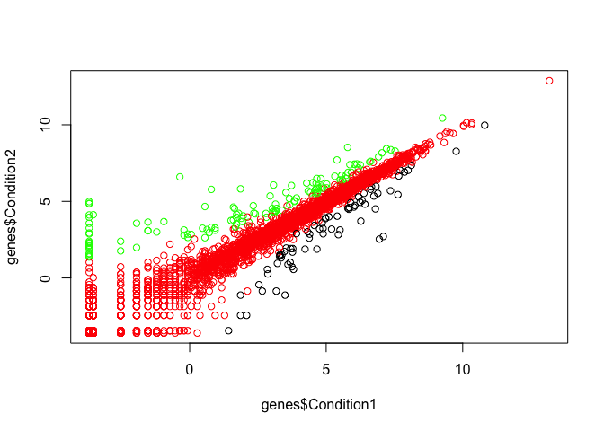

Class 5: Data Visualization in R
================

In this section we will learn how to read in tables of data from experiments, and then plot it to communicate our results
=========================================================================================================================

First we need to download the zip file containing the input data for class.

First download the zip file from the class website, unzip it, then add it to the same folder as the R project for this class.

Then we need to read in the weight\_chart.txt file into our R Studio workspace. We can read in the data using the function read.table(). For information on how to use it we do:

``` r
help("read.table")
```

Then we read in our data

``` r
weight_table = read.table('bimm143_05_rstats/weight_chart.txt', header = TRUE)

# what does our table look like 

head(weight_table)
```

    ##   Age Weight
    ## 1   0    3.6
    ## 2   1    4.4
    ## 3   2    5.2
    ## 4   3    6.0
    ## 5   4    6.6
    ## 6   5    7.2

Practice creating a line plot
=============================

``` r
plot(weight_table$Age, weight_table$Weight, type = "o", pch=15, cex=1.5, lwd=2, ylim=c(2,10), xlab="Age (months)", ylab="Weight (kg)", main="Baby weight vs age")
```


Practice creating a bar plot
============================

Read in the feature\_counts.txt file to create a bar plot

``` r
feature_count = read.table('bimm143_05_rstats/feature_counts.txt', sep="\t", header = TRUE)
```

``` r
# this line of code sets the margins for the plot. left, top, right, bottom

par(mar=c(4,7,4,7))

# plot the counts on the x axis and the features of the y. Use cex.axis to change font size of x axis. cex.names changes the lables on the bars. And cex.main adjusts the size of the title text.

barplot(feature_count$Count, horiz=TRUE, names.arg = feature_count$Feature, main="Number of Features in Mouse Genome", las=1, cex.axis = 1, cex.names = .5, cex.main = 1)
```


Practice plotting histograms
============================

First generate10000 points sampled from a standard normal distribution (use the rnorm() function) along with another 10000 points sampled from the same distribution but with an offset of 4.

``` r
random <- c(rnorm(10000),rnorm(10000)+4)
```

Take this sampke dataset and feed it into a histogram. Adjust breaks to make it easier to read.

``` r
hist(random, breaks=40)
```


Practicing adding color to plots
================================

The file male\_female\_counts.txt contains a time series split into male and female count values. We are reading this file in and creating a barplot with all bars different colors.

``` r
female_male <- read.table('bimm143_05_rstats/male_female_counts.txt', sep="\t", header = TRUE)

# check what data we are looking at 
head(female_male)
```

    ##      Sample Count
    ## 1   D1 Male     2
    ## 2 D1 Female     1
    ## 3   D2 Male     2
    ## 4 D2 Female     3
    ## 5   D3 Male     3
    ## 6 D3 Female     6

``` r
colors <- rainbow(nrow(female_male))

barplot(female_male$Count, names.arg= female_male$Sample, col=colors)
```


Re-plot, and make the bars for the males a different color to those for the females. In this case the male and female samples alternate so you can just pass a 2 color vector to the col parameter to achieve this effect.

``` r
barplot(female_male$Count, names.arg= female_male$Sample, col=c("blue2","red2"))
```


Coloring by value
=================

The file up\_down\_expression.txt contains an expression comparison dataset, but has an extra column which classifies the rows into one of 3 groups (up, down or unchanging).

``` r
genes <- read.table('bimm143_05_rstats/up_down_expression.txt', header = TRUE)

# view what our data looks like 
head(genes)
```

    ##         Gene Condition1 Condition2      State
    ## 1      A4GNT -3.6808610 -3.4401355 unchanging
    ## 2       AAAS  4.5479580  4.3864126 unchanging
    ## 3      AASDH  3.7190695  3.4787276 unchanging
    ## 4       AATF  5.0784720  5.0151916 unchanging
    ## 5       AATK  0.4711421  0.5598642 unchanging
    ## 6 AB015752.4 -3.6808610 -3.5921390 unchanging

``` r
# how many genes do we have data for 
nrow(genes)
```

    ## [1] 5196

``` r
# how many genes are up/down/unchange in this dataset?
table(genes$State)
```

    ## 
    ##       down unchanging         up 
    ##         72       4997        127

Instructions: For graphing start by just plotting the Condition1 column against the Condition2 column in a plot Pass the State column as the col parameter (col=genes$State for example). This will set the color according to the state of each point, but the colors will be set automatically from the output of palette.

``` r
 palette(c("black","red","green"))
plot(genes$Condition1, genes$Condition2, col = genes$State)
```



Instructions: Run palette() to see what colors are there initially and check that you can see how these relate to the colors you get in your plot. Run levels() on the State column and match this with what you saw in palette() to see how each color was selected. Work out what colors you would need to put into palette to get the color selection you actually want. Use the palette() function to set the corresponding colors you want to use (eg palette(c("red","green","blue")) – but using the correct colors in the correct order. Redraw the plot and check that the colors are now what you wanted.

``` r
palette()
```

    ## [1] "black" "red"   "green"

``` r
levels(genes$State)
```

    ## [1] "down"       "unchanging" "up"

``` r
palette(c("blue","gray","red"))
plot(genes$Condition1, genes$Condition2, col = genes$State)
```


Using a dyanmics use of color in R plots
========================================

First we will start by coloring by point density. Our data for this exercise is expression\_methylation.txt which contains data for gene body methylation, promoter methylation and gene expression.

``` r
# read in data file 
meth <- read.table('bimm143_05_rstats/expression_methylation.txt', header=TRUE)

# view data 

head(meth)
```

    ##          expression promoter.meth gene.meth
    ## Aars2      3.752997     3.5555556  85.31092
    ## Aarsd1     5.335752    10.9027780  35.25517
    ## Aasdh      5.605033     0.9935898  89.65585
    ## Aasdhppt   3.842794     5.5024514  40.66456
    ## Aass       4.484659     0.0000000  78.51562
    ## Aatf       6.163478     0.4662005  81.74055

``` r
plot(meth$gene.meth, meth$expression)
```


This is too hard to read, what does it mean? Use the densCols() function to make a new color vector that you can use in a new plot along with solid plotting character (e.g. pch=20).

``` r
# create this density function
dcols <- densCols(meth$gene.meth, meth$expression)
                            
#plot again
plot(meth$gene.meth, meth$expression, col = dcols , pch=20)
```


A lot of density is close to the origin. Restrict to methylation that is greater than 0

Change the colramp used by the densCols() function to go between blue, green, red and yellow with the colorRampPalette() function.

``` r
# saving the locations where methylation is greater than 0

inds <- meth$expression > 0

# create a new density function with a colorRampPalette
dcols.custom <- densCols(meth$gene.meth[inds], meth$expression[inds],
                                      colramp = colorRampPalette(c("blue2",
                                                                   "green2",
                                                                   "red2",
                                                                   "yellow")) )

# plot again 
plot(meth$gene.meth[inds], meth$expression[inds], col = dcols.custom,pch=20)
```


As always, save the sessionInfo() to preserve reproducibility

``` r
sessionInfo()
```

    ## R version 3.5.2 (2018-12-20)
    ## Platform: x86_64-apple-darwin15.6.0 (64-bit)
    ## Running under: macOS High Sierra 10.13.4
    ## 
    ## Matrix products: default
    ## BLAS: /Library/Frameworks/R.framework/Versions/3.5/Resources/lib/libRblas.0.dylib
    ## LAPACK: /Library/Frameworks/R.framework/Versions/3.5/Resources/lib/libRlapack.dylib
    ## 
    ## locale:
    ## [1] en_US.UTF-8/en_US.UTF-8/en_US.UTF-8/C/en_US.UTF-8/en_US.UTF-8
    ## 
    ## attached base packages:
    ## [1] stats     graphics  grDevices utils     datasets  methods   base     
    ## 
    ## loaded via a namespace (and not attached):
    ##  [1] compiler_3.5.2     magrittr_1.5       tools_3.5.2       
    ##  [4] htmltools_0.3.6    yaml_2.2.0         Rcpp_1.0.1        
    ##  [7] KernSmooth_2.23-15 stringi_1.4.3      rmarkdown_1.12    
    ## [10] knitr_1.22         stringr_1.4.0      xfun_0.6          
    ## [13] digest_0.6.18      evaluate_0.13
