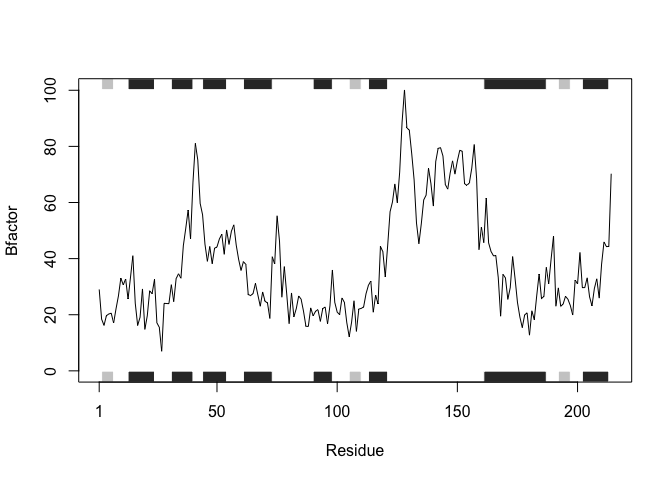

Class 6: R functions
================

Main purpose of these exercises is to take code and reformat it into a function.

Section 1: Improving analysis code by writing functions
=======================================================

``` r
# (A. Can you improve this analysis code?
df <- data.frame(a=1:10, b=seq(200,400,length=10),c=11:20,d=NA)
df$a <- (df$a - min(df$a)) / (max(df$a) - min(df$a))
df$b <- (df$b - min(df$a)) / (max(df$b) - min(df$b))
df$c <- (df$c - min(df$c)) / (max(df$c) - min(df$c))
df$d <- (df$d - min(df$d)) / (max(df$a) - min(df$d)) 
```

My attempt:

``` r
#create dataframe
df <- data.frame(a=1:10, b=seq(200,400,length=10),c=11:20,d=NA) 

# write function 

my_function <- function(a) {
  value <- (a - min(a)) / (max(a) - min(a))
  return(value)
}

# execute the function

my_function(df$a)
```

    ##  [1] 0.0000000 0.1111111 0.2222222 0.3333333 0.4444444 0.5555556 0.6666667
    ##  [8] 0.7777778 0.8888889 1.0000000

``` r
my_function(df$b)
```

    ##  [1] 0.0000000 0.1111111 0.2222222 0.3333333 0.4444444 0.5555556 0.6666667
    ##  [8] 0.7777778 0.8888889 1.0000000

``` r
my_function(df$c)
```

    ##  [1] 0.0000000 0.1111111 0.2222222 0.3333333 0.4444444 0.5555556 0.6666667
    ##  [8] 0.7777778 0.8888889 1.0000000

``` r
my_function(df$d)
```

    ##  [1] NA NA NA NA NA NA NA NA NA NA

Section 2: Writing and calling a function
=========================================

``` r
library(bio3d)
```

Can you improve this analysis code:

``` r
s1 <- read.pdb("4AKE") # kinase with drug
```

    ##   Note: Accessing on-line PDB file

``` r
s2 <- read.pdb("1AKE") # kinase no drug
```

    ##   Note: Accessing on-line PDB file
    ##    PDB has ALT records, taking A only, rm.alt=TRUE

``` r
s3 <- read.pdb("1E4Y") # kinase with drug
```

    ##   Note: Accessing on-line PDB file

``` r
s1.chainA <- trim.pdb(s1, chain="A", elety="CA")
s2.chainA <- trim.pdb(s2, chain="A", elety="CA")
s3.chainA <- trim.pdb(s1, chain="A", elety="CA")

s1.b <- s1.chainA$atom$b
s2.b <- s2.chainA$atom$b
s3.b <- s3.chainA$atom$b

plotb3(s1.b, sse=s1.chainA, typ="l", ylab="Bfactor")
```


``` r
plotb3(s2.b, sse=s2.chainA, typ="l", ylab="Bfactor")
```


``` r
plotb3(s3.b, sse=s3.chainA, typ="l", ylab="Bfactor")
```



My attempt at creating a function:

``` r
my_function <- function(protein_name, chain_name) {
  
  # first the function calls in the PDB database for the protein of interest
  s1 <- read.pdb(protein_name) 

  # then we trim down the large PDB file for just the chain of the protein that
  # we are interested in analyzing 
  s1.chainx <- trim.pdb(s1, chain = chain_name, elety="CA")
  
  # from this chain we pull out the atoms we want
  s1.b <- s1.chainx$atom$b

  # plot our region of interest
  return(plotb3(s1.b, sse=s1.chainx, typ="l", ylab="Bfactor"))
}

# practice by callin the function for "4AKE"

my_function("4AKE", "A")
```

    ##   Note: Accessing on-line PDB file

    ## Warning in get.pdb(file, path = tempdir(), verbose = FALSE): /var/folders/
    ## g3/mn3dxsw5717625m7pmgkqbf80000gn/T//RtmpoT2ctH/4AKE.pdb exists. Skipping
    ## download


``` r
my_function("1AKE", "A")
```

    ##   Note: Accessing on-line PDB file

    ## Warning in get.pdb(file, path = tempdir(), verbose = FALSE): /var/folders/
    ## g3/mn3dxsw5717625m7pmgkqbf80000gn/T//RtmpoT2ctH/1AKE.pdb exists. Skipping
    ## download

    ##    PDB has ALT records, taking A only, rm.alt=TRUE


``` r
my_function("1E4Y", "A")
```

    ##   Note: Accessing on-line PDB file

    ## Warning in get.pdb(file, path = tempdir(), verbose = FALSE): /var/folders/
    ## g3/mn3dxsw5717625m7pmgkqbf80000gn/T//RtmpoT2ctH/1E4Y.pdb exists. Skipping
    ## download


Writing and calling a function
==============================

Practice with this simple squaring function

``` r
square.it <- function(x) {
 square <- x * x
 return(square)
}
```

``` r
# square a number
square.it(5)
```

    ## [1] 25

``` r
# square a vector
square.it(c(1, 4, 2))
```

    ## [1]  1 16  4

``` r
# square a character
#square.it("hi")

# returns an error
```

I can also pass in an object that I already have saved. For example, here I have a matrix called matrix1, so I pass that into the square.it() function. R takes this matrix1 into the function as x. That is, in the local function environment it is now called x, where it is squared, and returned

``` r
matrix1 <- cbind(c(3, 10), c(4, 5))

square.it(matrix1)
```

    ##      [,1] [,2]
    ## [1,]    9   16
    ## [2,]  100   25

Local vs Global Environment
===========================

The reason you return an object is if you’ve saved the value of your statements into an object inside the function – in this case, the objects in the function are in a local environment and won’t appear in your global environment.

``` r
fun1 <- function(x) {
 3 * x - 1
}

fun1(5)
```

    ## [1] 14

``` r
# here the result of the function is not saved to a variable so it outputs when the funciton is called 
```

``` r
fun2 <- function(x) {
 y <- 3 * x - 1
}

fun2(5)

# in this function the results are saved within the function but we don't call it so nothing outputs
```

Section 3: More complex functions
=================================

This function passes in multiple arguments.

``` r
my.fun <- function(X.matrix, y.vec, z.scalar) {
 # use my previous function square.it() and save result
 sq.scalar <- square.it(z.scalar)
 # multiply the matrix by the vector using %*% operator
 mult <- X.matrix %*% y.vec
 # multiply the resulting objects together to get a final ans
 final <- mult * sq.scalar
 # return the result
 return(final)
}
```

creating variables to pass in as arguments

``` r
my.mat <- cbind(c(1, 3, 4), c(5, 4, 3))
my.vec <- c(4, 3)
```

Pass in my new variables into the function

``` r
my.fun(X.matrix = my.mat, y.vec = my.vec, z.scalar = 9)
```

    ##      [,1]
    ## [1,] 1539
    ## [2,] 1944
    ## [3,] 2025

Returning a list of objects Also, if you need to return multiple objects from a function, you can use list() to list them together.

``` r
another.fun <- function(sq.matrix, vector) {
 # transpose matrix and square the vector
 step1 <- t(sq.matrix)
 step2 <- vector * vector
 # save both results in a list and return
 final <- list(step1, step2)
 return(final)
}

# call the function and save result in object called outcome
outcome <- another.fun(sq.matrix = cbind(c(1, 2), c(3, 4)),
vector = c(2, 3))

# print the outcome list
print(outcome)
```

    ## [[1]]
    ##      [,1] [,2]
    ## [1,]    1    2
    ## [2,]    3    4
    ## 
    ## [[2]]
    ## [1] 4 9

Section 4: Debugging
====================

Can use the function debug()

``` r
debug(my.fun)
#my.fun(X.matrix = my.mat, y.vec = c(2, 3, 6, 4, 1), z.scalar =9)
```

Using this debug function we can figure out where the problems are and fix our code.

Another trick is to print out your progress within a function as a "sanity check"

Here is an example of using print to troubleshoot:

``` r
my.fun <- function(X.matrix, y.vec, z.scalar) {
 print("xmatrix")
 print(X.matrix)
 print("yvec")
 print(y.vec)
 print("Dimensions")
 print(dim(X.matrix))
 print(length(y.vec))
 # use previous function square.it() and save result
 sq.scalar <- square.it(z.scalar)
 print(paste("sq.scalar=", sq.scalar))
 # multiply the matrix by the vector using %*% operator
 mult <- X.matrix %*% y.vec
 # multiply the two resulting objects
 final <- mult * sq.scalar
 # return the result
 return(final)
}
```

``` r
#my.fun(X.matrix = my.mat, y.vec = c(2, 3, 6, 4, 1), z.scalar =9)
```

This shows us that it was a problem with the size of the matrix, which now that we know we can quickly fix!

Can also use stop() to terminate a function if some dependency is not met

Here is an example:

``` r
my.second.fun <- function(matrix, vector) {
 if (dim(matrix)[2] != length(vector)) {
 stop("Can't multiply matrix%*%vector because the
dimensions are wrong")
 }
 product <- matrix %*% vector
 return(product)
}

# function works when dimensions are right
my.second.fun(my.mat, c(6, 5))
```

    ##      [,1]
    ## [1,]   31
    ## [2,]   38
    ## [3,]   39

``` r
# function call triggered error
#my.second.fun(my.mat, c(6, 5, 7))
```

Section 5: Good coding practices
================================

1.  Keep functions short, call to each other
2.  Put in comments to know what a function does
3.  Check for errors periodically
