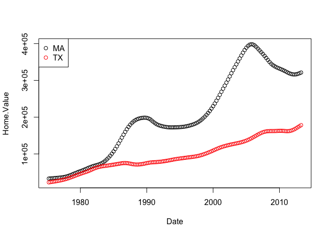
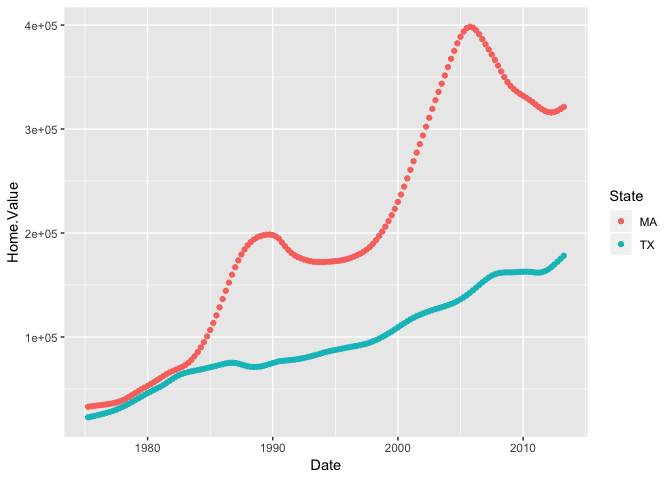

Class 7: R functions and packages
================

This is work from an in-class exercise in function writing.
===========================================================

First we will use the same function from the other day.

Function 1: Rescale
===================

``` r
source("http://tinyurl.com/rescale-R")

# insert a stop statment to fail early and loudly 

rescale <- function(x, na.rm=TRUE, plot=FALSE, ...) {
  if( !is.numeric(x) ) {
 stop("Input x should be numeric", call.=FALSE)
 }
  rng <-range(x, na.rm=na.rm)
  
  answer <- (x - rng[1]) / (rng[2] - rng[1])
  if(plot) {
    plot(answer, ...)
  }
  return(answer)
}

rescale( c(1:10) )
```

    ##  [1] 0.0000000 0.1111111 0.2222222 0.3333333 0.4444444 0.5555556 0.6666667
    ##  [8] 0.7777778 0.8888889 1.0000000

Function 2: both\_na
====================

We want to write a function, called both\_na(), that counts how many positions in two input vectors, x and y, both have a missing value

``` r
# start with a smaller problem, tell if there is any NA in both functions

# give your function small input to test if it works 

x <- c( 1, 2, NA, 3, NA)
y <- c(NA, 3, NA, 3, 4)


if (sum(is.na(x)) >= 1 & sum(is.na(y)) >= 1) {
  print("I work!")
}
```

    ## [1] "I work!"

``` r
# now put this into a function 

both_na <- function(x,y) {
  if (sum(is.na(x)) >= 1 & sum(is.na(y)) >= 1) {
  print("I work!")
}
}
```

Now that our small function works we can make it more complicated!

``` r
both_na3 <- function(x, y) {
 if(length(x) != length(y)) {
   # add in sanity checks to prevent bugs
 stop("Input x and y should be vectors of the same length")
 }

 na.in.both <- ( is.na(x) & is.na(y) )
 na.number <- sum(na.in.both)
 na.which <- which(na.in.both)
 message(
  
 )
# return relevant data we want from our function 
 return( list(number=na.number, which=na.which) )
}


both_na3(x,y)
```

    ## 

    ## $number
    ## [1] 1
    ## 
    ## $which
    ## [1] 3

Function 3: Calculate Students' Grades
======================================

Calculate a function to output the average grade of a student. For this function I turned any NAs to 0s. Also drop the lowest grade for each student when calculating the average.

``` r
#here is our data input we are working with 

student1 <- c(100, 100, 100, 100, 100,100, 100, 90)
student2 <- c(100, NA, 90, 90,90, 90, 97, 80)

# here is our function 
calculate_grade <- function(student){
  # take NAs and convert them to 0s
  if(sum(is.na(student)) >= 1) {
    student <- replace(student, is.na(student), 0)
  }
  # find the lowest grade for the student
  this_min = min(student)
  # drop this lowest grade 
  average = (sum(student) - this_min) / (length(student) - 1)
  # print out the results 
  print("The average for the student is:")
  print(average)
}

# run my function
calculate_grade(student2)
```

    ## [1] "The average for the student is:"
    ## [1] 91

Testing our my new function

``` r
# read in a file of student scores 
df <- read.csv('student_homework.csv', row.names = 1)
df
```

    ##            hw1 hw2 hw3 hw4 hw5
    ## student-1  100  73 100  88  79
    ## student-2   85  64  78  89  78
    ## student-3   83  69  77 100  77
    ## student-4   88  NA  73 100  76
    ## student-5   88 100  75  86  79
    ## student-6   89  78 100  89  77
    ## student-7   89 100  74  87 100
    ## student-8   89 100  76  86 100
    ## student-9   86 100  77  88  77
    ## student-10  89  72  79  NA  76
    ## student-11  82  66  78  84 100
    ## student-12 100  70  75  92 100
    ## student-13  89 100  76 100  80
    ## student-14  85 100  77  89  76
    ## student-15  85  65  76  89  NA
    ## student-16  92 100  74  89  77
    ## student-17  88  63 100  86  78
    ## student-18  91  NA 100  87 100
    ## student-19  91  68  75  86  79
    ## student-20  91  68  76  88  76

``` r
# run my function on my file 
calculate_grade(df[1,])
```

    ## [1] "The average for the student is:"
    ## [1] 91.75

``` r
# try using apply to run my function on the file
answer <- apply(df, 1 ,calculate_grade)
```

    ## [1] "The average for the student is:"
    ## [1] 91.75
    ## [1] "The average for the student is:"
    ## [1] 82.5
    ## [1] "The average for the student is:"
    ## [1] 84.25
    ## [1] "The average for the student is:"
    ## [1] 84.25
    ## [1] "The average for the student is:"
    ## [1] 88.25
    ## [1] "The average for the student is:"
    ## [1] 89
    ## [1] "The average for the student is:"
    ## [1] 94
    ## [1] "The average for the student is:"
    ## [1] 93.75
    ## [1] "The average for the student is:"
    ## [1] 87.75
    ## [1] "The average for the student is:"
    ## [1] 79
    ## [1] "The average for the student is:"
    ## [1] 86
    ## [1] "The average for the student is:"
    ## [1] 91.75
    ## [1] "The average for the student is:"
    ## [1] 92.25
    ## [1] "The average for the student is:"
    ## [1] 87.75
    ## [1] "The average for the student is:"
    ## [1] 78.75
    ## [1] "The average for the student is:"
    ## [1] 89.5
    ## [1] "The average for the student is:"
    ## [1] 88
    ## [1] "The average for the student is:"
    ## [1] 94.5
    ## [1] "The average for the student is:"
    ## [1] 82.75
    ## [1] "The average for the student is:"
    ## [1] 82.75

``` r
# sort the students by their grades

sort(answer, decreasing = TRUE)
```

    ## student-18  student-7  student-8 student-13  student-1 student-12 
    ##      94.50      94.00      93.75      92.25      91.75      91.75 
    ## student-16  student-6  student-5 student-17  student-9 student-14 
    ##      89.50      89.00      88.25      88.00      87.75      87.75 
    ## student-11  student-3  student-4 student-19 student-20  student-2 
    ##      86.00      84.25      84.25      82.75      82.75      82.50 
    ## student-10 student-15 
    ##      79.00      78.75

Function 4: Find common genes in two datasets
=============================================

This is another example problem from the class 7 lecture.

We will start small with a example dataset.

``` r
# create two data frames with genes and their expression 

df1 <- data.frame(IDs=c("gene1", "gene2", "gene3"),
 exp=c(2,1,1),
 stringsAsFactors=FALSE)

df2 <- data.frame(IDs=c("gene2", "gene4", "gene3", "gene5"),
 exp=c(-2, NA, 1, 2),
 stringsAsFactors=FALSE)
```

Simplify these into single vectors

``` r
x <- df1$IDs
y <- df2$IDs
```

We can use the built in function to R of intersect

``` r
intersect(x, y)
```

    ## [1] "gene2" "gene3"

``` r
# this isn't quite what we want we want their locations or indicies
```

``` r
# instead let's try 

x %in% y
```

    ## [1] FALSE  TRUE  TRUE

Find the smallest working snippet that you can then put into a function

``` r
cbind( x[ x %in% y ], y[ y %in% x ] )
```

    ##      [,1]    [,2]   
    ## [1,] "gene2" "gene2"
    ## [2,] "gene3" "gene3"

Now that it works put it into a function! Woot!

``` r
gene_intersect <- function(x, y) {
  cbind( x[ x %in% y ], y[ y %in% x ] )
}
```

Now run our function:

``` r
gene_intersect(x,y)
```

    ##      [,1]    [,2]   
    ## [1,] "gene2" "gene2"
    ## [2,] "gene3" "gene3"

Exercise to practice using packages in R. We practiced used ggplot2
===================================================================

First install like this: install.packages("BiocManager") install.packages("ggplot2") library("ggplot2")

``` r
# here we are reading in a library with data

# example of how plotting in base R

library(tidyverse)
```

    ## ── Attaching packages ──────────────────────────────────────── tidyverse 1.2.1 ──

    ## ✔ ggplot2 3.1.1       ✔ purrr   0.3.2  
    ## ✔ tibble  2.1.1       ✔ dplyr   0.8.0.1
    ## ✔ tidyr   0.8.3       ✔ stringr 1.4.0  
    ## ✔ readr   1.3.1       ✔ forcats 0.4.0

    ## ── Conflicts ─────────────────────────────────────────── tidyverse_conflicts() ──
    ## ✖ dplyr::filter() masks stats::filter()
    ## ✖ dplyr::lag()    masks stats::lag()

``` r
housing <- read_csv("dataSets/landdata-states.csv")
```

    ## Parsed with column specification:
    ## cols(
    ##   State = col_character(),
    ##   region = col_character(),
    ##   Date = col_double(),
    ##   Home.Value = col_double(),
    ##   Structure.Cost = col_double(),
    ##   Land.Value = col_double(),
    ##   Land.Share..Pct. = col_double(),
    ##   Home.Price.Index = col_double(),
    ##   Land.Price.Index = col_double(),
    ##   Year = col_double(),
    ##   Qrtr = col_double()
    ## )

``` r
plot(Home.Value ~ Date,
     col = factor(State),
     data = filter(housing, State %in% c("MA", "TX")))

legend("topleft",
       legend = c("MA", "TX"),
       col = c("black", "red"),
       pch = 1)
```



``` r
# example of how using ggplot it becomes a much more beautiful plot! 

ggplot(filter(housing, State %in% c("MA", "TX")),
       aes(x=Date,
           y=Home.Value,
           color=State))+
  geom_point()
```



``` r
sessionInfo()
```

    ## R version 3.5.2 (2018-12-20)
    ## Platform: x86_64-apple-darwin15.6.0 (64-bit)
    ## Running under: macOS High Sierra 10.13.4
    ## 
    ## Matrix products: default
    ## BLAS: /Library/Frameworks/R.framework/Versions/3.5/Resources/lib/libRblas.0.dylib
    ## LAPACK: /Library/Frameworks/R.framework/Versions/3.5/Resources/lib/libRlapack.dylib
    ## 
    ## locale:
    ## [1] en_US.UTF-8/en_US.UTF-8/en_US.UTF-8/C/en_US.UTF-8/en_US.UTF-8
    ## 
    ## attached base packages:
    ## [1] stats     graphics  grDevices utils     datasets  methods   base     
    ## 
    ## other attached packages:
    ## [1] forcats_0.4.0   stringr_1.4.0   dplyr_0.8.0.1   purrr_0.3.2    
    ## [5] readr_1.3.1     tidyr_0.8.3     tibble_2.1.1    ggplot2_3.1.1  
    ## [9] tidyverse_1.2.1
    ## 
    ## loaded via a namespace (and not attached):
    ##  [1] Rcpp_1.0.1       cellranger_1.1.0 pillar_1.3.1     compiler_3.5.2  
    ##  [5] plyr_1.8.4       tools_3.5.2      digest_0.6.18    lubridate_1.7.4 
    ##  [9] jsonlite_1.6     evaluate_0.13    nlme_3.1-139     gtable_0.3.0    
    ## [13] lattice_0.20-38  pkgconfig_2.0.2  rlang_0.3.4      cli_1.1.0       
    ## [17] rstudioapi_0.10  yaml_2.2.0       haven_2.1.0      xfun_0.6        
    ## [21] withr_2.1.2      xml2_1.2.0       httr_1.4.0       knitr_1.22      
    ## [25] hms_0.4.2        generics_0.0.2   grid_3.5.2       tidyselect_0.2.5
    ## [29] glue_1.3.1       R6_2.4.0         readxl_1.3.1     rmarkdown_1.12  
    ## [33] modelr_0.1.4     magrittr_1.5     backports_1.1.4  scales_1.0.0    
    ## [37] htmltools_0.3.6  rvest_0.3.3      assertthat_0.2.1 colorspace_1.4-1
    ## [41] labeling_0.3     stringi_1.4.3    lazyeval_0.2.2   munsell_0.5.0   
    ## [45] broom_0.5.2      crayon_1.3.4
