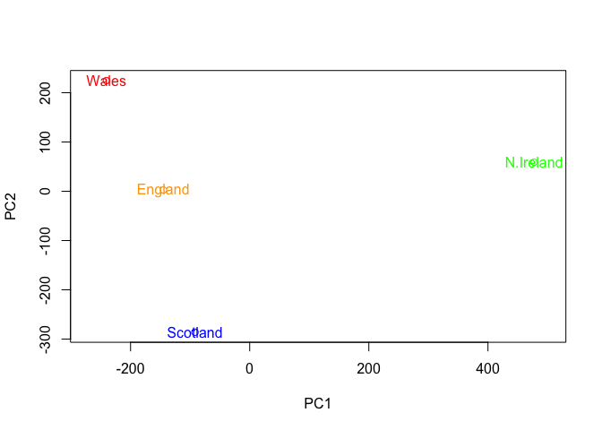

Class 8: PCA exercise
================

Principal component analysis with food in UK
============================================

Read in our data file, view what we are working with

``` r
# set the index of the dataframe as the first row
w <- read.csv("UK_foods.csv", row.names = 1)

w
```

    ##                     England Wales Scotland N.Ireland
    ## Cheese                  105   103      103        66
    ## Carcass_meat            245   227      242       267
    ## Other_meat              685   803      750       586
    ## Fish                    147   160      122        93
    ## Fats_and_oils           193   235      184       209
    ## Sugars                  156   175      147       139
    ## Fresh_potatoes          720   874      566      1033
    ## Fresh_Veg               253   265      171       143
    ## Other_Veg               488   570      418       355
    ## Processed_potatoes      198   203      220       187
    ## Processed_Veg           360   365      337       334
    ## Fresh_fruit            1102  1137      957       674
    ## Cereals                1472  1582     1462      1494
    ## Beverages                57    73       53        47
    ## Soft_drinks            1374  1256     1572      1506
    ## Alcoholic_drinks        375   475      458       135
    ## Confectionery            54    64       62        41

How many rows and columns

``` r
dim(w)
```

    ## [1] 17  4

Checking the top of the data

``` r
head(w)
```

    ##                England Wales Scotland N.Ireland
    ## Cheese             105   103      103        66
    ## Carcass_meat       245   227      242       267
    ## Other_meat         685   803      750       586
    ## Fish               147   160      122        93
    ## Fats_and_oils      193   235      184       209
    ## Sugars             156   175      147       139

Start visulaizing data

``` r
barplot(as.matrix(w), beside=T, col=rainbow(nrow(w)))
```


Changing beside to false gives you a much different plot

``` r
barplot(as.matrix(w), beside=F, col=rainbow(nrow(w)))
```


Generating pairwise plots to compare

``` r
pairs(w, col=rainbow(10), pch=16)
```


Principle Component Analysis makes comparing these multivariable datasets easier

R makes this easy by using the prcomp() function

``` r
pca <- prcomp( t(w))
summary(pca)
```

    ## Importance of components:
    ##                             PC1      PC2      PC3       PC4
    ## Standard deviation     324.1502 212.7478 73.87622 4.189e-14
    ## Proportion of Variance   0.6744   0.2905  0.03503 0.000e+00
    ## Cumulative Proportion    0.6744   0.9650  1.00000 1.000e+00

This summary shows us that PC1 accounts for 67% of the sample variance.

We can plot principle components against each other:

``` r
plot(pca$x[,1], pca$x[,2], xlab="PC1", ylab="PC2", xlim=c(-270,500))
text(pca$x[,1], pca$x[,2], colnames(w))
```


We can jazz up this plot by adding colors to our labels

``` r
my_cols <- c("orange", "red","blue", "green")

plot(pca$x[,1], pca$x[,2], xlab="PC1", ylab="PC2", xlim=c(-270,500), col = my_cols)

text(pca$x[,1], pca$x[,2], colnames(w), col= my_cols)
```



Below we can use the square of pca$sdev , which stands for “standard deviation”, to calculate how much variation in the original data each PC accounts for.

``` r
v <- round( pca$sdev^2/sum(pca$sdev^2) * 100 )
v
```

    ## [1] 67 29  4  0

We can plot principle components by the amount of variance they contribute

``` r
barplot(v, xlab="Principal Component", ylab="Percent Variation")
```


Can plot across one principle component (the one with the most variance) tell which of the variables are contributing the most

``` r
## Lets focus on PC1 as it accounts for > 90% of variance 
par(mar=c(8, 4, 4, 3))
barplot( pca$rotation[,1], las=2, cex.names = .75)
```


Now do the same with PC2

``` r
## Now plot PC2
par(mar=c(8, 4, 4, 3))
barplot( pca$rotation[,2], las=2, cex.names = .75)
```


We can also try to plot a biplot which are popular ways to represent PCA data

``` r
biplot(pca)
```


Section 2: PCA of RNA-seq data
==============================

Read in RNA-seq data and perform the same functions to analyze it using PCA

``` r
#read in data
mydata <- read.csv("expression.csv", row.names = 1)


head(mydata)
```

    ##        wt1 wt2  wt3  wt4 wt5 ko1 ko2 ko3 ko4 ko5
    ## gene1  439 458  408  429 420  90  88  86  90  93
    ## gene2  219 200  204  210 187 427 423 434 433 426
    ## gene3 1006 989 1030 1017 973 252 237 238 226 210
    ## gene4  783 792  829  856 760 849 856 835 885 894
    ## gene5  181 249  204  244 225 277 305 272 270 279
    ## gene6  460 502  491  491 493 612 594 577 618 638

How big is our dataset?

``` r
dim(mydata)
```

    ## [1] 100  10

First we run prcomp() to start principle component analysis

``` r
pca <- prcomp(t(mydata), scale=TRUE) 

#attributes(pca)

plot(pca$x[,1], pca$x[,2]) 
```


``` r
# Calculate variance for each PC

pca.var <- pca$sdev^2 

# Calculate percent variance 
pca.var.per <- round(pca.var/sum(pca.var)*100, 1) 
pca.var.per
```

    ##  [1] 92.6  2.3  1.1  1.1  0.8  0.7  0.6  0.4  0.4  0.0

Use these percent variances to make a scree plot

``` r
barplot(pca.var.per, main="Scree Plot",
 xlab="Principal Component", ylab="Percent Variation")
```


This shows us that pretty much all of the variation is in the first principle component, making analysis of 100 genes much easier.

We now want to make a prettier graph

``` r
## A vector of colors for wt and ko samples
colvec <- colnames(mydata)
colvec[grep("wt", colvec)] <- "red"
colvec[grep("ko", colvec)] <- "blue"

plot(pca$x[,1], pca$x[,2], col=colvec, pch=16,
     xlab=paste0("PC1 (", pca.var.per[1], "%)"),
     ylab=paste0("PC2 (", pca.var.per[2], "%)"))

text(pca$x[,1], pca$x[,2], labels = colnames(mydata), pos=c(rep(4,5), rep(2,5)))
```


Find the top 10 measurements (genes) that contribute most to pc1 in either direction (+ or -).

``` r
loading_scores <- pca$rotation[,1]

## Find the top 10 measurements (genes) that contribute
## most to PC1 in either direction (+ or -)
gene_scores <- abs(loading_scores) 
gene_score_ranked <- sort(gene_scores, decreasing=TRUE)

## show the names of the top 10 genes
top_10_genes <- names(gene_score_ranked[1:10])
top_10_genes 
```

    ##  [1] "gene100" "gene66"  "gene45"  "gene68"  "gene98"  "gene60"  "gene21" 
    ##  [8] "gene56"  "gene10"  "gene90"

``` r
sessionInfo()
```

    ## R version 3.5.2 (2018-12-20)
    ## Platform: x86_64-apple-darwin15.6.0 (64-bit)
    ## Running under: macOS High Sierra 10.13.4
    ## 
    ## Matrix products: default
    ## BLAS: /Library/Frameworks/R.framework/Versions/3.5/Resources/lib/libRblas.0.dylib
    ## LAPACK: /Library/Frameworks/R.framework/Versions/3.5/Resources/lib/libRlapack.dylib
    ## 
    ## locale:
    ## [1] en_US.UTF-8/en_US.UTF-8/en_US.UTF-8/C/en_US.UTF-8/en_US.UTF-8
    ## 
    ## attached base packages:
    ## [1] stats     graphics  grDevices utils     datasets  methods   base     
    ## 
    ## loaded via a namespace (and not attached):
    ##  [1] compiler_3.5.2  magrittr_1.5    tools_3.5.2     htmltools_0.3.6
    ##  [5] yaml_2.2.0      Rcpp_1.0.1      stringi_1.4.3   rmarkdown_1.12 
    ##  [9] knitr_1.22      stringr_1.4.0   xfun_0.6        digest_0.6.18  
    ## [13] evaluate_0.13
