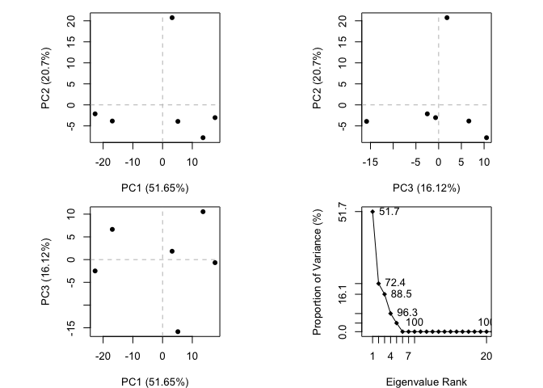

Class 11: Structural Bioinformatics
================

Section 1: Introduction to the RCSB Protein Data Bank
=====================================================

Downloaded a CSV file from <http://www.rcsb.org/stats/summary> on 05-08-2019.

Download a CSV file from the PDB site (accessible from “Analyze” -&gt; “PDB Statistics” &gt; “by Experimental Method and Molecular Type”.

``` r
data <- read.csv("Data Export Summary.csv", row.names = 1)

#check what data we downloaded 

head(data)
```

    ##                     Proteins Nucleic.Acids Protein.NA.Complex Other  Total
    ## X-Ray                 127027          2012               6549     8 135596
    ## NMR                    11064          1279                259     8  12610
    ## Electron Microscopy     2296            31                803     0   3130
    ## Other                    256             4                  6    13    279
    ## Multi Method             131             5                  2     1    139

Can you determine what proportion of structures are protein?

``` r
calculate <- sum(data$Proteins) / (sum(data$Total))
calculate
```

    ## [1] 0.9276461

Determine the percentage of structures are solved by x-Ray and electron microscopy

``` r
# solved by x-ray

data$Total[1]
```

    ## [1] 135596

``` r
# solved by electron microscopy 

data$Total[3]
```

    ## [1] 3130

Section 2 : Using VMD
=====================

In this section we will use the 2Å resolution X-ray crystal structure of HIV-1 protease with a bound drug molecule indinavir (PDB ID: 1HSG) \[3\]. We will use the VMD molecular viewer to visually inspect the protein, the binding site and the drug molecule. After exploring features of the complex we will move on to computationally dock a couple of drug molecules into the binding site of HIV-1 protease to see how well computational docking can reproduce the crystallographically observed binding pose. If time permits, we will also explore the conformational dynamics and flexibility of the protein - important for it’s function and for considering during drug design.

Section 3 : Introduction to Bio3D in R
======================================

Let's read the PDB file we downloaded into R to see how things live in this space

``` r
# load the bio3d package which we are going to use

library(bio3d)
```

Reading PDB file data into R

``` r
pdb <- read.pdb("1hsg.pdb")
```

View what is in a PDB file

``` r
pdb
```

    ## 
    ##  Call:  read.pdb(file = "1hsg.pdb")
    ## 
    ##    Total Models#: 1
    ##      Total Atoms#: 1686,  XYZs#: 5058  Chains#: 2  (values: A B)
    ## 
    ##      Protein Atoms#: 1514  (residues/Calpha atoms#: 198)
    ##      Nucleic acid Atoms#: 0  (residues/phosphate atoms#: 0)
    ## 
    ##      Non-protein/nucleic Atoms#: 172  (residues: 128)
    ##      Non-protein/nucleic resid values: [ HOH (127), MK1 (1) ]
    ## 
    ##    Protein sequence:
    ##       PQITLWQRPLVTIKIGGQLKEALLDTGADDTVLEEMSLPGRWKPKMIGGIGGFIKVRQYD
    ##       QILIEICGHKAIGTVLVGPTPVNIIGRNLLTQIGCTLNFPQITLWQRPLVTIKIGGQLKE
    ##       ALLDTGADDTVLEEMSLPGRWKPKMIGGIGGFIKVRQYDQILIEICGHKAIGTVLVGPTP
    ##       VNIIGRNLLTQIGCTLNF
    ## 
    ## + attr: atom, xyz, seqres, helix, sheet,
    ##         calpha, remark, call

How many amino acid residues are there in this pdb object and what are the two nonprotein residues?

``` r
# first look at the attributes stored in our PDB file 

attributes(pdb)
```

    ## $names
    ## [1] "atom"   "xyz"    "seqres" "helix"  "sheet"  "calpha" "remark" "call"  
    ## 
    ## $class
    ## [1] "pdb" "sse"

To access these individual attributes we use the dollar-attribute name convention that is common with R list objects

``` r
head(pdb$atom)
```

    ##   type eleno elety  alt resid chain resno insert      x      y     z o
    ## 1 ATOM     1     N <NA>   PRO     A     1   <NA> 29.361 39.686 5.862 1
    ## 2 ATOM     2    CA <NA>   PRO     A     1   <NA> 30.307 38.663 5.319 1
    ## 3 ATOM     3     C <NA>   PRO     A     1   <NA> 29.760 38.071 4.022 1
    ## 4 ATOM     4     O <NA>   PRO     A     1   <NA> 28.600 38.302 3.676 1
    ## 5 ATOM     5    CB <NA>   PRO     A     1   <NA> 30.508 37.541 6.342 1
    ## 6 ATOM     6    CG <NA>   PRO     A     1   <NA> 29.296 37.591 7.162 1
    ##       b segid elesy charge
    ## 1 38.10  <NA>     N   <NA>
    ## 2 40.62  <NA>     C   <NA>
    ## 3 42.64  <NA>     C   <NA>
    ## 4 43.40  <NA>     O   <NA>
    ## 5 37.87  <NA>     C   <NA>
    ## 6 38.40  <NA>     C   <NA>

``` r
# Print a subset of $atom data for the first two atoms
pdb$atom[1:2, c("eleno", "elety", "x","y","z")]
```

    ##   eleno elety      x      y     z
    ## 1     1     N 29.361 39.686 5.862
    ## 2     2    CA 30.307 38.663 5.319

Also information of structure by coordinates

``` r
# Print a summary of the coordinate data in $xyz
pdb$xyz
```

    ## 
    ##    Total Frames#: 1
    ##    Total XYZs#:   5058,  (Atoms#:  1686)
    ## 
    ##     [1]  29.361  39.686  5.862  <...>  30.112  17.912  -4.791  [5058] 
    ## 
    ## + attr: Matrix DIM = 1 x 5058

Section 4: Atom Selection
=========================

The Bio3D atom.select() function is arguably one of the most challenging for newcomers to master. It is however central to PDB structure manipulation and analysis. At its most basic, this function operates on PDB structure objects (as created by read.pdb()) and returns the numeric indices of a selected atom subset. These indices can then be used to access the $atom and $xyz attributes of PDB structure related objects.

``` r
# Select all C-alpha atoms (return their indices)
ca.inds <- atom.select(pdb, "calpha")
ca.inds
```

    ## 
    ##  Call:  atom.select.pdb(pdb = pdb, string = "calpha")
    ## 
    ##    Atom Indices#: 198  ($atom)
    ##    XYZ  Indices#: 594  ($xyz)
    ## 
    ## + attr: atom, xyz, call

Select residue number 10

``` r
inds <- atom.select(pdb, resno = 10)

inds
```

    ## 
    ##  Call:  atom.select.pdb(pdb = pdb, resno = 10)
    ## 
    ##    Atom Indices#: 16  ($atom)
    ##    XYZ  Indices#: 48  ($xyz)
    ## 
    ## + attr: atom, xyz, call

PDB Object Trimming
===================

This is a way to take only parts of the PDB file that you are interested and output them into a new PDB file

``` r
indicies_to_save <- atom.select(pdb, 'protein', value=TRUE)
indicies_to_save
```

    ## 
    ##  Call:  trim.pdb(pdb = pdb, sele)
    ## 
    ##    Total Models#: 1
    ##      Total Atoms#: 1514,  XYZs#: 4542  Chains#: 2  (values: A B)
    ## 
    ##      Protein Atoms#: 1514  (residues/Calpha atoms#: 198)
    ##      Nucleic acid Atoms#: 0  (residues/phosphate atoms#: 0)
    ## 
    ##      Non-protein/nucleic Atoms#: 0  (residues: 0)
    ##      Non-protein/nucleic resid values: [ none ]
    ## 
    ##    Protein sequence:
    ##       PQITLWQRPLVTIKIGGQLKEALLDTGADDTVLEEMSLPGRWKPKMIGGIGGFIKVRQYD
    ##       QILIEICGHKAIGTVLVGPTPVNIIGRNLLTQIGCTLNFPQITLWQRPLVTIKIGGQLKE
    ##       ALLDTGADDTVLEEMSLPGRWKPKMIGGIGGFIKVRQYDQILIEICGHKAIGTVLVGPTP
    ##       VNIIGRNLLTQIGCTLNF
    ## 
    ## + attr: atom, helix, sheet, seqres, xyz,
    ##         calpha, call

``` r
write.pdb(indicies_to_save, file = "1HSG_PROTEIN.pdb") 
```

If you just want the ligand or drug you can select it and save it to a new PDB file

``` r
ligand_inds <- atom.select(pdb, 'ligand', value=TRUE) 
write.pdb(ligand_inds, file = "1HSE_LIGAND.pdb") 
```

Section 5: 3D structure viewing in R
====================================

You can view 3D structures within R using the bio3d.view package.

``` r
# The 'devtools' package allows us to install development versions
#install.packages("devtools")


#install.packages("rgl")

# Install the bio3d.view package from bitbucket
#devtools::install_bitbucket("Grantlab/bio3d-view")
```

``` r
# load the package we need 
library("bio3d.view")

# view our PDB file 
view(pdb, "overview", col="sse")
```

    ## Computing connectivity from coordinates...

For example, here we use the view() function to visualize the results of a Normal Mode Analysis, a bioinformatics method that can predict the major motions of biomolecules.

``` r
pdb <- read.pdb("1hel")
```

    ##   Note: Accessing on-line PDB file

``` r
# Normal mode analysis calculation

modes <- nma(pdb)
```

    ##  Building Hessian...     Done in 0.017 seconds.
    ##  Diagonalizing Hessian...    Done in 0.093 seconds.

``` r
m7 <- mktrj(modes,
 mode=7,
 file="mode_7.pdb")

view(m7, col=vec2color( rmsf(m7) ))
```

    ## Potential all C-alpha atom structure(s) detected: Using calpha.connectivity()

Section 6: Working with multiple PDB files
==========================================

Before delving into more advanced analysis (detailed in the next section and additional vignettes) lets examine how we can read multiple PDB structures from the RCSB PDB for a particular protein and perform some basic analysis:

Note! You will need to download the appropriate version of the muscle multiple alignment program from: <https://www.drive5.com/muscle/downloads.htm>

Execute these things in Terminal!

``` bash

#sudo curl -o "/usr/local/bin/muscle" "http://thegrantlab.org/misc/
#muscle"

#sudo chmod +x /usr/local/bin/muscle
```

Now back in R, we are going to align multiple structures to compare them

``` r
# make of list of the PDB files you are interested in

ids <- c("1TND_B","1AGR_A","1TAG_A","1GG2_A","1KJY_A","4G5Q_A")

# Download the PDB files
#split = TRUE requests further that we want to extract particular chains, i.e. those specified by the _A suffix of each PDB ID in the example above

files <- get.pdb(ids, split = TRUE)
```

    ## Warning in get.pdb(ids, split = TRUE): ./1TND.pdb exists. Skipping download

    ## Warning in get.pdb(ids, split = TRUE): ./1AGR.pdb exists. Skipping download

    ## Warning in get.pdb(ids, split = TRUE): ./1TAG.pdb exists. Skipping download

    ## Warning in get.pdb(ids, split = TRUE): ./1GG2.pdb exists. Skipping download

    ## Warning in get.pdb(ids, split = TRUE): ./1KJY.pdb exists. Skipping download

    ## Warning in get.pdb(ids, split = TRUE): ./4G5Q.pdb exists. Skipping download

    ## 
      |                                                                       
      |                                                                 |   0%
      |                                                                       
      |===========                                                      |  17%
      |                                                                       
      |======================                                           |  33%
      |                                                                       
      |================================                                 |  50%
      |                                                                       
      |===========================================                      |  67%
      |                                                                       
      |======================================================           |  83%
      |                                                                       
      |=================================================================| 100%

``` r
# Extract and align the chains we are interested in
pdbs <- pdbaln(files, fit = TRUE)
```

    ## Reading PDB files:
    ## ./split_chain/1TND_B.pdb
    ## ./split_chain/1AGR_A.pdb
    ## ./split_chain/1TAG_A.pdb
    ## ./split_chain/1GG2_A.pdb
    ## ./split_chain/1KJY_A.pdb
    ## ./split_chain/4G5Q_A.pdb
    ## .....   PDB has ALT records, taking A only, rm.alt=TRUE
    ## .
    ## 
    ## Extracting sequences
    ## 
    ## pdb/seq: 1   name: ./split_chain/1TND_B.pdb 
    ## pdb/seq: 2   name: ./split_chain/1AGR_A.pdb 
    ## pdb/seq: 3   name: ./split_chain/1TAG_A.pdb 
    ## pdb/seq: 4   name: ./split_chain/1GG2_A.pdb 
    ## pdb/seq: 5   name: ./split_chain/1KJY_A.pdb 
    ## pdb/seq: 6   name: ./split_chain/4G5Q_A.pdb 
    ##    PDB has ALT records, taking A only, rm.alt=TRUE

``` r
# Print to screen a summary of the 'pdbs' object
pdbs
```

    ##                                1        .         .         .         .         50 
    ## [Truncated_Name:1]1TND_B.pdb   --------------------------ARTVKLLLLGAGESGKSTIVKQMK
    ## [Truncated_Name:2]1AGR_A.pdb   LSAEDKAAVERSKMIDRNLREDGEKAAREVKLLLLGAGESGKSTIVKQMK
    ## [Truncated_Name:3]1TAG_A.pdb   --------------------------ARTVKLLLLGAGESGKSTIVKQMK
    ## [Truncated_Name:4]1GG2_A.pdb   LSAEDKAAVERSKMIDRNLREDGEKAAREVKLLLLGAGESGKSTIVKQMK
    ## [Truncated_Name:5]1KJY_A.pdb   -------------------------GAREVKLLLLGAGESGKSTIVKQMK
    ## [Truncated_Name:6]4G5Q_A.pdb   --------------------------AREVKLLLLGAGESGKSTIVKQMK
    ##                                                          ** ********************* 
    ##                                1        .         .         .         .         50 
    ## 
    ##                               51        .         .         .         .         100 
    ## [Truncated_Name:1]1TND_B.pdb   IIHQDGYSLEECLEFIAIIYGNTLQSILAIVRAMTTLNIQYGDSARQDDA
    ## [Truncated_Name:2]1AGR_A.pdb   IIHEAGYSEEECKQYKAVVYSNTIQSIIAIIRAMGRLKIDFGDAARADDA
    ## [Truncated_Name:3]1TAG_A.pdb   IIHQDGYSLEECLEFIAIIYGNTLQSILAIVRAMTTLNIQYGDSARQDDA
    ## [Truncated_Name:4]1GG2_A.pdb   IIHEAGYSEEECKQYKAVVYSNTIQSIIAIIRAMGRLKIDFGDAARADDA
    ## [Truncated_Name:5]1KJY_A.pdb   IIHEAGYSEEECKQYKAVVYSNTIQSIIAIIRAMGRLKIDFGDSARADDA
    ## [Truncated_Name:6]4G5Q_A.pdb   IIHEAGYSEEECKQYKAVVYSNTIQSIIAIIRAMGRLKIDFGDSARADDA
    ##                                ***  *** ***  ^ *^^* **^***^**^***  * * ^** ** *** 
    ##                               51        .         .         .         .         100 
    ## 
    ##                              101        .         .         .         .         150 
    ## [Truncated_Name:1]1TND_B.pdb   RKLMHMADTIEEGTMPKEMSDIIQRLWKDSGIQACFDRASEYQLNDSAGY
    ## [Truncated_Name:2]1AGR_A.pdb   RQLFVLAGAAEEGFMTAELAGVIKRLWKDSGVQACFNRSREYQLNDSAAY
    ## [Truncated_Name:3]1TAG_A.pdb   RKLMHMADTIEEGTMPKEMSDIIQRLWKDSGIQACFDRASEYQLNDSAGY
    ## [Truncated_Name:4]1GG2_A.pdb   RQLFVLAGAAEEGFMTAELAGVIKRLWKDSGVQACFNRSREYQLNDSAAY
    ## [Truncated_Name:5]1KJY_A.pdb   RQLFVLAGAAEEGFMTAELAGVIKRLWKDSGVQACFNRSREYQLNDSAAY
    ## [Truncated_Name:6]4G5Q_A.pdb   RQLFVLAGAAEEGFMTAELAGVIKRLWKDSGVQACFNRSREYQLNDSAAY
    ##                                * *  ^*   *** *  *^  ^* *******^**** *  ********^* 
    ##                              101        .         .         .         .         150 
    ## 
    ##                              151        .         .         .         .         200 
    ## [Truncated_Name:1]1TND_B.pdb   YLSDLERLVTPGYVPTEQDVLRSRVKTTGIIETQFSFKDLNFRMFDVGGQ
    ## [Truncated_Name:2]1AGR_A.pdb   YLNDLDRIAQPNYIPTQQDVLRTRVKTTGIVETHFTFKDLHFKMFDVGGQ
    ## [Truncated_Name:3]1TAG_A.pdb   YLSDLERLVTPGYVPTEQDVLRSRVKTTGIIETQFSFKDLNFRMFDVGGQ
    ## [Truncated_Name:4]1GG2_A.pdb   YLNDLDRIAQPNYIPTQQDVLRTRVKTTGIVETHFTFKDLHFKMFDVGAQ
    ## [Truncated_Name:5]1KJY_A.pdb   YLNDLDRIAQPNYIPTQQDVLRTRVKTTGIVETHFTFKDLHFKMFDVGGQ
    ## [Truncated_Name:6]4G5Q_A.pdb   YLNDLDRIAQPNYIPTQQDVLRTRVKTTGIVETHFTFKDLHFKMFDVGGQ
    ##                                ** **^*^  * *^** *****^*******^** *^**** *^*****^* 
    ##                              151        .         .         .         .         200 
    ## 
    ##                              201        .         .         .         .         250 
    ## [Truncated_Name:1]1TND_B.pdb   RSERKKWIHCFEGVTCIIFIAALSAYDMVLVEDDEVNRMHESLHLFNSIC
    ## [Truncated_Name:2]1AGR_A.pdb   RSERKKWIHCFEGVTAIIFCVALSDYDLVLAEDEEMNRMHESMKLFDSIC
    ## [Truncated_Name:3]1TAG_A.pdb   RSERKKWIHCFEGVTCIIFIAALSAYDMVLVEDDEVNRMHESLHLFNSIC
    ## [Truncated_Name:4]1GG2_A.pdb   RSERKKWIHCFEGVTAIIFCVALSDYDLVLAEDEEMNRMHESMKLFDSIC
    ## [Truncated_Name:5]1KJY_A.pdb   RSERKKWIHCFEGVTAIIFCVALSDYDLVLAEDEEMNRMHESMKLFDSIC
    ## [Truncated_Name:6]4G5Q_A.pdb   RSERKKWIHCFEGVTAIIFCVALSDYDLVLAEDEEMNRMHESMKLFDSIC
    ##                                *************** ***  *** **^** **^*^******^^** *** 
    ##                              201        .         .         .         .         250 
    ## 
    ##                              251        .         .         .         .         300 
    ## [Truncated_Name:1]1TND_B.pdb   NHRYFATTSIVLFLNKKDVFSEKIKKAHLSICFPDYNGPNTYEDAGNYIK
    ## [Truncated_Name:2]1AGR_A.pdb   NNKWFTDTSIILFLNKKDLFEEKIKKSPLTICYPEYAGSNTYEEAAAYIQ
    ## [Truncated_Name:3]1TAG_A.pdb   NHRYFATTSIVLFLNKKDVFSEKIKKAHLSICFPDYNGPNTYEDAGNYIK
    ## [Truncated_Name:4]1GG2_A.pdb   NNKWFTDTSIILFLNKKDLFEEKIKKSPLTICYPEYAGSNTYEEAAAYIQ
    ## [Truncated_Name:5]1KJY_A.pdb   NNKWFTDTSIILFLNKKDLFEEKIKKSPLTICYPEYAGSNTYEEAAAYIQ
    ## [Truncated_Name:6]4G5Q_A.pdb   NNKWFTDTSIILFLNKKDLFEEKIKKSPLTICYPEYAGSNTYEEAAAYIQ
    ##                                * ^^*  ***^*******^* *****  *^**^*^* * ****^*^ **  
    ##                              251        .         .         .         .         300 
    ## 
    ##                              301        .         .         .         .         350 
    ## [Truncated_Name:1]1TND_B.pdb   VQFLELNMRRDVKEIYSHMTCATDTQNVKFVFDAVTDIIIKE--------
    ## [Truncated_Name:2]1AGR_A.pdb   CQFEDLNKRKDTKEIYTHFTCATDTKNVQFVFDAVTDVIIKNNLKDCGLF
    ## [Truncated_Name:3]1TAG_A.pdb   VQFLELNMRRDVKEIYSHMTCATDTQNVKFVFDAVTDIII----------
    ## [Truncated_Name:4]1GG2_A.pdb   CQFEDLNKRKDTKEIYTHFTCATDTKNVQFVFDAVTDVIIKNNL------
    ## [Truncated_Name:5]1KJY_A.pdb   CQFEDLNKRKDTKEIYTHFTCATDTKNVQFVFDAVTDVIIKNNLK-----
    ## [Truncated_Name:6]4G5Q_A.pdb   CQFEDLNKRKDTKEIYTHFTCATDTKNVQFVFDAVTDVIIKNNLKD----
    ##                                 ** ^** *^* ****^* ****** ** ********^**           
    ##                              301        .         .         .         .         350 
    ## 
    ## Call:
    ##   pdbaln(files = files, fit = TRUE)
    ## 
    ## Class:
    ##   pdbs, fasta
    ## 
    ## Alignment dimensions:
    ##   6 sequence rows; 350 position columns (314 non-gap, 36 gap) 
    ## 
    ## + attr: xyz, resno, b, chain, id, ali, resid, sse, call

``` r
# Access the first 5 rows, and 8 columns
pdbs$ali[1:5, 1:8]
```

    ##                          [,1] [,2] [,3] [,4] [,5] [,6] [,7] [,8]
    ## ./split_chain/1TND_B.pdb "-"  "-"  "-"  "-"  "-"  "-"  "-"  "-" 
    ## ./split_chain/1AGR_A.pdb "L"  "S"  "A"  "E"  "D"  "K"  "A"  "A" 
    ## ./split_chain/1TAG_A.pdb "-"  "-"  "-"  "-"  "-"  "-"  "-"  "-" 
    ## ./split_chain/1GG2_A.pdb "L"  "S"  "A"  "E"  "D"  "K"  "A"  "A" 
    ## ./split_chain/1KJY_A.pdb "-"  "-"  "-"  "-"  "-"  "-"  "-"  "-"

``` r
# Associated residues numbers
pdbs$resno[1:5, 1:8]
```

    ##                          [,1] [,2] [,3] [,4] [,5] [,6] [,7] [,8]
    ## ./split_chain/1TND_B.pdb   NA   NA   NA   NA   NA   NA   NA   NA
    ## ./split_chain/1AGR_A.pdb    5    6    7    8    9   10   11   12
    ## ./split_chain/1TAG_A.pdb   NA   NA   NA   NA   NA   NA   NA   NA
    ## ./split_chain/1GG2_A.pdb    5    6    7    8    9   10   11   12
    ## ./split_chain/1KJY_A.pdb   NA   NA   NA   NA   NA   NA   NA   NA

``` r
# Calculate pairwise sequence identity between strucuters 
seqidentity(pdbs)
```

    ##                          ./split_chain/1TND_B.pdb ./split_chain/1AGR_A.pdb
    ## ./split_chain/1TND_B.pdb                    1.000                    0.693
    ## ./split_chain/1AGR_A.pdb                    0.693                    1.000
    ## ./split_chain/1TAG_A.pdb                    1.000                    0.694
    ## ./split_chain/1GG2_A.pdb                    0.690                    0.997
    ## ./split_chain/1KJY_A.pdb                    0.696                    0.994
    ## ./split_chain/4G5Q_A.pdb                    0.696                    0.997
    ##                          ./split_chain/1TAG_A.pdb ./split_chain/1GG2_A.pdb
    ## ./split_chain/1TND_B.pdb                    1.000                    0.690
    ## ./split_chain/1AGR_A.pdb                    0.694                    0.997
    ## ./split_chain/1TAG_A.pdb                    1.000                    0.691
    ## ./split_chain/1GG2_A.pdb                    0.691                    1.000
    ## ./split_chain/1KJY_A.pdb                    0.697                    0.991
    ## ./split_chain/4G5Q_A.pdb                    0.697                    0.994
    ##                          ./split_chain/1KJY_A.pdb ./split_chain/4G5Q_A.pdb
    ## ./split_chain/1TND_B.pdb                    0.696                    0.696
    ## ./split_chain/1AGR_A.pdb                    0.994                    0.997
    ## ./split_chain/1TAG_A.pdb                    0.697                    0.697
    ## ./split_chain/1GG2_A.pdb                    0.991                    0.994
    ## ./split_chain/1KJY_A.pdb                    1.000                    1.000
    ## ./split_chain/4G5Q_A.pdb                    1.000                    1.000

``` r
# This calculates the root mean square deviation
rmsd(pdbs)
```

    ## Warning in rmsd(pdbs): No indices provided, using the 314 non NA positions

    ##       [,1]  [,2]  [,3]  [,4]  [,5]  [,6]
    ## [1,] 0.000 1.042 1.281 1.651 2.098 2.367
    ## [2,] 1.042 0.000 1.628 1.811 1.949 2.244
    ## [3,] 1.281 1.628 0.000 1.730 1.840 1.885
    ## [4,] 1.651 1.811 1.730 0.000 1.901 2.032
    ## [5,] 2.098 1.949 1.840 1.901 0.000 1.225
    ## [6,] 2.367 2.244 1.885 2.032 1.225 0.000

These functions we ran calculate similarity by using clustering analysis algorithms

``` r
# Calculate RMSD
rd <- rmsd(pdbs)
```

    ## Warning in rmsd(pdbs): No indices provided, using the 314 non NA positions

``` r
# Clustering
hc <- hclust(as.dist(rd))
grps <- cutree(hc, k=3)

# Plot results as dendrogram
hclustplot(hc, k=3)
```


Running PCA analysis on our list of structures to compare them

``` r
view(pdbs)

pca.xray <- pca(pdbs)

plot(pca.xray)
```



``` r
# just visualize the first principal component
pc1 <- mktrj(pca.xray, pc=1, file="pc_1.pdb")
```

Now we can go back to using bio3d.view to look at the structures we are comparing

``` r
# make sure library is loaded 
library(bio3d.view)

# Structural displacements captured by PC1
view(pc1)
```

    ## Potential all C-alpha atom structure(s) detected: Using calpha.connectivity()

``` r
# The rglwidget() function from the rgl
# package will show output in your Rmd
# notebook and rendered html_output
# documents
library(rgl)
#rglwidget(pc1)
```

As always, save sessionInfo() for reproducibility

``` r
sessionInfo()
```

    ## R version 3.5.2 (2018-12-20)
    ## Platform: x86_64-apple-darwin15.6.0 (64-bit)
    ## Running under: macOS High Sierra 10.13.4
    ## 
    ## Matrix products: default
    ## BLAS: /Library/Frameworks/R.framework/Versions/3.5/Resources/lib/libRblas.0.dylib
    ## LAPACK: /Library/Frameworks/R.framework/Versions/3.5/Resources/lib/libRlapack.dylib
    ## 
    ## locale:
    ## [1] en_US.UTF-8/en_US.UTF-8/en_US.UTF-8/C/en_US.UTF-8/en_US.UTF-8
    ## 
    ## attached base packages:
    ## [1] stats     graphics  grDevices utils     datasets  methods   base     
    ## 
    ## other attached packages:
    ## [1] rgl_0.100.19          bio3d.view_0.1.0.9000 bio3d_2.3-4          
    ## 
    ## loaded via a namespace (and not attached):
    ##  [1] Rcpp_1.0.1              knitr_1.22             
    ##  [3] magrittr_1.5            xtable_1.8-4           
    ##  [5] R6_2.4.0                stringr_1.4.0          
    ##  [7] tools_3.5.2             webshot_0.5.1          
    ##  [9] parallel_3.5.2          grid_3.5.2             
    ## [11] xfun_0.6                miniUI_0.1.1.1         
    ## [13] htmltools_0.3.6         crosstalk_1.0.0        
    ## [15] yaml_2.2.0              digest_0.6.18          
    ## [17] shiny_1.3.2             later_0.8.0            
    ## [19] htmlwidgets_1.3         promises_1.0.1         
    ## [21] manipulateWidget_0.10.0 evaluate_0.13          
    ## [23] mime_0.6                rmarkdown_1.12         
    ## [25] stringi_1.4.3           compiler_3.5.2         
    ## [27] jsonlite_1.6            httpuv_1.5.1
