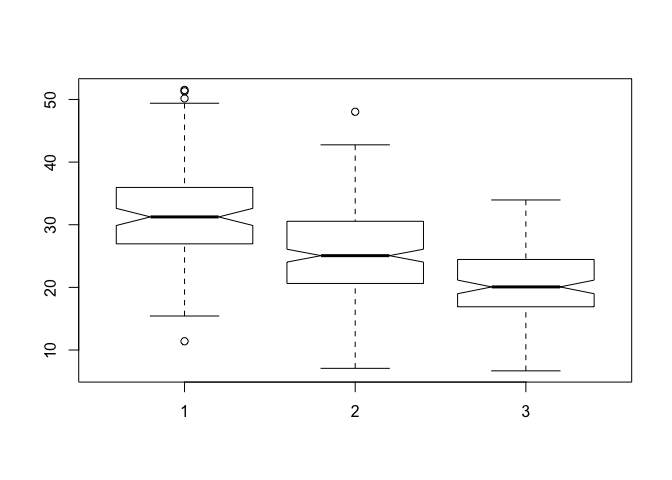

Class 13: Genome Informatics
================

``` r
# read in sample genotypes 
info <- read.csv("373531-SampleGenotypes-Homo_sapiens_Variation_Sample_rs8067378 (1).csv")

table(info$Genotype..forward.strand.)
```

    ## 
    ## A|A A|G G|A G|G 
    ##  22  21  12   9

What percentage of the population has each of the genotypes?

``` r
(table(info$Genotype..forward.strand.)/nrow(info) *100)
```

    ## 
    ##     A|A     A|G     G|A     G|G 
    ## 34.3750 32.8125 18.7500 14.0625

Read this file into R and determine the sample size for each genotype and their corresponding median expression levels for each of these genotypes.

``` r
genotypes = read.csv("rs8067378_ENSG00000172057.6.txt", sep = "")

summary(genotypes)
```

    ##      sample     geno          exp        
    ##  HG00096:  1   A/A:108   Min.   : 6.675  
    ##  HG00097:  1   A/G:233   1st Qu.:20.004  
    ##  HG00099:  1   G/G:121   Median :25.116  
    ##  HG00100:  1             Mean   :25.640  
    ##  HG00101:  1             3rd Qu.:30.779  
    ##  HG00102:  1             Max.   :51.518  
    ##  (Other):456

Create a boxplot comparing genotype to the gene expression

``` r
gg <- genotypes$exp[genotypes$geno == "G/G"]

mean(gg)
```

    ## [1] 20.59371

``` r
aa <- genotypes$exp[genotypes$geno == "A/A"]

mean(aa)
```

    ## [1] 31.81864

``` r
ag <- genotypes$exp[genotypes$geno == "A/G"]

mean(ag)
```

    ## [1] 25.3968

``` r
boxplot(aa, ag, gg, notch = TRUE)
```


