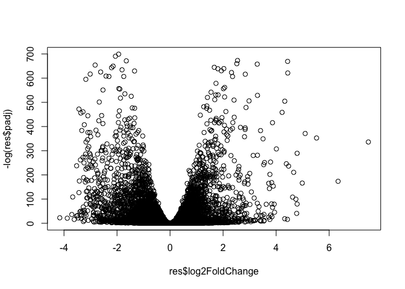
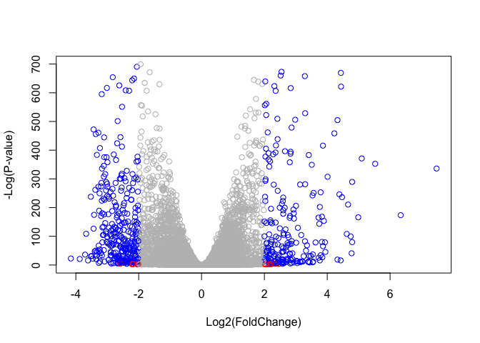

Class 15 Gene Ontology
================

Section 1: Differential Expression Analysis
===========================================

``` r
# load this package we need 

library(DESeq2)
```

    ## Loading required package: S4Vectors

    ## Loading required package: stats4

    ## Loading required package: BiocGenerics

    ## Loading required package: parallel

    ## 
    ## Attaching package: 'BiocGenerics'

    ## The following objects are masked from 'package:parallel':
    ## 
    ##     clusterApply, clusterApplyLB, clusterCall, clusterEvalQ,
    ##     clusterExport, clusterMap, parApply, parCapply, parLapply,
    ##     parLapplyLB, parRapply, parSapply, parSapplyLB

    ## The following objects are masked from 'package:stats':
    ## 
    ##     IQR, mad, sd, var, xtabs

    ## The following objects are masked from 'package:base':
    ## 
    ##     anyDuplicated, append, as.data.frame, basename, cbind,
    ##     colMeans, colnames, colSums, dirname, do.call, duplicated,
    ##     eval, evalq, Filter, Find, get, grep, grepl, intersect,
    ##     is.unsorted, lapply, lengths, Map, mapply, match, mget, order,
    ##     paste, pmax, pmax.int, pmin, pmin.int, Position, rank, rbind,
    ##     Reduce, rowMeans, rownames, rowSums, sapply, setdiff, sort,
    ##     table, tapply, union, unique, unsplit, which, which.max,
    ##     which.min

    ## 
    ## Attaching package: 'S4Vectors'

    ## The following object is masked from 'package:base':
    ## 
    ##     expand.grid

    ## Loading required package: IRanges

    ## Loading required package: GenomicRanges

    ## Loading required package: GenomeInfoDb

    ## Loading required package: SummarizedExperiment

    ## Loading required package: Biobase

    ## Welcome to Bioconductor
    ## 
    ##     Vignettes contain introductory material; view with
    ##     'browseVignettes()'. To cite Bioconductor, see
    ##     'citation("Biobase")', and for packages 'citation("pkgname")'.

    ## Loading required package: DelayedArray

    ## Loading required package: matrixStats

    ## 
    ## Attaching package: 'matrixStats'

    ## The following objects are masked from 'package:Biobase':
    ## 
    ##     anyMissing, rowMedians

    ## Loading required package: BiocParallel

    ## 
    ## Attaching package: 'DelayedArray'

    ## The following objects are masked from 'package:matrixStats':
    ## 
    ##     colMaxs, colMins, colRanges, rowMaxs, rowMins, rowRanges

    ## The following objects are masked from 'package:base':
    ## 
    ##     aperm, apply

First we read in the files

``` r
metaFile <- "GSE37704_metadata.csv"
countFile <- "GSE37704_featurecounts.csv"
```

Import metadata and view it

``` r
colData = read.csv(metaFile, row.names=1)
head(colData)
```

    ##               condition
    ## SRR493366 control_sirna
    ## SRR493367 control_sirna
    ## SRR493368 control_sirna
    ## SRR493369      hoxa1_kd
    ## SRR493370      hoxa1_kd
    ## SRR493371      hoxa1_kd

Import countdata calculated through RNA-seq

``` r
countData = read.csv(countFile, row.names=1)

#view 
head(countData)
```

    ##                 length SRR493366 SRR493367 SRR493368 SRR493369 SRR493370
    ## ENSG00000186092    918         0         0         0         0         0
    ## ENSG00000279928    718         0         0         0         0         0
    ## ENSG00000279457   1982        23        28        29        29        28
    ## ENSG00000278566    939         0         0         0         0         0
    ## ENSG00000273547    939         0         0         0         0         0
    ## ENSG00000187634   3214       124       123       205       207       212
    ##                 SRR493371
    ## ENSG00000186092         0
    ## ENSG00000279928         0
    ## ENSG00000279457        46
    ## ENSG00000278566         0
    ## ENSG00000273547         0
    ## ENSG00000187634       258

Note we need to remove the odd first length column. Then we can merge our two files by sample name

``` r
countData <- as.matrix(countData[,2:7])

#check to make sure we removed the right thing

head(countData)
```

    ##                 SRR493366 SRR493367 SRR493368 SRR493369 SRR493370
    ## ENSG00000186092         0         0         0         0         0
    ## ENSG00000279928         0         0         0         0         0
    ## ENSG00000279457        23        28        29        29        28
    ## ENSG00000278566         0         0         0         0         0
    ## ENSG00000273547         0         0         0         0         0
    ## ENSG00000187634       124       123       205       207       212
    ##                 SRR493371
    ## ENSG00000186092         0
    ## ENSG00000279928         0
    ## ENSG00000279457        46
    ## ENSG00000278566         0
    ## ENSG00000273547         0
    ## ENSG00000187634       258

In our data there are many genes where there is 0 expression across all of the samples. We want to remove these for downstream analysis.

``` r
countData[countData==0] <- NA
countData = na.omit(countData)

#check that it worked 
head(countData)
```

    ##                 SRR493366 SRR493367 SRR493368 SRR493369 SRR493370
    ## ENSG00000279457        23        28        29        29        28
    ## ENSG00000187634       124       123       205       207       212
    ## ENSG00000188976      1637      1831      2383      1226      1326
    ## ENSG00000187961       120       153       180       236       255
    ## ENSG00000187583        24        48        65        44        48
    ## ENSG00000187642         4         9        16        14        16
    ##                 SRR493371
    ## ENSG00000279457        46
    ## ENSG00000187634       258
    ## ENSG00000188976      1504
    ## ENSG00000187961       357
    ## ENSG00000187583        64
    ## ENSG00000187642        16

Running DESeq2 on our count data
================================

``` r
# feed in our countData and colData 

dds = DESeqDataSetFromMatrix(countData=countData,
                             colData=colData,
                             design=~condition)
dds = DESeq(dds)
```

    ## estimating size factors

    ## estimating dispersions

    ## gene-wise dispersion estimates

    ## mean-dispersion relationship

    ## final dispersion estimates

    ## fitting model and testing

``` r
dds
```

    ## class: DESeqDataSet 
    ## dim: 13282 6 
    ## metadata(1): version
    ## assays(4): counts mu H cooks
    ## rownames(13282): ENSG00000279457 ENSG00000187634 ...
    ##   ENSG00000276345 ENSG00000271254
    ## rowData names(22): baseMean baseVar ... deviance maxCooks
    ## colnames(6): SRR493366 SRR493367 ... SRR493370 SRR493371
    ## colData names(2): condition sizeFactor

``` r
# view our results 

res = results(dds)
```

View summary of how many genes are up or downregulated

``` r
summary(res)
```

    ## 
    ## out of 13282 with nonzero total read count
    ## adjusted p-value < 0.1
    ## LFC > 0 (up)       : 4333, 33%
    ## LFC < 0 (down)     : 4400, 33%
    ## outliers [1]       : 0, 0%
    ## low counts [2]     : 0, 0%
    ## (mean count < 1)
    ## [1] see 'cooksCutoff' argument of ?results
    ## [2] see 'independentFiltering' argument of ?results

Plotting a volcano plot
=======================

Traditional format for displaying differential expression data. We plot log2FoldChange of gene expression against adjusted p value.

``` r
plot( res$log2FoldChange, -log(res$padj) )
```



This is hard to read so we are going to add color to highlight the differentially expressed genes that we are most interested in.

``` r
# Make a color vector for all genes
mycols <- rep("gray", nrow(res) )

# Color red the genes with absolute fold change above 2
mycols[ abs(res$log2FoldChange) > 2 ] <- "red"

# Color blue those with adjusted p-value less than 0.01
#  and absolute fold change more than 2
inds <- (res$padj < .01) & (abs(res$log2FoldChange) > 2 )
mycols[ inds ] <- "blue"

plot( res$log2FoldChange, -log(res$padj), col=mycols, xlab="Log2(FoldChange)", ylab="-Log(P-value)" )
```



Adding Gene Annotations
=======================

``` r
#load these packages:

library("AnnotationDbi")
library("org.Hs.eg.db")
```

    ## 

For this part we are going to change the gene annotation from Ensembl to Entrez

``` r
# list all of the annotations available
columns(org.Hs.eg.db)
```

    ##  [1] "ACCNUM"       "ALIAS"        "ENSEMBL"      "ENSEMBLPROT" 
    ##  [5] "ENSEMBLTRANS" "ENTREZID"     "ENZYME"       "EVIDENCE"    
    ##  [9] "EVIDENCEALL"  "GENENAME"     "GO"           "GOALL"       
    ## [13] "IPI"          "MAP"          "OMIM"         "ONTOLOGY"    
    ## [17] "ONTOLOGYALL"  "PATH"         "PFAM"         "PMID"        
    ## [21] "PROSITE"      "REFSEQ"       "SYMBOL"       "UCSCKG"      
    ## [25] "UNIGENE"      "UNIPROT"

``` r
# Add symbol annotations 
res$symbol = mapIds(org.Hs.eg.db,
                    keys=row.names(res), 
                    keytype="ENSEMBL",
                    column="SYMBOL",
                    multiVals="first")
```

    ## 'select()' returned 1:many mapping between keys and columns

``` r
# Add ENTREZ annotations 
res$entrez = mapIds(org.Hs.eg.db,
                    keys=row.names(res),
                    keytype="ENSEMBL",
                    column="ENTREZID",
                    multiVals="first")
```

    ## 'select()' returned 1:many mapping between keys and columns

``` r
# Add Genename annotations
res$name =   mapIds(org.Hs.eg.db,
                    keys=row.names(res),
                    keytype="ENSEMBL",
                    column="GENENAME",
                    multiVals="first")
```

    ## 'select()' returned 1:many mapping between keys and columns

``` r
# view the res file with our new added annotations 
head(res, 10)
```

    ## log2 fold change (MLE): condition hoxa1 kd vs control sirna 
    ## Wald test p-value: condition hoxa1 kd vs control sirna 
    ## DataFrame with 10 rows and 9 columns
    ##                         baseMean     log2FoldChange              lfcSE
    ##                        <numeric>          <numeric>          <numeric>
    ## ENSG00000279457 29.9135794276176  0.180303888481417  0.312156632938218
    ## ENSG00000187634 183.229649921658    0.4258966124633  0.135530296574722
    ## ENSG00000188976 1651.18807619944      -0.6927118145 0.0549875514910791
    ## ENSG00000187961 209.637938486147  0.729959682270616  0.127761342182241
    ## ENSG00000187583 47.2551232589398 0.0392548670538831   0.26061919328335
    ## ENSG00000187642 11.9797501642461  0.539508161780775  0.500135539847362
    ## ENSG00000188290 108.922127976716   2.05628552862143  0.191071390213032
    ## ENSG00000187608  350.71686801731  0.257025132759729 0.0999768960893559
    ## ENSG00000188157   9128.439421961  0.389909640847361 0.0482213707584273
    ## ENSG00000131591 156.479083393338  0.196891799089255  0.140679994719082
    ##                              stat               pvalue
    ##                         <numeric>            <numeric>
    ## ENSG00000279457 0.577607103152932    0.563529410215546
    ## ENSG00000187634  3.14244580899658  0.00167542723665655
    ## ENSG00000188976 -12.5976115632714 2.17635468081964e-36
    ## ENSG00000187961  5.71346285036194 1.10700049011348e-08
    ## ENSG00000187583 0.150621550774292    0.880274260282847
    ## ENSG00000187642  1.07872390341512    0.280710826521724
    ## ENSG00000188290  10.7618703476685 5.21018179448534e-27
    ## ENSG00000187608  2.57084529339667    0.010145063581271
    ## ENSG00000188157  8.08582656848715 6.17439972783561e-16
    ## ENSG00000131591  1.39957212453996    0.161641486264178
    ##                                 padj      symbol      entrez
    ##                            <numeric> <character> <character>
    ## ENSG00000279457    0.647026074211868      WASH9P   102723897
    ## ENSG00000187634  0.00334029188791238      SAMD11      148398
    ## ENSG00000188976 2.35970145882828e-35       NOC2L       26155
    ## ENSG00000187961 3.69612380836783e-08      KLHL17      339451
    ## ENSG00000187583    0.910931260231926     PLEKHN1       84069
    ## ENSG00000187642    0.361174193341232       PERM1       84808
    ## ENSG00000188290  4.1788426687412e-26        HES4       57801
    ## ENSG00000187608   0.0179950233021424       ISG15        9636
    ## ENSG00000188157 3.15902839696119e-15        AGRN      375790
    ## ENSG00000131591    0.223894276833957    C1orf159       54991
    ##                                                                     name
    ##                                                              <character>
    ## ENSG00000279457                 WAS protein family homolog 9, pseudogene
    ## ENSG00000187634                 sterile alpha motif domain containing 11
    ## ENSG00000188976 NOC2 like nucleolar associated transcriptional repressor
    ## ENSG00000187961                              kelch like family member 17
    ## ENSG00000187583                 pleckstrin homology domain containing N1
    ## ENSG00000187642             PPARGC1 and ESRR induced regulator, muscle 1
    ## ENSG00000188290                   hes family bHLH transcription factor 4
    ## ENSG00000187608                            ISG15 ubiquitin-like modifier
    ## ENSG00000188157                                                    agrin
    ## ENSG00000131591                      chromosome 1 open reading frame 159

``` r
# Order the results by their adjusted p value 
res = res[order(res$pvalue),]

# Write the results of our analysis to a csv 
write.csv(res, file="deseq_results.csv")
```

Section 2: Pathway Analysis
===========================

We are going to use packages to analyse if the genes that are up and down are enriched in certain biological pathways.

Background on KEGG pathways: The gageData package has pre-compiled databases mapping genes to KEGG pathways and GO terms for common organisms. kegg.sets.hs is a named list of 229 elements. Each element is a character vector of member gene Entrez IDs for a single KEGG pathway. (See also go.sets.hs). The sigmet.idx.hs is an index of numbers of signaling and metabolic pathways in kegg.set.gs. In other words, KEGG pathway include other types of pathway definitions, like "Global Map" and "Human Diseases", which may be undesirable in a particular pathway analysis. Therefore, kegg.sets.hs\[sigmet.idx.hs\] gives you the "cleaner" gene sets of signaling and metabolic pathways only.

Install these relevant packages in the console: BiocManager::install( c("pathview", "gage", "gageData") )

``` r
# load all of the packages we will need 

library(pathview)
```

    ## ##############################################################################
    ## Pathview is an open source software package distributed under GNU General
    ## Public License version 3 (GPLv3). Details of GPLv3 is available at
    ## http://www.gnu.org/licenses/gpl-3.0.html. Particullary, users are required to
    ## formally cite the original Pathview paper (not just mention it) in publications
    ## or products. For details, do citation("pathview") within R.
    ## 
    ## The pathview downloads and uses KEGG data. Non-academic uses may require a KEGG
    ## license agreement (details at http://www.kegg.jp/kegg/legal.html).
    ## ##############################################################################

``` r
library(gage)
library(gageData)
```

``` r
# pull out the datasets we are interested in 

data(kegg.sets.hs)

data(sigmet.idx.hs)
```

``` r
# Focus on signaling and metabolic pathways only
kegg.sets.hs = kegg.sets.hs[sigmet.idx.hs]

# Examine the first 3 pathways
head(kegg.sets.hs, 3)
```

    ## $`hsa00232 Caffeine metabolism`
    ## [1] "10"   "1544" "1548" "1549" "1553" "7498" "9"   
    ## 
    ## $`hsa00983 Drug metabolism - other enzymes`
    ##  [1] "10"     "1066"   "10720"  "10941"  "151531" "1548"   "1549"  
    ##  [8] "1551"   "1553"   "1576"   "1577"   "1806"   "1807"   "1890"  
    ## [15] "221223" "2990"   "3251"   "3614"   "3615"   "3704"   "51733" 
    ## [22] "54490"  "54575"  "54576"  "54577"  "54578"  "54579"  "54600" 
    ## [29] "54657"  "54658"  "54659"  "54963"  "574537" "64816"  "7083"  
    ## [36] "7084"   "7172"   "7363"   "7364"   "7365"   "7366"   "7367"  
    ## [43] "7371"   "7372"   "7378"   "7498"   "79799"  "83549"  "8824"  
    ## [50] "8833"   "9"      "978"   
    ## 
    ## $`hsa00230 Purine metabolism`
    ##   [1] "100"    "10201"  "10606"  "10621"  "10622"  "10623"  "107"   
    ##   [8] "10714"  "108"    "10846"  "109"    "111"    "11128"  "11164" 
    ##  [15] "112"    "113"    "114"    "115"    "122481" "122622" "124583"
    ##  [22] "132"    "158"    "159"    "1633"   "171568" "1716"   "196883"
    ##  [29] "203"    "204"    "205"    "221823" "2272"   "22978"  "23649" 
    ##  [36] "246721" "25885"  "2618"   "26289"  "270"    "271"    "27115" 
    ##  [43] "272"    "2766"   "2977"   "2982"   "2983"   "2984"   "2986"  
    ##  [50] "2987"   "29922"  "3000"   "30833"  "30834"  "318"    "3251"  
    ##  [57] "353"    "3614"   "3615"   "3704"   "377841" "471"    "4830"  
    ##  [64] "4831"   "4832"   "4833"   "4860"   "4881"   "4882"   "4907"  
    ##  [71] "50484"  "50940"  "51082"  "51251"  "51292"  "5136"   "5137"  
    ##  [78] "5138"   "5139"   "5140"   "5141"   "5142"   "5143"   "5144"  
    ##  [85] "5145"   "5146"   "5147"   "5148"   "5149"   "5150"   "5151"  
    ##  [92] "5152"   "5153"   "5158"   "5167"   "5169"   "51728"  "5198"  
    ##  [99] "5236"   "5313"   "5315"   "53343"  "54107"  "5422"   "5424"  
    ## [106] "5425"   "5426"   "5427"   "5430"   "5431"   "5432"   "5433"  
    ## [113] "5434"   "5435"   "5436"   "5437"   "5438"   "5439"   "5440"  
    ## [120] "5441"   "5471"   "548644" "55276"  "5557"   "5558"   "55703" 
    ## [127] "55811"  "55821"  "5631"   "5634"   "56655"  "56953"  "56985" 
    ## [134] "57804"  "58497"  "6240"   "6241"   "64425"  "646625" "654364"
    ## [141] "661"    "7498"   "8382"   "84172"  "84265"  "84284"  "84618" 
    ## [148] "8622"   "8654"   "87178"  "8833"   "9060"   "9061"   "93034" 
    ## [155] "953"    "9533"   "954"    "955"    "956"    "957"    "9583"  
    ## [162] "9615"

The main gage() function requires a named vector of fold changes, where the names of the values are the Entrez gene IDs.

Note that we used the mapIDs() function above to obtain Entrez gene IDs (stored in res*e**n**t**r**e**z*)*a**n**d**w**e**h**a**v**e**t**h**e**f**o**l**d**c**h**a**n**g**e**r**e**s**u**l**t**s**f**r**o**m**D**E**S**e**q*2*a**n**a**l**y**s**i**s*(*s**t**o**r**e**d**i**n**r**e**s*log2FoldChange).

``` r
foldchanges = res$log2FoldChange

names(foldchanges) = res$entrez

head(foldchanges)
```

    ##      1266     54855      1465      2034      2150      6659 
    ## -2.422683  3.201858 -2.313713 -1.887999  3.344480  2.392257

Run the gage function on our foldchanges (with entrez annotations)

``` r
keggres = gage(foldchanges, gsets=kegg.sets.hs)
```

Look at our results

``` r
attributes(keggres)
```

    ## $names
    ## [1] "greater" "less"    "stats"

We want to look at the first pathways that are downregulated

``` r
head(keggres$less)
```

    ##                                       p.geomean stat.mean        p.val
    ## hsa04110 Cell cycle                3.548176e-06 -4.604234 3.548176e-06
    ## hsa03030 DNA replication           3.992330e-05 -4.191094 3.992330e-05
    ## hsa04114 Oocyte meiosis            2.332810e-04 -3.564509 2.332810e-04
    ## hsa03440 Homologous recombination  2.248158e-03 -2.967340 2.248158e-03
    ## hsa03013 RNA transport             4.162613e-03 -2.662235 4.162613e-03
    ## hsa00670 One carbon pool by folate 8.202725e-03 -2.535331 8.202725e-03
    ##                                           q.val set.size         exp1
    ## hsa04110 Cell cycle                0.0005535155      118 3.548176e-06
    ## hsa03030 DNA replication           0.0031140177       36 3.992330e-05
    ## hsa04114 Oocyte meiosis            0.0121306145       95 2.332810e-04
    ## hsa03440 Homologous recombination  0.0876781678       28 2.248158e-03
    ## hsa03013 RNA transport             0.1298735381      140 4.162613e-03
    ## hsa00670 One carbon pool by folate 0.2115248982       17 8.202725e-03

Use the pathview() function to make a pathway plot.

First manually supply a pathway.id (namely the first part of the "hsa04110 Cell cycle") that we could see in the cell above.

``` r
pathview(gene.data=foldchanges, pathway.id="hsa04110")
```

    ## 'select()' returned 1:1 mapping between keys and columns

    ## Info: Working in directory /Users/margaretburns/Documents/Classes/BIO213/Bggn213/bggn_github_sync/class15

    ## Info: Writing image file hsa04110.pathview.png

``` r
# A different PDF based output of the same data
pathview(gene.data=foldchanges, pathway.id="hsa04110", kegg.native=FALSE)
```

    ## 'select()' returned 1:1 mapping between keys and columns

    ## Info: Working in directory /Users/margaretburns/Documents/Classes/BIO213/Bggn213/bggn_github_sync/class15

    ## Info: Writing image file hsa04110.pathview.pdf

First we are going to pull out the top 4 pathways to then feed into pathview

``` r
keggrespathways <- rownames(keggres$greater)[1:5]

# Extract the 8 character long IDs part of each string
keggresids = substr(keggrespathways, start=1, stop=8)
keggresids
```

    ## [1] "hsa04142" "hsa04640" "hsa04974" "hsa00603" "hsa04380"

Pass these IDs in keggresids to the pathview() function to draw plots for all the top 5 pathways.

``` r
pathview(gene.data=foldchanges, pathway.id=keggresids, species="hsa")
```

    ## 'select()' returned 1:1 mapping between keys and columns

    ## Info: Working in directory /Users/margaretburns/Documents/Classes/BIO213/Bggn213/bggn_github_sync/class15

    ## Info: Writing image file hsa04142.pathview.png

    ## Info: some node width is different from others, and hence adjusted!

    ## 'select()' returned 1:1 mapping between keys and columns

    ## Info: Working in directory /Users/margaretburns/Documents/Classes/BIO213/Bggn213/bggn_github_sync/class15

    ## Info: Writing image file hsa04640.pathview.png

    ## 'select()' returned 1:1 mapping between keys and columns

    ## Info: Working in directory /Users/margaretburns/Documents/Classes/BIO213/Bggn213/bggn_github_sync/class15

    ## Info: Writing image file hsa04974.pathview.png

    ## Info: some node width is different from others, and hence adjusted!

    ## Warning in structure(x$children, class = "XMLNodeList"): Calling 'structure(NULL, *)' is deprecated, as NULL cannot have attributes.
    ##   Consider 'structure(list(), *)' instead.

    ## Warning in structure(x$children, class = "XMLNodeList"): Calling 'structure(NULL, *)' is deprecated, as NULL cannot have attributes.
    ##   Consider 'structure(list(), *)' instead.

    ## Warning in structure(x$children, class = "XMLNodeList"): Calling 'structure(NULL, *)' is deprecated, as NULL cannot have attributes.
    ##   Consider 'structure(list(), *)' instead.

    ## Warning in structure(x$children, class = "XMLNodeList"): Calling 'structure(NULL, *)' is deprecated, as NULL cannot have attributes.
    ##   Consider 'structure(list(), *)' instead.

    ## Warning in structure(x$children, class = "XMLNodeList"): Calling 'structure(NULL, *)' is deprecated, as NULL cannot have attributes.
    ##   Consider 'structure(list(), *)' instead.

    ## Warning in structure(x$children, class = "XMLNodeList"): Calling 'structure(NULL, *)' is deprecated, as NULL cannot have attributes.
    ##   Consider 'structure(list(), *)' instead.

    ## Warning in structure(x$children, class = "XMLNodeList"): Calling 'structure(NULL, *)' is deprecated, as NULL cannot have attributes.
    ##   Consider 'structure(list(), *)' instead.

    ## Warning in structure(x$children, class = "XMLNodeList"): Calling 'structure(NULL, *)' is deprecated, as NULL cannot have attributes.
    ##   Consider 'structure(list(), *)' instead.

    ## Warning in structure(x$children, class = "XMLNodeList"): Calling 'structure(NULL, *)' is deprecated, as NULL cannot have attributes.
    ##   Consider 'structure(list(), *)' instead.

    ## Warning in structure(x$children, class = "XMLNodeList"): Calling 'structure(NULL, *)' is deprecated, as NULL cannot have attributes.
    ##   Consider 'structure(list(), *)' instead.

    ## Warning in structure(x$children, class = "XMLNodeList"): Calling 'structure(NULL, *)' is deprecated, as NULL cannot have attributes.
    ##   Consider 'structure(list(), *)' instead.

    ## Warning in structure(x$children, class = "XMLNodeList"): Calling 'structure(NULL, *)' is deprecated, as NULL cannot have attributes.
    ##   Consider 'structure(list(), *)' instead.

    ## Warning in structure(x$children, class = "XMLNodeList"): Calling 'structure(NULL, *)' is deprecated, as NULL cannot have attributes.
    ##   Consider 'structure(list(), *)' instead.

    ## Warning in structure(x$children, class = "XMLNodeList"): Calling 'structure(NULL, *)' is deprecated, as NULL cannot have attributes.
    ##   Consider 'structure(list(), *)' instead.

    ## Warning in structure(x$children, class = "XMLNodeList"): Calling 'structure(NULL, *)' is deprecated, as NULL cannot have attributes.
    ##   Consider 'structure(list(), *)' instead.

    ## Warning in structure(x$children, class = "XMLNodeList"): Calling 'structure(NULL, *)' is deprecated, as NULL cannot have attributes.
    ##   Consider 'structure(list(), *)' instead.

    ## Warning in structure(x$children, class = "XMLNodeList"): Calling 'structure(NULL, *)' is deprecated, as NULL cannot have attributes.
    ##   Consider 'structure(list(), *)' instead.

    ## Warning in structure(x$children, class = "XMLNodeList"): Calling 'structure(NULL, *)' is deprecated, as NULL cannot have attributes.
    ##   Consider 'structure(list(), *)' instead.

    ## Warning in structure(x$children, class = "XMLNodeList"): Calling 'structure(NULL, *)' is deprecated, as NULL cannot have attributes.
    ##   Consider 'structure(list(), *)' instead.

    ## Warning in structure(x$children, class = "XMLNodeList"): Calling 'structure(NULL, *)' is deprecated, as NULL cannot have attributes.
    ##   Consider 'structure(list(), *)' instead.

    ## Warning in structure(x$children, class = "XMLNodeList"): Calling 'structure(NULL, *)' is deprecated, as NULL cannot have attributes.
    ##   Consider 'structure(list(), *)' instead.

    ## Warning in structure(x$children, class = "XMLNodeList"): Calling 'structure(NULL, *)' is deprecated, as NULL cannot have attributes.
    ##   Consider 'structure(list(), *)' instead.

    ## Warning in structure(x$children, class = "XMLNodeList"): Calling 'structure(NULL, *)' is deprecated, as NULL cannot have attributes.
    ##   Consider 'structure(list(), *)' instead.

    ## Warning in structure(x$children, class = "XMLNodeList"): Calling 'structure(NULL, *)' is deprecated, as NULL cannot have attributes.
    ##   Consider 'structure(list(), *)' instead.

    ## Warning in structure(x$children, class = "XMLNodeList"): Calling 'structure(NULL, *)' is deprecated, as NULL cannot have attributes.
    ##   Consider 'structure(list(), *)' instead.

    ## Warning in structure(x$children, class = "XMLNodeList"): Calling 'structure(NULL, *)' is deprecated, as NULL cannot have attributes.
    ##   Consider 'structure(list(), *)' instead.

    ## Warning in structure(x$children, class = "XMLNodeList"): Calling 'structure(NULL, *)' is deprecated, as NULL cannot have attributes.
    ##   Consider 'structure(list(), *)' instead.

    ## Warning in structure(x$children, class = "XMLNodeList"): Calling 'structure(NULL, *)' is deprecated, as NULL cannot have attributes.
    ##   Consider 'structure(list(), *)' instead.

    ## Warning in structure(x$children, class = "XMLNodeList"): Calling 'structure(NULL, *)' is deprecated, as NULL cannot have attributes.
    ##   Consider 'structure(list(), *)' instead.

    ## Warning in structure(x$children, class = "XMLNodeList"): Calling 'structure(NULL, *)' is deprecated, as NULL cannot have attributes.
    ##   Consider 'structure(list(), *)' instead.

    ## Warning in structure(x$children, class = "XMLNodeList"): Calling 'structure(NULL, *)' is deprecated, as NULL cannot have attributes.
    ##   Consider 'structure(list(), *)' instead.

    ## Warning in structure(x$children, class = "XMLNodeList"): Calling 'structure(NULL, *)' is deprecated, as NULL cannot have attributes.
    ##   Consider 'structure(list(), *)' instead.

    ## Warning in structure(x$children, class = "XMLNodeList"): Calling 'structure(NULL, *)' is deprecated, as NULL cannot have attributes.
    ##   Consider 'structure(list(), *)' instead.

    ## Warning in structure(x$children, class = "XMLNodeList"): Calling 'structure(NULL, *)' is deprecated, as NULL cannot have attributes.
    ##   Consider 'structure(list(), *)' instead.

    ## Warning in structure(x$children, class = "XMLNodeList"): Calling 'structure(NULL, *)' is deprecated, as NULL cannot have attributes.
    ##   Consider 'structure(list(), *)' instead.

    ## Warning in structure(x$children, class = "XMLNodeList"): Calling 'structure(NULL, *)' is deprecated, as NULL cannot have attributes.
    ##   Consider 'structure(list(), *)' instead.

    ## Warning in structure(x$children, class = "XMLNodeList"): Calling 'structure(NULL, *)' is deprecated, as NULL cannot have attributes.
    ##   Consider 'structure(list(), *)' instead.

    ## Warning in structure(x$children, class = "XMLNodeList"): Calling 'structure(NULL, *)' is deprecated, as NULL cannot have attributes.
    ##   Consider 'structure(list(), *)' instead.

    ## Warning in structure(x$children, class = "XMLNodeList"): Calling 'structure(NULL, *)' is deprecated, as NULL cannot have attributes.
    ##   Consider 'structure(list(), *)' instead.

    ## Warning in structure(x$children, class = "XMLNodeList"): Calling 'structure(NULL, *)' is deprecated, as NULL cannot have attributes.
    ##   Consider 'structure(list(), *)' instead.

    ## Warning in structure(x$children, class = "XMLNodeList"): Calling 'structure(NULL, *)' is deprecated, as NULL cannot have attributes.
    ##   Consider 'structure(list(), *)' instead.

    ## Warning in structure(x$children, class = "XMLNodeList"): Calling 'structure(NULL, *)' is deprecated, as NULL cannot have attributes.
    ##   Consider 'structure(list(), *)' instead.

    ## Warning in structure(x$children, class = "XMLNodeList"): Calling 'structure(NULL, *)' is deprecated, as NULL cannot have attributes.
    ##   Consider 'structure(list(), *)' instead.

    ## Warning in structure(x$children, class = "XMLNodeList"): Calling 'structure(NULL, *)' is deprecated, as NULL cannot have attributes.
    ##   Consider 'structure(list(), *)' instead.

    ## Warning in structure(x$children, class = "XMLNodeList"): Calling 'structure(NULL, *)' is deprecated, as NULL cannot have attributes.
    ##   Consider 'structure(list(), *)' instead.

    ## Warning in structure(x$children, class = "XMLNodeList"): Calling 'structure(NULL, *)' is deprecated, as NULL cannot have attributes.
    ##   Consider 'structure(list(), *)' instead.

    ## Warning in structure(x$children, class = "XMLNodeList"): Calling 'structure(NULL, *)' is deprecated, as NULL cannot have attributes.
    ##   Consider 'structure(list(), *)' instead.

    ## Warning in structure(x$children, class = "XMLNodeList"): Calling 'structure(NULL, *)' is deprecated, as NULL cannot have attributes.
    ##   Consider 'structure(list(), *)' instead.

    ## Warning in structure(x$children, class = "XMLNodeList"): Calling 'structure(NULL, *)' is deprecated, as NULL cannot have attributes.
    ##   Consider 'structure(list(), *)' instead.

    ## Warning in structure(x$children, class = "XMLNodeList"): Calling 'structure(NULL, *)' is deprecated, as NULL cannot have attributes.
    ##   Consider 'structure(list(), *)' instead.

    ## Warning in structure(x$children, class = "XMLNodeList"): Calling 'structure(NULL, *)' is deprecated, as NULL cannot have attributes.
    ##   Consider 'structure(list(), *)' instead.

    ## Warning in structure(x$children, class = "XMLNodeList"): Calling 'structure(NULL, *)' is deprecated, as NULL cannot have attributes.
    ##   Consider 'structure(list(), *)' instead.

    ## Warning in structure(x$children, class = "XMLNodeList"): Calling 'structure(NULL, *)' is deprecated, as NULL cannot have attributes.
    ##   Consider 'structure(list(), *)' instead.

    ## Warning in structure(x$children, class = "XMLNodeList"): Calling 'structure(NULL, *)' is deprecated, as NULL cannot have attributes.
    ##   Consider 'structure(list(), *)' instead.

    ## Warning in structure(x$children, class = "XMLNodeList"): Calling 'structure(NULL, *)' is deprecated, as NULL cannot have attributes.
    ##   Consider 'structure(list(), *)' instead.

    ## Warning in structure(x$children, class = "XMLNodeList"): Calling 'structure(NULL, *)' is deprecated, as NULL cannot have attributes.
    ##   Consider 'structure(list(), *)' instead.

    ## 'select()' returned 1:1 mapping between keys and columns

    ## Info: Working in directory /Users/margaretburns/Documents/Classes/BIO213/Bggn213/bggn_github_sync/class15

    ## Info: Writing image file hsa00603.pathview.png

    ## 'select()' returned 1:1 mapping between keys and columns

    ## Info: Working in directory /Users/margaretburns/Documents/Classes/BIO213/Bggn213/bggn_github_sync/class15

    ## Info: Writing image file hsa04380.pathview.png

Gene Ontology
=============

We can also do a similar procedure with gene ontology.

``` r
data(go.sets.hs)
data(go.subs.hs)

# Focus on Biological Process subset of GO
gobpsets = go.sets.hs[go.subs.hs$BP]

gobpres = gage(foldchanges, gsets=gobpsets, same.dir=TRUE)

lapply(gobpres, head)
```

    ## $greater
    ##                                                         p.geomean
    ## GO:0007156 homophilic cell adhesion                  7.523307e-05
    ## GO:0016339 calcium-dependent cell-cell adhesion      8.556504e-04
    ## GO:0010817 regulation of hormone levels              1.058523e-03
    ## GO:0048729 tissue morphogenesis                      1.389102e-03
    ## GO:0008285 negative regulation of cell proliferation 1.654959e-03
    ## GO:0051047 positive regulation of secretion          1.877703e-03
    ##                                                      stat.mean
    ## GO:0007156 homophilic cell adhesion                   3.873939
    ## GO:0016339 calcium-dependent cell-cell adhesion       3.340855
    ## GO:0010817 regulation of hormone levels               3.091986
    ## GO:0048729 tissue morphogenesis                       3.002504
    ## GO:0008285 negative regulation of cell proliferation  2.947174
    ## GO:0051047 positive regulation of secretion           2.927781
    ##                                                             p.val
    ## GO:0007156 homophilic cell adhesion                  7.523307e-05
    ## GO:0016339 calcium-dependent cell-cell adhesion      8.556504e-04
    ## GO:0010817 regulation of hormone levels              1.058523e-03
    ## GO:0048729 tissue morphogenesis                      1.389102e-03
    ## GO:0008285 negative regulation of cell proliferation 1.654959e-03
    ## GO:0051047 positive regulation of secretion          1.877703e-03
    ##                                                          q.val set.size
    ## GO:0007156 homophilic cell adhesion                  0.2797918       90
    ## GO:0016339 calcium-dependent cell-cell adhesion      0.5735674       24
    ## GO:0010817 regulation of hormone levels              0.5735674      225
    ## GO:0048729 tissue morphogenesis                      0.5735674      347
    ## GO:0008285 negative regulation of cell proliferation 0.5735674      387
    ## GO:0051047 positive regulation of secretion          0.5735674      130
    ##                                                              exp1
    ## GO:0007156 homophilic cell adhesion                  7.523307e-05
    ## GO:0016339 calcium-dependent cell-cell adhesion      8.556504e-04
    ## GO:0010817 regulation of hormone levels              1.058523e-03
    ## GO:0048729 tissue morphogenesis                      1.389102e-03
    ## GO:0008285 negative regulation of cell proliferation 1.654959e-03
    ## GO:0051047 positive regulation of secretion          1.877703e-03
    ## 
    ## $less
    ##                                             p.geomean stat.mean
    ## GO:0000279 M phase                       7.003506e-18 -8.728607
    ## GO:0048285 organelle fission             2.005870e-16 -8.358218
    ## GO:0000280 nuclear division              2.879485e-16 -8.327962
    ## GO:0007067 mitosis                       2.879485e-16 -8.327962
    ## GO:0000087 M phase of mitotic cell cycle 1.009178e-15 -8.154879
    ## GO:0007059 chromosome segregation        2.502912e-12 -7.264756
    ##                                                 p.val        q.val
    ## GO:0000279 M phase                       7.003506e-18 2.604604e-14
    ## GO:0048285 organelle fission             2.005870e-16 2.677201e-13
    ## GO:0000280 nuclear division              2.879485e-16 2.677201e-13
    ## GO:0007067 mitosis                       2.879485e-16 2.677201e-13
    ## GO:0000087 M phase of mitotic cell cycle 1.009178e-15 7.506267e-13
    ## GO:0007059 chromosome segregation        2.502912e-12 1.551388e-09
    ##                                          set.size         exp1
    ## GO:0000279 M phase                            467 7.003506e-18
    ## GO:0048285 organelle fission                  360 2.005870e-16
    ## GO:0000280 nuclear division                   338 2.879485e-16
    ## GO:0007067 mitosis                            338 2.879485e-16
    ## GO:0000087 M phase of mitotic cell cycle      348 1.009178e-15
    ## GO:0007059 chromosome segregation             135 2.502912e-12
    ## 
    ## $stats
    ##                                                      stat.mean     exp1
    ## GO:0007156 homophilic cell adhesion                   3.873939 3.873939
    ## GO:0016339 calcium-dependent cell-cell adhesion       3.340855 3.340855
    ## GO:0010817 regulation of hormone levels               3.091986 3.091986
    ## GO:0048729 tissue morphogenesis                       3.002504 3.002504
    ## GO:0008285 negative regulation of cell proliferation  2.947174 2.947174
    ## GO:0051047 positive regulation of secretion           2.927781 2.927781

Reactome Analysis
=================

Reactome is a database consisting of biological molecules and their relation to pathways and processes. Reactome has an R package available (<https://bioconductor.org/packages/release/bioc/html/ReactomePA.html>).

Using R, output the list of significant genes from our res file from DESeq2 at the 0.05 level as a plain text file:

``` r
sig_genes <- res[res$padj <= 0.05 & !is.na(res$padj), "symbol"]
print(paste("Total number of significant genes:", length(sig_genes)))
```

    ## [1] "Total number of significant genes: 8186"

``` r
write.table(sig_genes, file="significant_genes.txt", row.names=FALSE, col.names=FALSE, quote=FALSE)
```

Then, to perform pathway analysis online go to the Reactome website (<https://reactome.org/PathwayBrowser/#TOOL=AT>). Select “choose file” to upload your significant gene list. Then, select the parameters “Project to Humans”, then click “Analyze”.

Q: What pathway has the most significant “Entities p-value”?

Endosomal/vacuolar pathway

``` r
sessionInfo()
```

    ## R version 3.5.2 (2018-12-20)
    ## Platform: x86_64-apple-darwin15.6.0 (64-bit)
    ## Running under: macOS High Sierra 10.13.4
    ## 
    ## Matrix products: default
    ## BLAS: /Library/Frameworks/R.framework/Versions/3.5/Resources/lib/libRblas.0.dylib
    ## LAPACK: /Library/Frameworks/R.framework/Versions/3.5/Resources/lib/libRlapack.dylib
    ## 
    ## locale:
    ## [1] en_US.UTF-8/en_US.UTF-8/en_US.UTF-8/C/en_US.UTF-8/en_US.UTF-8
    ## 
    ## attached base packages:
    ## [1] parallel  stats4    stats     graphics  grDevices utils     datasets 
    ## [8] methods   base     
    ## 
    ## other attached packages:
    ##  [1] gageData_2.20.0             gage_2.32.1                
    ##  [3] pathview_1.22.3             org.Hs.eg.db_3.7.0         
    ##  [5] AnnotationDbi_1.44.0        DESeq2_1.20.0              
    ##  [7] SummarizedExperiment_1.10.1 DelayedArray_0.6.6         
    ##  [9] BiocParallel_1.14.2         matrixStats_0.54.0         
    ## [11] Biobase_2.40.0              GenomicRanges_1.32.7       
    ## [13] GenomeInfoDb_1.16.0         IRanges_2.14.12            
    ## [15] S4Vectors_0.18.3            BiocGenerics_0.26.0        
    ## 
    ## loaded via a namespace (and not attached):
    ##  [1] httr_1.4.0             bit64_0.9-7            splines_3.5.2         
    ##  [4] Formula_1.2-3          assertthat_0.2.1       latticeExtra_0.6-28   
    ##  [7] blob_1.1.1             GenomeInfoDbData_1.1.0 yaml_2.2.0            
    ## [10] pillar_1.3.1           RSQLite_2.1.1          backports_1.1.4       
    ## [13] lattice_0.20-38        glue_1.3.1             digest_0.6.18         
    ## [16] RColorBrewer_1.1-2     XVector_0.20.0         checkmate_1.9.3       
    ## [19] colorspace_1.4-1       htmltools_0.3.6        Matrix_1.2-17         
    ## [22] plyr_1.8.4             XML_3.98-1.19          pkgconfig_2.0.2       
    ## [25] genefilter_1.62.0      zlibbioc_1.26.0        purrr_0.3.2           
    ## [28] xtable_1.8-4           scales_1.0.0           htmlTable_1.13.1      
    ## [31] tibble_2.1.1           annotate_1.58.0        KEGGREST_1.22.0       
    ## [34] ggplot2_3.1.1          nnet_7.3-12            lazyeval_0.2.2        
    ## [37] survival_2.44-1.1      magrittr_1.5           crayon_1.3.4          
    ## [40] KEGGgraph_1.42.0       memoise_1.1.0          evaluate_0.13         
    ## [43] foreign_0.8-71         graph_1.60.0           tools_3.5.2           
    ## [46] data.table_1.12.2      stringr_1.4.0          locfit_1.5-9.1        
    ## [49] munsell_0.5.0          cluster_2.0.8          Biostrings_2.50.2     
    ## [52] compiler_3.5.2         rlang_0.3.4            grid_3.5.2            
    ## [55] RCurl_1.95-4.12        rstudioapi_0.10        htmlwidgets_1.3       
    ## [58] bitops_1.0-6           base64enc_0.1-3        rmarkdown_1.12        
    ## [61] gtable_0.3.0           DBI_1.0.0              R6_2.4.0              
    ## [64] gridExtra_2.3          knitr_1.22             dplyr_0.8.0.1         
    ## [67] bit_1.1-14             Hmisc_4.2-0            Rgraphviz_2.26.0      
    ## [70] stringi_1.4.3          Rcpp_1.0.1             png_0.1-7             
    ## [73] geneplotter_1.58.0     rpart_4.1-15           acepack_1.4.1         
    ## [76] tidyselect_0.2.5       xfun_0.6
