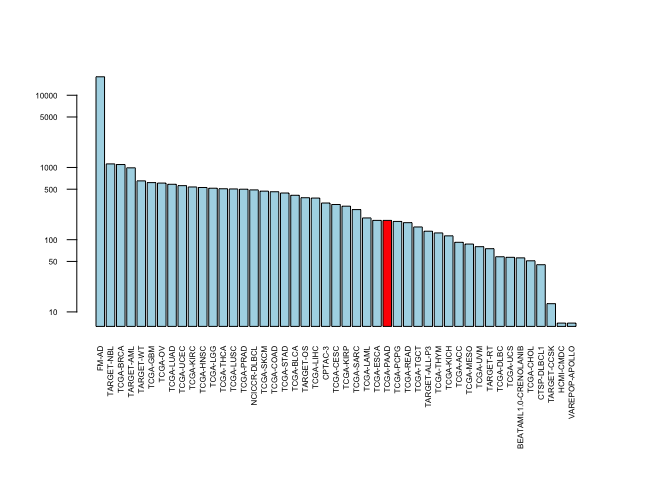
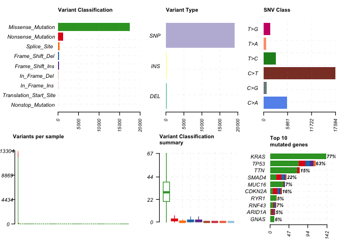
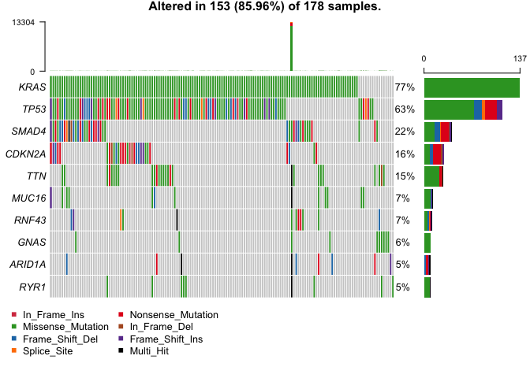
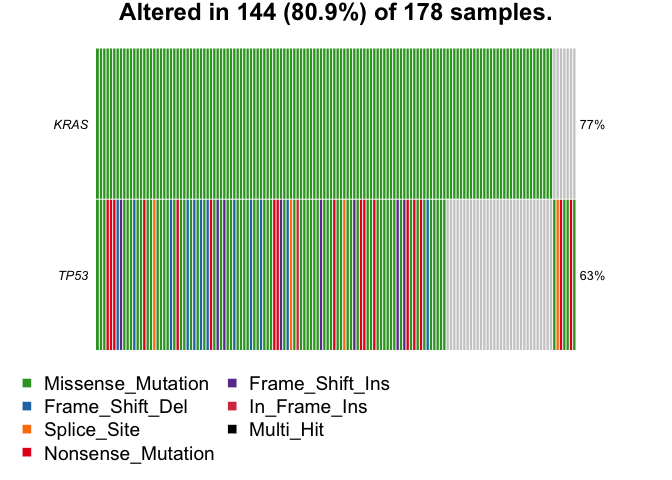
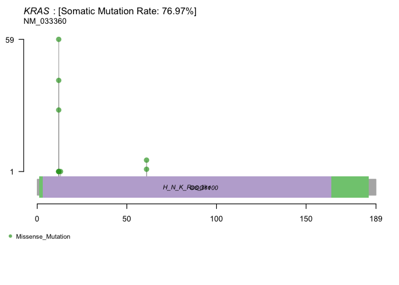
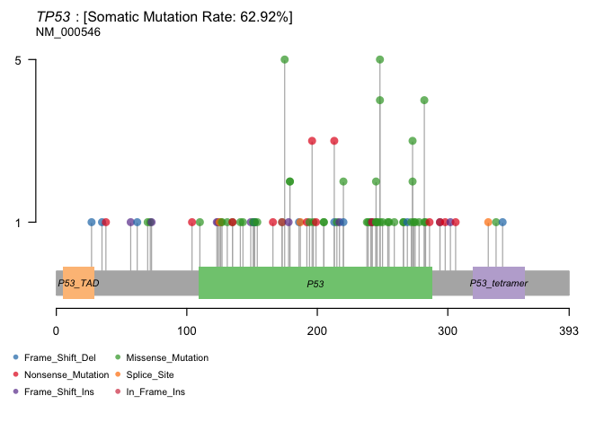

Class 18: Cancer Genomics
================

Part 1: NCI- Genomic Data Commons
=================================

In this exercise we explored the NCI- Genomic Data Commons and saw how we can access information by different mutations or different cancer types.

An R packages exists for the Genomic Data Commons to pull from and analyze cancer datasets.

These packages need to first be downloaded then loaded into Rstudio.

``` r
library(GenomicDataCommons)
```

    ## Loading required package: magrittr

    ## 
    ## Attaching package: 'GenomicDataCommons'

    ## The following object is masked from 'package:stats':
    ## 
    ##     filter

``` r
library(TCGAbiolinks)
```

    ## Warning: package 'TCGAbiolinks' was built under R version 3.5.3

``` r
library(maftools)
```

    ## Warning: package 'maftools' was built under R version 3.6.0

Check the status to make sure it is working.

``` r
status()
```

    ## $commit
    ## [1] "3e22a4257d5079ae9f7193950b51ed9dfc561ed1"
    ## 
    ## $data_release
    ## [1] "Data Release 17.0 - June 05, 2019"
    ## 
    ## $status
    ## [1] "OK"
    ## 
    ## $tag
    ## [1] "1.21.0"
    ## 
    ## $version
    ## [1] 1

Querying the GDC from R
=======================

We will typically start our interaction with the GDC by searching the resource to find data that we are interested in investigating further. The are four main sets of metadata that we can query, namely projects(), cases(), files(), and annotations(). We will start with projects()

``` r
# here's how to get projects
projects <- getGDCprojects()

# what do we have to choose from
head(projects)
```

    ##   dbgap_accession_number
    ## 1              phs001287
    ## 2              phs001374
    ## 3              phs001628
    ## 4              phs000466
    ## 5              phs000467
    ## 6              phs001179
    ##                                                                                                                                                                                                                                                                                                                                                                                                                                                                                                                                                                                                                                 disease_type
    ## 1                                                                                                                                                                                                                                                                                                                                                                                                                                                                                                                                                                                                               Adenomas and Adenocarcinomas
    ## 2                                                                                                                                                                                                                                                                                                                                                                                                                                                                                                                                                                                         Epithelial Neoplasms, NOS, Squamous Cell Neoplasms
    ## 3                                                                                                                                                                                                                                                                                                                                                                                                                                                                                                                                                                                                                          Myeloid Leukemias
    ## 4                                                                                                                                                                                                                                                                                                                                                                                                                                                                                                                                                                                                           Clear Cell Sarcoma of the Kidney
    ## 5                                                                                                                                                                                                                                                                                                                                                                                                                                                                                                                                                                                                                              Neuroblastoma
    ## 6 Germ Cell Neoplasms, Acinar Cell Neoplasms, Miscellaneous Tumors, Thymic Epithelial Neoplasms, Gliomas, Basal Cell Neoplasms, Neuroepitheliomatous Neoplasms, Ductal and Lobular Neoplasms, Complex Mixed and Stromal Neoplasms, Complex Epithelial Neoplasms, Adnexal and Skin Appendage Neoplasms, Mesothelial Neoplasms, Mucoepidermoid Neoplasms, Not Reported, Specialized Gonadal Neoplasms, Cystic, Mucinous and Serous Neoplasms, Adenomas and Adenocarcinomas, Epithelial Neoplasms, NOS, Squamous Cell Neoplasms, Transitional Cell Papillomas and Carcinomas, Paragangliomas and Glomus Tumors, Nevi and Melanomas, Meningiomas
    ##   releasable released state
    ## 1      FALSE     TRUE  open
    ## 2      FALSE     TRUE  open
    ## 3      FALSE     TRUE  open
    ## 4       TRUE     TRUE  open
    ## 5       TRUE     TRUE  open
    ## 6      FALSE     TRUE  open
    ##                                                                                                                                                                                                                                                                                                                                                                                                                                                                                                                                                                                                                                                                                                                                                                                                                                                               primary_site
    ## 1                                                                                                                                                                                                                                                                                                                                                                                                                                                                                                                                                                                                                                                                                                                                                                                                                                   Kidney, Bronchus and lung, Uterus, NOS
    ## 2                                                                                                                                                                                                                                                                                                                                                                                                                                                                                                                                                                                                                                                                                                                                                                                                                                                        Bronchus and lung
    ## 3                                                                                                                                                                                                                                                                                                                                                                                                                                                                                                                                                                                                                                                                                                                                                                                                                            Hematopoietic and reticuloendothelial systems
    ## 4                                                                                                                                                                                                                                                                                                                                                                                                                                                                                                                                                                                                                                                                                                                                                                                                                                                                   Kidney
    ## 5                                                                                                                                                                                                                                                                                                                                                                                                                                                                                                                                                                                                                                                                                                                                                                                                                                                           Nervous System
    ## 6 Testis, Gallbladder, Unknown, Other and unspecified parts of biliary tract, Adrenal gland, Thyroid gland, Spinal cord, cranial nerves, and other parts of central nervous system, Peripheral nerves and autonomic nervous system, Stomach, Cervix uteri, Bladder, Small intestine, Breast, Prostate gland, Other and unspecified female genital organs, Other and unspecified major salivary glands, Rectum, Retroperitoneum and peritoneum, Pancreas, Heart, mediastinum, and pleura, Bronchus and lung, Liver and intrahepatic bile ducts, Other and ill-defined sites, Thymus, Penis, Nasopharynx, Ovary, Uterus, NOS, Vulva, Anus and anal canal, Other and unspecified urinary organs, Trachea, Ureter, Other endocrine glands and related structures, Not Reported, Colon, Kidney, Vagina, Skin, Esophagus, Eye and adnexa, Other and ill-defined digestive organs
    ##              project_id                    id
    ## 1               CPTAC-3               CPTAC-3
    ## 2        VAREPOP-APOLLO        VAREPOP-APOLLO
    ## 3 BEATAML1.0-CRENOLANIB BEATAML1.0-CRENOLANIB
    ## 4           TARGET-CCSK           TARGET-CCSK
    ## 5            TARGET-NBL            TARGET-NBL
    ## 6                 FM-AD                 FM-AD
    ##                                                                                              name
    ## 1                                                                                                
    ## 2                                                          VA Research Precision Oncology Program
    ## 3 Clinical Resistance to Crenolanib in Acute Myeloid Leukemia Due to Diverse Molecular Mechanisms
    ## 4                                                                Clear Cell Sarcoma of the Kidney
    ## 5                                                                                   Neuroblastoma
    ## 6                                       Foundation Medicine Adult Cancer Clinical Dataset (FM-AD)
    ##        tumor
    ## 1          3
    ## 2     APOLLO
    ## 3 CRENOLANIB
    ## 4       CCSK
    ## 5        NBL
    ## 6         AD

Moving onto cases() we can use an example from the package associated publication to answer our first from question above (i.e. find the number of cases/patients across different projects within the GDC):

``` r
# we can calculate the stats for how many patients each project has so we can choose which we are most interested in
cases_by_project <- cases() %>%
  facet("project.project_id") %>%
  aggregations()

# check the values we calculated
head(cases_by_project)
```

    ## $project.project_id
    ##                      key doc_count
    ## 1                  FM-AD     18004
    ## 2             TARGET-NBL      1120
    ## 3              TCGA-BRCA      1098
    ## 4             TARGET-AML       988
    ## 5              TARGET-WT       652
    ## 6               TCGA-GBM       617
    ## 7                TCGA-OV       608
    ## 8              TCGA-LUAD       585
    ## 9              TCGA-UCEC       560
    ## 10             TCGA-KIRC       537
    ## 11             TCGA-HNSC       528
    ## 12              TCGA-LGG       516
    ## 13             TCGA-THCA       507
    ## 14             TCGA-LUSC       504
    ## 15             TCGA-PRAD       500
    ## 16          NCICCR-DLBCL       489
    ## 17             TCGA-SKCM       470
    ## 18             TCGA-COAD       461
    ## 19             TCGA-STAD       443
    ## 20             TCGA-BLCA       412
    ## 21             TARGET-OS       381
    ## 22             TCGA-LIHC       377
    ## 23               CPTAC-3       322
    ## 24             TCGA-CESC       307
    ## 25             TCGA-KIRP       291
    ## 26             TCGA-SARC       261
    ## 27             TCGA-LAML       200
    ## 28             TCGA-ESCA       185
    ## 29             TCGA-PAAD       185
    ## 30             TCGA-PCPG       179
    ## 31             TCGA-READ       172
    ## 32             TCGA-TGCT       150
    ## 33         TARGET-ALL-P3       131
    ## 34             TCGA-THYM       124
    ## 35             TCGA-KICH       113
    ## 36              TCGA-ACC        92
    ## 37             TCGA-MESO        87
    ## 38              TCGA-UVM        80
    ## 39             TARGET-RT        75
    ## 40             TCGA-DLBC        58
    ## 41              TCGA-UCS        57
    ## 42 BEATAML1.0-CRENOLANIB        56
    ## 43             TCGA-CHOL        51
    ## 44           CTSP-DLBCL1        45
    ## 45           TARGET-CCSK        13
    ## 46             HCMI-CMDC         7
    ## 47        VAREPOP-APOLLO         7

Q9. Write the R code to make a barplot of the cases per project. Lets plot this data with a log scale for the y axis (log="y"), rotated axis labels (las=2) and color the bar coresponding to the TCGA-PAAD project.

``` r
x <- cases_by_project$project.project_id

# Make a custom color vector for our plot
# Highlight the "TCGA=PAAD" project in red 
colvec <- rep("lightblue", nrow(x))
colvec[x$key == "TCGA-PAAD"] <- "red"

# Plot with 'log' for y axis and rotate labels with 'las'
par(mar=c(8,4,4,4))
barplot(x$doc_count, names.arg=x$key, log="y", col=colvec, las=2, cex.names = .5, cex.axis = .5)
```



We can use the getSampleFilesSummary() function to determine for a given project how many cases and what type of data we have available for each case:

``` r
samp <- getSampleFilesSummary("TCGA-PAAD")
```

    ## Accessing information for project: TCGA-PAAD

    ## Using 'state_comment' as value column. Use 'value.var' to override

    ## Aggregation function missing: defaulting to length

``` r
head(samp)
```

    ##            .id Biospecimen_Biospecimen Supplement
    ## 1 TCGA-2J-AAB1                                 14
    ## 2 TCGA-2J-AAB4                                 14
    ## 3 TCGA-2J-AAB6                                 14
    ## 4 TCGA-2J-AAB8                                 14
    ## 5 TCGA-2J-AAB9                                 14
    ## 6 TCGA-2J-AABA                                 14
    ##   Biospecimen_Slide Image_Diagnostic Slide
    ## 1                                        1
    ## 2                                        1
    ## 3                                        1
    ## 4                                        1
    ## 5                                        1
    ## 6                                        1
    ##   Biospecimen_Slide Image_Tissue Slide Clinical_Clinical Supplement
    ## 1                                    1                            8
    ## 2                                    1                            8
    ## 3                                    1                            8
    ## 4                                    1                            8
    ## 5                                    1                            8
    ## 6                                    1                            8
    ##   Copy Number Variation_Copy Number Segment_Genotyping Array_Affymetrix SNP 6.0
    ## 1                                                                             2
    ## 2                                                                             2
    ## 3                                                                             2
    ## 4                                                                             2
    ## 5                                                                             2
    ## 6                                                                             2
    ##   Copy Number Variation_Gene Level Copy Number Scores_Genotyping Array_Affymetrix SNP 6.0
    ## 1                                                                                       1
    ## 2                                                                                       1
    ## 3                                                                                       1
    ## 4                                                                                       1
    ## 5                                                                                       1
    ## 6                                                                                       1
    ##   Copy Number Variation_Masked Copy Number Segment_Genotyping Array_Affymetrix SNP 6.0
    ## 1                                                                                    2
    ## 2                                                                                    2
    ## 3                                                                                    2
    ## 4                                                                                    2
    ## 5                                                                                    2
    ## 6                                                                                    2
    ##   DNA Methylation_Methylation Beta Value_Methylation Array_Illumina Human Methylation 450
    ## 1                                                                                       1
    ## 2                                                                                       1
    ## 3                                                                                       1
    ## 4                                                                                       1
    ## 5                                                                                       1
    ## 6                                                                                       1
    ##   Sequencing Reads_Aligned Reads_miRNA-Seq_Illumina
    ## 1                                                 1
    ## 2                                                 1
    ## 3                                                 1
    ## 4                                                 1
    ## 5                                                 1
    ## 6                                                 1
    ##   Sequencing Reads_Aligned Reads_RNA-Seq_Illumina
    ## 1                                               1
    ## 2                                               1
    ## 3                                               1
    ## 4                                               1
    ## 5                                               1
    ## 6                                               1
    ##   Sequencing Reads_Aligned Reads_WXS_Illumina
    ## 1                                           2
    ## 2                                           2
    ## 3                                           2
    ## 4                                           2
    ## 5                                           2
    ## 6                                           2
    ##   Simple Nucleotide Variation_Aggregated Somatic Mutation_WXS
    ## 1                                                           4
    ## 2                                                           4
    ## 3                                                           4
    ## 4                                                           4
    ## 5                                                           4
    ## 6                                                           4
    ##   Simple Nucleotide Variation_Annotated Somatic Mutation_WXS
    ## 1                                                          4
    ## 2                                                          4
    ## 3                                                          4
    ## 4                                                          4
    ## 5                                                          4
    ## 6                                                          4
    ##   Simple Nucleotide Variation_Masked Somatic Mutation_WXS
    ## 1                                                       4
    ## 2                                                       4
    ## 3                                                       4
    ## 4                                                       4
    ## 5                                                       4
    ## 6                                                       4
    ##   Simple Nucleotide Variation_Raw Simple Somatic Mutation_WXS
    ## 1                                                           4
    ## 2                                                           4
    ## 3                                                           4
    ## 4                                                           4
    ## 5                                                           4
    ## 6                                                           4
    ##   Transcriptome Profiling_Gene Expression Quantification_RNA-Seq
    ## 1                                                              3
    ## 2                                                              3
    ## 3                                                              3
    ## 4                                                              3
    ## 5                                                              3
    ## 6                                                              3
    ##   Transcriptome Profiling_Isoform Expression Quantification_miRNA-Seq
    ## 1                                                                   1
    ## 2                                                                   1
    ## 3                                                                   1
    ## 4                                                                   1
    ## 5                                                                   1
    ## 6                                                                   1
    ##   Transcriptome Profiling_miRNA Expression Quantification_miRNA-Seq
    ## 1                                                                 1
    ## 2                                                                 1
    ## 3                                                                 1
    ## 4                                                                 1
    ## 5                                                                 1
    ## 6                                                                 1
    ##     project
    ## 1 TCGA-PAAD
    ## 2 TCGA-PAAD
    ## 3 TCGA-PAAD
    ## 4 TCGA-PAAD
    ## 5 TCGA-PAAD
    ## 6 TCGA-PAAD

Now we can use GDCquery() function to focus in on a particular data type that we are interested in. For example, to answer our second question from above - namely ‘find all gene expression data files for all pancreatic cancer patients’:

``` r
query <- GDCquery(project="TCGA-PAAD",
                  data.category="Transcriptome Profiling",
                  data.type="Gene Expression Quantification")
```

    ## --------------------------------------

    ## o GDCquery: Searching in GDC database

    ## --------------------------------------

    ## Genome of reference: hg38

    ## --------------------------------------------

    ## oo Accessing GDC. This might take a while...

    ## --------------------------------------------

    ## ooo Project: TCGA-PAAD

    ## --------------------

    ## oo Filtering results

    ## --------------------

    ## ooo By data.type

    ## ----------------

    ## oo Checking data

    ## ----------------

    ## ooo Check if there are duplicated cases

    ## Warning: There are more than one file for the same case. Please verify query results. You can use the command View(getResults(query)) in rstudio

    ## ooo Check if there results for the query

    ## -------------------

    ## o Preparing output

    ## -------------------

``` r
ans <- getResults(query)
```

``` r
# what are our answers
head(ans)
```

    ##   data_release                      data_type
    ## 1  12.0 - 17.0 Gene Expression Quantification
    ## 2  12.0 - 17.0 Gene Expression Quantification
    ## 3  12.0 - 17.0 Gene Expression Quantification
    ## 4  12.0 - 17.0 Gene Expression Quantification
    ## 5  12.0 - 17.0 Gene Expression Quantification
    ## 6  12.0 - 17.0 Gene Expression Quantification
    ##                   updated_datetime
    ## 1 2019-05-23T23:18:56.468363+00:00
    ## 2 2019-05-23T23:18:56.468363+00:00
    ## 3 2019-05-23T23:18:56.468363+00:00
    ## 4 2019-05-23T23:18:56.468363+00:00
    ## 5 2019-05-23T23:18:56.468363+00:00
    ## 6 2019-05-23T23:18:56.468363+00:00
    ##                                              file_name
    ## 1  4df16e07-cdbc-46cc-8b9c-39d4a9dca09e.FPKM-UQ.txt.gz
    ## 2 1f997074-0020-47e6-9928-5bf7209c552d.htseq.counts.gz
    ## 3 cc133a8a-77ad-4570-852e-df72548c6897.htseq.counts.gz
    ## 4  e7cc80ef-4b87-47d9-bebe-1fb05b5b04a2.FPKM-UQ.txt.gz
    ## 5 232f085b-6201-4e4d-8473-e592b8d8e16d.htseq.counts.gz
    ## 6     a155ec07-2baf-404b-85bc-28330a8fee33.FPKM.txt.gz
    ##                                  submitter_id
    ## 1 4df16e07-cdbc-46cc-8b9c-39d4a9dca09e_uqfpkm
    ## 2  1f997074-0020-47e6-9928-5bf7209c552d_count
    ## 3  cc133a8a-77ad-4570-852e-df72548c6897_count
    ## 4 e7cc80ef-4b87-47d9-bebe-1fb05b5b04a2_uqfpkm
    ## 5  232f085b-6201-4e4d-8473-e592b8d8e16d_count
    ## 6   a155ec07-2baf-404b-85bc-28330a8fee33_fpkm
    ##                                file_id file_size
    ## 1 4ac5c2da-497f-4fb4-80db-c7e774c1873a    526515
    ## 2 78bb8d49-54aa-43a1-aec4-31da818cdb14    250443
    ## 3 82d7d3b5-85bc-46b9-b9cd-2bdeb279dc0f    255221
    ## 4 3cbf3948-3ac4-4824-9b6f-6efcf13066b5    556107
    ## 5 13dfd8da-5d36-48fa-a82c-77b5c5e77e7b    252815
    ## 6 c6a9b770-845a-4a10-ac02-28928def043c    504140
    ##                          cases                                   id
    ## 1 TCGA-YY-A8LH-01A-11R-A36G-07 4ac5c2da-497f-4fb4-80db-c7e774c1873a
    ## 2 TCGA-H6-A45N-01A-11R-A26U-07 78bb8d49-54aa-43a1-aec4-31da818cdb14
    ## 3 TCGA-RB-AA9M-01A-11R-A39D-07 82d7d3b5-85bc-46b9-b9cd-2bdeb279dc0f
    ## 4 TCGA-HZ-8637-01A-11R-2404-07 3cbf3948-3ac4-4824-9b6f-6efcf13066b5
    ## 5 TCGA-HZ-7918-01A-11R-2156-07 13dfd8da-5d36-48fa-a82c-77b5c5e77e7b
    ## 6 TCGA-2J-AABP-01A-11R-A41B-07 c6a9b770-845a-4a10-ac02-28928def043c
    ##                   created_datetime                           md5sum
    ## 1 2016-05-30T18:58:14.322399-05:00 fece0a61ad30a786de8ee50d25028d61
    ## 2 2016-05-30T18:21:31.785829-05:00 31eaf2ddc469f44cbbcddf92e631af67
    ## 3 2016-05-30T18:32:49.244208-05:00 435a535f7904090d6b97eb2eee7ed71e
    ## 4 2016-05-29T10:21:16.740924-05:00 9d250e9709c04a2005a93948fc8e11eb
    ## 5 2016-05-29T10:37:43.483990-05:00 fb22772a5d5948778ea2f77cdecb3050
    ## 6 2016-05-30T18:36:35.355486-05:00 7dd83ad6f57154e1ce9c921f2d61d7a3
    ##   data_format access    state version           data_category
    ## 1         TXT   open released       1 Transcriptome Profiling
    ## 2         TXT   open released       1 Transcriptome Profiling
    ## 3         TXT   open released       1 Transcriptome Profiling
    ## 4         TXT   open released       1 Transcriptome Profiling
    ## 5         TXT   open released       1 Transcriptome Profiling
    ## 6         TXT   open released       1 Transcriptome Profiling
    ##              type experimental_strategy   project
    ## 1 gene_expression               RNA-Seq TCGA-PAAD
    ## 2 gene_expression               RNA-Seq TCGA-PAAD
    ## 3 gene_expression               RNA-Seq TCGA-PAAD
    ## 4 gene_expression               RNA-Seq TCGA-PAAD
    ## 5 gene_expression               RNA-Seq TCGA-PAAD
    ## 6 gene_expression               RNA-Seq TCGA-PAAD
    ##                            analysis_id        analysis_updated_datetime
    ## 1 509f861f-23f1-4201-b0ea-90cfd03ccd49 2018-09-10T15:08:41.786316-05:00
    ## 2 e196345c-9a5d-481d-abd1-67c65c271283 2018-09-10T15:08:41.786316-05:00
    ## 3 7d970bb5-b3d5-4e90-9a32-cfddb0590287 2018-09-10T15:08:41.786316-05:00
    ## 4 f6899766-4888-436e-bc07-3158e2fbf0a9 2018-09-10T15:08:41.786316-05:00
    ## 5 3283f6cf-5aff-4833-b7a8-60726c06d7f6 2018-09-10T15:08:41.786316-05:00
    ## 6 21eda9da-73c8-44c2-a666-c7ca7a570a23 2018-09-10T15:08:41.786316-05:00
    ##          analysis_created_datetime
    ## 1 2016-05-30T18:58:14.322399-05:00
    ## 2 2016-05-30T18:21:31.785829-05:00
    ## 3 2016-05-30T18:32:49.244208-05:00
    ## 4 2016-05-29T10:21:16.740924-05:00
    ## 5 2016-05-29T10:37:43.483990-05:00
    ## 6 2016-05-30T18:36:35.355486-05:00
    ##                         analysis_submitter_id analysis_state
    ## 1 4df16e07-cdbc-46cc-8b9c-39d4a9dca09e_uqfpkm       released
    ## 2  1f997074-0020-47e6-9928-5bf7209c552d_count       released
    ## 3  cc133a8a-77ad-4570-852e-df72548c6897_count       released
    ## 4 e7cc80ef-4b87-47d9-bebe-1fb05b5b04a2_uqfpkm       released
    ## 5  232f085b-6201-4e4d-8473-e592b8d8e16d_count       released
    ## 6   a155ec07-2baf-404b-85bc-28330a8fee33_fpkm       released
    ##                 analysis_workflow_link analysis_workflow_type
    ## 1 https://github.com/NCI-GDC/htseq-cwl        HTSeq - FPKM-UQ
    ## 2 https://github.com/NCI-GDC/htseq-cwl         HTSeq - Counts
    ## 3 https://github.com/NCI-GDC/htseq-cwl         HTSeq - Counts
    ## 4 https://github.com/NCI-GDC/htseq-cwl        HTSeq - FPKM-UQ
    ## 5 https://github.com/NCI-GDC/htseq-cwl         HTSeq - Counts
    ## 6 https://github.com/NCI-GDC/htseq-cwl           HTSeq - FPKM
    ##   analysis_workflow_version   tissue.definition
    ## 1                        v1 Primary solid Tumor
    ## 2                        v1 Primary solid Tumor
    ## 3                        v1 Primary solid Tumor
    ## 4                        v1 Primary solid Tumor
    ## 5                        v1 Primary solid Tumor
    ## 6                        v1 Primary solid Tumor

In RStudio we can now use the View() function to get a feel for the data organization and values in the returned ans object.

Variant Analysis
================

Lets do a search in R with the help of the TCGAbiolinks package function GDCquery\_Maf(). For brevity we will focus on only one of the MAF files for this project, namely the MuTect2 workflow variant calls.

``` r
maf.file <- GDCquery_Maf(tumor="PAAD", pipelines = "mutect")
```

    ## ============================================================================

    ##  For more information about MAF data please read the following GDC manual and web pages:

    ##  GDC manual: https://gdc-docs.nci.nih.gov/Data/PDF/Data_UG.pdf

    ##  https://gdc-docs.nci.nih.gov/Data/Bioinformatics_Pipelines/DNA_Seq_Variant_Calling_Pipeline/

    ##  https://gdc.cancer.gov/about-gdc/variant-calling-gdc

    ## ============================================================================

    ## --------------------------------------

    ## o GDCquery: Searching in GDC database

    ## --------------------------------------

    ## Genome of reference: hg38

    ## --------------------------------------------

    ## oo Accessing GDC. This might take a while...

    ## --------------------------------------------

    ## ooo Project: TCGA-PAAD

    ## --------------------

    ## oo Filtering results

    ## --------------------

    ## ooo By access

    ## ooo By data.type

    ## ooo By workflow.type

    ## ----------------

    ## oo Checking data

    ## ----------------

    ## ooo Check if there are duplicated cases

    ## ooo Check if there results for the query

    ## -------------------

    ## o Preparing output

    ## -------------------

    ## Downloading data for project TCGA-PAAD

    ## Of the 1 files for download 1 already exist.

    ## All samples have been already downloaded

``` r
head(maf.file)
```

    ## # A tibble: 6 x 120
    ##   Hugo_Symbol Entrez_Gene_Id Center NCBI_Build Chromosome Start_Position
    ##   <chr>                <int> <chr>  <chr>      <chr>               <int>
    ## 1 BCAN                 63827 BI     GRCh38     chr1            156651635
    ## 2 TNN                  63923 BI     GRCh38     chr1            175135891
    ## 3 PM20D1              148811 BI     GRCh38     chr1            205850012
    ## 4 CR1                   1378 BI     GRCh38     chr1            207523807
    ## 5 MLK4                 84451 BI     GRCh38     chr1            233372058
    ## 6 ITSN2                50618 BI     GRCh38     chr2             24310368
    ## # … with 114 more variables: End_Position <int>, Strand <chr>,
    ## #   Variant_Classification <chr>, Variant_Type <chr>,
    ## #   Reference_Allele <chr>, Tumor_Seq_Allele1 <chr>,
    ## #   Tumor_Seq_Allele2 <chr>, dbSNP_RS <chr>, dbSNP_Val_Status <chr>,
    ## #   Tumor_Sample_Barcode <chr>, Matched_Norm_Sample_Barcode <chr>,
    ## #   Match_Norm_Seq_Allele1 <lgl>, Match_Norm_Seq_Allele2 <lgl>,
    ## #   Tumor_Validation_Allele1 <chr>, Tumor_Validation_Allele2 <chr>,
    ## #   Match_Norm_Validation_Allele1 <lgl>,
    ## #   Match_Norm_Validation_Allele2 <lgl>, Verification_Status <lgl>,
    ## #   Validation_Status <lgl>, Mutation_Status <chr>,
    ## #   Sequencing_Phase <lgl>, Sequence_Source <lgl>,
    ## #   Validation_Method <chr>, Score <lgl>, BAM_File <lgl>, Sequencer <chr>,
    ## #   Tumor_Sample_UUID <chr>, Matched_Norm_Sample_UUID <chr>, HGVSc <chr>,
    ## #   HGVSp <chr>, HGVSp_Short <chr>, Transcript_ID <chr>,
    ## #   Exon_Number <chr>, t_depth <int>, t_ref_count <int>,
    ## #   t_alt_count <int>, n_depth <int>, n_ref_count <lgl>,
    ## #   n_alt_count <lgl>, all_effects <chr>, Allele <chr>, Gene <chr>,
    ## #   Feature <chr>, Feature_type <chr>, One_Consequence <chr>,
    ## #   Consequence <chr>, cDNA_position <chr>, CDS_position <chr>,
    ## #   Protein_position <chr>, Amino_acids <chr>, Codons <chr>,
    ## #   Existing_variation <chr>, ALLELE_NUM <int>, DISTANCE <dbl>,
    ## #   TRANSCRIPT_STRAND <int>, SYMBOL <chr>, SYMBOL_SOURCE <chr>,
    ## #   HGNC_ID <chr>, BIOTYPE <chr>, CANONICAL <chr>, CCDS <chr>, ENSP <chr>,
    ## #   SWISSPROT <chr>, TREMBL <chr>, UNIPARC <chr>, RefSeq <chr>,
    ## #   SIFT <chr>, PolyPhen <chr>, EXON <chr>, INTRON <chr>, DOMAINS <chr>,
    ## #   GMAF <dbl>, AFR_MAF <dbl>, AMR_MAF <dbl>, ASN_MAF <lgl>,
    ## #   EAS_MAF <dbl>, EUR_MAF <dbl>, SAS_MAF <dbl>, AA_MAF <dbl>,
    ## #   EA_MAF <dbl>, CLIN_SIG <chr>, SOMATIC <dbl>, PUBMED <chr>,
    ## #   MOTIF_NAME <lgl>, MOTIF_POS <lgl>, HIGH_INF_POS <lgl>,
    ## #   MOTIF_SCORE_CHANGE <lgl>, IMPACT <chr>, PICK <int>,
    ## #   VARIANT_CLASS <chr>, TSL <int>, HGVS_OFFSET <int>, PHENO <chr>,
    ## #   MINIMISED <int>, ExAC_AF <dbl>, ExAC_AF_Adj <dbl>, ExAC_AF_AFR <dbl>,
    ## #   ExAC_AF_AMR <dbl>, ExAC_AF_EAS <dbl>, ExAC_AF_FIN <dbl>, …

MAF analysis The MAF file contents is now stored as a dataframe and the maftools package workflow, which starts with a MAF file or dataframe, can proceed, starting with reading the pancreatic cancer MAF file.

``` r
vars = read.maf(maf = maf.file, verbose = FALSE)
```

We can use plotmafSummary() function to plot a summary of the maf object, which displays number of variants in each sample as a stacked barplot and variant types as a boxplot summarized by Variant\_Classification.

``` r
par(mar=c(2,2,2,2))
plotmafSummary(vars)
```



Drawing Oncoplots There is a built in function called oncoplots, also known as waterfall plots

``` r
oncoplot(maf = vars, top = 10)
```



Oncostrip Another visualization technique

``` r
oncostrip(maf=vars, genes=c("KRAS", "TP53"))
```



Can create a lollipop plot for the KRAS gene

``` r
lollipopPlot(vars, gene='KRAS')
```

    ## Assuming protein change information are stored under column HGVSp_Short. Use argument AACol to override if necessary.

    ## 2 transcripts available. Use arguments refSeqID or proteinID to manually specify tx name.

    ##    HGNC refseq.ID protein.ID aa.length
    ## 1: KRAS NM_004985  NP_004976       188
    ## 2: KRAS NM_033360  NP_203524       189

    ## Using longer transcript NM_033360 for now.



Can also make a lollipop plot for P53

``` r
lollipopPlot(vars, gene='TP53')
```

    ## Assuming protein change information are stored under column HGVSp_Short. Use argument AACol to override if necessary.

    ## 8 transcripts available. Use arguments refSeqID or proteinID to manually specify tx name.

    ##    HGNC    refseq.ID   protein.ID aa.length
    ## 1: TP53    NM_000546    NP_000537       393
    ## 2: TP53 NM_001126112 NP_001119584       393
    ## 3: TP53 NM_001126118 NP_001119590       354
    ## 4: TP53 NM_001126115 NP_001119587       261
    ## 5: TP53 NM_001126113 NP_001119585       346
    ## 6: TP53 NM_001126117 NP_001119589       214
    ## 7: TP53 NM_001126114 NP_001119586       341
    ## 8: TP53 NM_001126116 NP_001119588       209

    ## Using longer transcript NM_000546 for now.



Part 2: Designing a personalized cancer vaccine
===============================================

In this exercise we will be identifying somatic mutations by comparing sequences of DNA from a control and a cancer patient. Then we will select 9 mers that are cancer specific to design a personalized cancer vaccine.

Here are the FASTA files of each &gt;P53\_wt Cellular tumor antigen p53 - Healthy Tissue MEEPQSDPSVEPPLSQETFSDLWKLLPENNVLSPLPSQAMDDLMLSPDDIEQWFTEDPGP DEAPRMPEAAPPVAPAPAAPTPAAPAPAPSWPLSSSVPSQKTYQGSYGFRLGFLHSGTAK SVTCTYSPALNKMFCQLAKTCPVQLWVDSTPPPGTRVRAMAIYKQSQHMTEVVRRCPHHE RCSDSDGLAPPQHLIRVEGNLRVEYLDDRNTFRHSVVVPYEPPEVGSDCTTIHYNYMCNS SCMGGMNRRPILTIITLEDSSGNLLGRNSFEVRVCACPGRDRRTEEENLRKKGEPHHELP PGSTKRALPNNTSSSPQPKKKPLDGEYFTLQIRGRERFEMFRELNEALELKDAQAGKEPG GSRAHSSHLKSKKGQSTSRHKKLMFKTEGPDSD

> P53\_mutant Cellular tumor antigen p53 - Tumor Tissue MEEPQSDPSVEPPLSQETFSDLWKLLPENNVLSPLPSQAMLDLMLSPDDIEQWFTEDPGP DEAPWMPEAAPPVAPAPAAPTPAAPAPAPSWPLSSSVPSQKTYQGSYGFRLGFLHSGTAK SVTCTYSPALNKMFCQLAKTCPVQLWVDSTPPPGTRVRAMAIYKQSQHMTEVVRRCPHHE RCSDSDGLAPPQHLIRVEGNLRVEYLDDRNTFVHSVVVPYEPPEVGSDCTTIHYNYMCNS SCMGGMNRRPILTIITLEV

``` r
# load bio3d
library("bio3d")

# read in the fasta file
file = "lecture18_sequences.fa"

# save fasta file 
data <- read.fasta(file)
```

``` r
# combine the two fasta sequences 

seqbind(data)
```

    ## $id1
    ## [1] "P53_wt"
    ## 
    ## $id2
    ## [1] "P53_mutant"
    ## 
    ## $ali1
    ## [1] "M"
    ## 
    ## $ali2
    ## [1] "M"
    ## 
    ## $ali3
    ## [1] "E"
    ## 
    ## $ali4
    ## [1] "E"
    ## 
    ## $ali5
    ## [1] "E"
    ## 
    ## $ali6
    ## [1] "E"
    ## 
    ## $ali7
    ## [1] "P"
    ## 
    ## $ali8
    ## [1] "P"
    ## 
    ## $ali9
    ## [1] "Q"
    ## 
    ## $ali10
    ## [1] "Q"
    ## 
    ## $ali11
    ## [1] "S"
    ## 
    ## $ali12
    ## [1] "S"
    ## 
    ## $ali13
    ## [1] "D"
    ## 
    ## $ali14
    ## [1] "D"
    ## 
    ## $ali15
    ## [1] "P"
    ## 
    ## $ali16
    ## [1] "P"
    ## 
    ## $ali17
    ## [1] "S"
    ## 
    ## $ali18
    ## [1] "S"
    ## 
    ## $ali19
    ## [1] "V"
    ## 
    ## $ali20
    ## [1] "V"
    ## 
    ## $ali21
    ## [1] "E"
    ## 
    ## $ali22
    ## [1] "E"
    ## 
    ## $ali23
    ## [1] "P"
    ## 
    ## $ali24
    ## [1] "P"
    ## 
    ## $ali25
    ## [1] "P"
    ## 
    ## $ali26
    ## [1] "P"
    ## 
    ## $ali27
    ## [1] "L"
    ## 
    ## $ali28
    ## [1] "L"
    ## 
    ## $ali29
    ## [1] "S"
    ## 
    ## $ali30
    ## [1] "S"
    ## 
    ## $ali31
    ## [1] "Q"
    ## 
    ## $ali32
    ## [1] "Q"
    ## 
    ## $ali33
    ## [1] "E"
    ## 
    ## $ali34
    ## [1] "E"
    ## 
    ## $ali35
    ## [1] "T"
    ## 
    ## $ali36
    ## [1] "T"
    ## 
    ## $ali37
    ## [1] "F"
    ## 
    ## $ali38
    ## [1] "F"
    ## 
    ## $ali39
    ## [1] "S"
    ## 
    ## $ali40
    ## [1] "S"
    ## 
    ## $ali41
    ## [1] "D"
    ## 
    ## $ali42
    ## [1] "D"
    ## 
    ## $ali43
    ## [1] "L"
    ## 
    ## $ali44
    ## [1] "L"
    ## 
    ## $ali45
    ## [1] "W"
    ## 
    ## $ali46
    ## [1] "W"
    ## 
    ## $ali47
    ## [1] "K"
    ## 
    ## $ali48
    ## [1] "K"
    ## 
    ## $ali49
    ## [1] "L"
    ## 
    ## $ali50
    ## [1] "L"
    ## 
    ## $ali51
    ## [1] "L"
    ## 
    ## $ali52
    ## [1] "L"
    ## 
    ## $ali53
    ## [1] "P"
    ## 
    ## $ali54
    ## [1] "P"
    ## 
    ## $ali55
    ## [1] "E"
    ## 
    ## $ali56
    ## [1] "E"
    ## 
    ## $ali57
    ## [1] "N"
    ## 
    ## $ali58
    ## [1] "N"
    ## 
    ## $ali59
    ## [1] "N"
    ## 
    ## $ali60
    ## [1] "N"
    ## 
    ## $ali61
    ## [1] "V"
    ## 
    ## $ali62
    ## [1] "V"
    ## 
    ## $ali63
    ## [1] "L"
    ## 
    ## $ali64
    ## [1] "L"
    ## 
    ## $ali65
    ## [1] "S"
    ## 
    ## $ali66
    ## [1] "S"
    ## 
    ## $ali67
    ## [1] "P"
    ## 
    ## $ali68
    ## [1] "P"
    ## 
    ## $ali69
    ## [1] "L"
    ## 
    ## $ali70
    ## [1] "L"
    ## 
    ## $ali71
    ## [1] "P"
    ## 
    ## $ali72
    ## [1] "P"
    ## 
    ## $ali73
    ## [1] "S"
    ## 
    ## $ali74
    ## [1] "S"
    ## 
    ## $ali75
    ## [1] "Q"
    ## 
    ## $ali76
    ## [1] "Q"
    ## 
    ## $ali77
    ## [1] "A"
    ## 
    ## $ali78
    ## [1] "A"
    ## 
    ## $ali79
    ## [1] "M"
    ## 
    ## $ali80
    ## [1] "M"
    ## 
    ## $ali81
    ## [1] "D"
    ## 
    ## $ali82
    ## [1] "L"
    ## 
    ## $ali83
    ## [1] "D"
    ## 
    ## $ali84
    ## [1] "D"
    ## 
    ## $ali85
    ## [1] "L"
    ## 
    ## $ali86
    ## [1] "L"
    ## 
    ## $ali87
    ## [1] "M"
    ## 
    ## $ali88
    ## [1] "M"
    ## 
    ## $ali89
    ## [1] "L"
    ## 
    ## $ali90
    ## [1] "L"
    ## 
    ## $ali91
    ## [1] "S"
    ## 
    ## $ali92
    ## [1] "S"
    ## 
    ## $ali93
    ## [1] "P"
    ## 
    ## $ali94
    ## [1] "P"
    ## 
    ## $ali95
    ## [1] "D"
    ## 
    ## $ali96
    ## [1] "D"
    ## 
    ## $ali97
    ## [1] "D"
    ## 
    ## $ali98
    ## [1] "D"
    ## 
    ## $ali99
    ## [1] "I"
    ## 
    ## $ali100
    ## [1] "I"
    ## 
    ## $ali101
    ## [1] "E"
    ## 
    ## $ali102
    ## [1] "E"
    ## 
    ## $ali103
    ## [1] "Q"
    ## 
    ## $ali104
    ## [1] "Q"
    ## 
    ## $ali105
    ## [1] "W"
    ## 
    ## $ali106
    ## [1] "W"
    ## 
    ## $ali107
    ## [1] "F"
    ## 
    ## $ali108
    ## [1] "F"
    ## 
    ## $ali109
    ## [1] "T"
    ## 
    ## $ali110
    ## [1] "T"
    ## 
    ## $ali111
    ## [1] "E"
    ## 
    ## $ali112
    ## [1] "E"
    ## 
    ## $ali113
    ## [1] "D"
    ## 
    ## $ali114
    ## [1] "D"
    ## 
    ## $ali115
    ## [1] "P"
    ## 
    ## $ali116
    ## [1] "P"
    ## 
    ## $ali117
    ## [1] "G"
    ## 
    ## $ali118
    ## [1] "G"
    ## 
    ## $ali119
    ## [1] "P"
    ## 
    ## $ali120
    ## [1] "P"
    ## 
    ## $ali121
    ## [1] "D"
    ## 
    ## $ali122
    ## [1] "D"
    ## 
    ## $ali123
    ## [1] "E"
    ## 
    ## $ali124
    ## [1] "E"
    ## 
    ## $ali125
    ## [1] "A"
    ## 
    ## $ali126
    ## [1] "A"
    ## 
    ## $ali127
    ## [1] "P"
    ## 
    ## $ali128
    ## [1] "P"
    ## 
    ## $ali129
    ## [1] "R"
    ## 
    ## $ali130
    ## [1] "W"
    ## 
    ## $ali131
    ## [1] "M"
    ## 
    ## $ali132
    ## [1] "M"
    ## 
    ## $ali133
    ## [1] "P"
    ## 
    ## $ali134
    ## [1] "P"
    ## 
    ## $ali135
    ## [1] "E"
    ## 
    ## $ali136
    ## [1] "E"
    ## 
    ## $ali137
    ## [1] "A"
    ## 
    ## $ali138
    ## [1] "A"
    ## 
    ## $ali139
    ## [1] "A"
    ## 
    ## $ali140
    ## [1] "A"
    ## 
    ## $ali141
    ## [1] "P"
    ## 
    ## $ali142
    ## [1] "P"
    ## 
    ## $ali143
    ## [1] "P"
    ## 
    ## $ali144
    ## [1] "P"
    ## 
    ## $ali145
    ## [1] "V"
    ## 
    ## $ali146
    ## [1] "V"
    ## 
    ## $ali147
    ## [1] "A"
    ## 
    ## $ali148
    ## [1] "A"
    ## 
    ## $ali149
    ## [1] "P"
    ## 
    ## $ali150
    ## [1] "P"
    ## 
    ## $ali151
    ## [1] "A"
    ## 
    ## $ali152
    ## [1] "A"
    ## 
    ## $ali153
    ## [1] "P"
    ## 
    ## $ali154
    ## [1] "P"
    ## 
    ## $ali155
    ## [1] "A"
    ## 
    ## $ali156
    ## [1] "A"
    ## 
    ## $ali157
    ## [1] "A"
    ## 
    ## $ali158
    ## [1] "A"
    ## 
    ## $ali159
    ## [1] "P"
    ## 
    ## $ali160
    ## [1] "P"
    ## 
    ## $ali161
    ## [1] "T"
    ## 
    ## $ali162
    ## [1] "T"
    ## 
    ## $ali163
    ## [1] "P"
    ## 
    ## $ali164
    ## [1] "P"
    ## 
    ## $ali165
    ## [1] "A"
    ## 
    ## $ali166
    ## [1] "A"
    ## 
    ## $ali167
    ## [1] "A"
    ## 
    ## $ali168
    ## [1] "A"
    ## 
    ## $ali169
    ## [1] "P"
    ## 
    ## $ali170
    ## [1] "P"
    ## 
    ## $ali171
    ## [1] "A"
    ## 
    ## $ali172
    ## [1] "A"
    ## 
    ## $ali173
    ## [1] "P"
    ## 
    ## $ali174
    ## [1] "P"
    ## 
    ## $ali175
    ## [1] "A"
    ## 
    ## $ali176
    ## [1] "A"
    ## 
    ## $ali177
    ## [1] "P"
    ## 
    ## $ali178
    ## [1] "P"
    ## 
    ## $ali179
    ## [1] "S"
    ## 
    ## $ali180
    ## [1] "S"
    ## 
    ## $ali181
    ## [1] "W"
    ## 
    ## $ali182
    ## [1] "W"
    ## 
    ## $ali183
    ## [1] "P"
    ## 
    ## $ali184
    ## [1] "P"
    ## 
    ## $ali185
    ## [1] "L"
    ## 
    ## $ali186
    ## [1] "L"
    ## 
    ## $ali187
    ## [1] "S"
    ## 
    ## $ali188
    ## [1] "S"
    ## 
    ## $ali189
    ## [1] "S"
    ## 
    ## $ali190
    ## [1] "S"
    ## 
    ## $ali191
    ## [1] "S"
    ## 
    ## $ali192
    ## [1] "S"
    ## 
    ## $ali193
    ## [1] "V"
    ## 
    ## $ali194
    ## [1] "V"
    ## 
    ## $ali195
    ## [1] "P"
    ## 
    ## $ali196
    ## [1] "P"
    ## 
    ## $ali197
    ## [1] "S"
    ## 
    ## $ali198
    ## [1] "S"
    ## 
    ## $ali199
    ## [1] "Q"
    ## 
    ## $ali200
    ## [1] "Q"
    ## 
    ## $ali201
    ## [1] "K"
    ## 
    ## $ali202
    ## [1] "K"
    ## 
    ## $ali203
    ## [1] "T"
    ## 
    ## $ali204
    ## [1] "T"
    ## 
    ## $ali205
    ## [1] "Y"
    ## 
    ## $ali206
    ## [1] "Y"
    ## 
    ## $ali207
    ## [1] "Q"
    ## 
    ## $ali208
    ## [1] "Q"
    ## 
    ## $ali209
    ## [1] "G"
    ## 
    ## $ali210
    ## [1] "G"
    ## 
    ## $ali211
    ## [1] "S"
    ## 
    ## $ali212
    ## [1] "S"
    ## 
    ## $ali213
    ## [1] "Y"
    ## 
    ## $ali214
    ## [1] "Y"
    ## 
    ## $ali215
    ## [1] "G"
    ## 
    ## $ali216
    ## [1] "G"
    ## 
    ## $ali217
    ## [1] "F"
    ## 
    ## $ali218
    ## [1] "F"
    ## 
    ## $ali219
    ## [1] "R"
    ## 
    ## $ali220
    ## [1] "R"
    ## 
    ## $ali221
    ## [1] "L"
    ## 
    ## $ali222
    ## [1] "L"
    ## 
    ## $ali223
    ## [1] "G"
    ## 
    ## $ali224
    ## [1] "G"
    ## 
    ## $ali225
    ## [1] "F"
    ## 
    ## $ali226
    ## [1] "F"
    ## 
    ## $ali227
    ## [1] "L"
    ## 
    ## $ali228
    ## [1] "L"
    ## 
    ## $ali229
    ## [1] "H"
    ## 
    ## $ali230
    ## [1] "H"
    ## 
    ## $ali231
    ## [1] "S"
    ## 
    ## $ali232
    ## [1] "S"
    ## 
    ## $ali233
    ## [1] "G"
    ## 
    ## $ali234
    ## [1] "G"
    ## 
    ## $ali235
    ## [1] "T"
    ## 
    ## $ali236
    ## [1] "T"
    ## 
    ## $ali237
    ## [1] "A"
    ## 
    ## $ali238
    ## [1] "A"
    ## 
    ## $ali239
    ## [1] "K"
    ## 
    ## $ali240
    ## [1] "K"
    ## 
    ## $ali241
    ## [1] "S"
    ## 
    ## $ali242
    ## [1] "S"
    ## 
    ## $ali243
    ## [1] "V"
    ## 
    ## $ali244
    ## [1] "V"
    ## 
    ## $ali245
    ## [1] "T"
    ## 
    ## $ali246
    ## [1] "T"
    ## 
    ## $ali247
    ## [1] "C"
    ## 
    ## $ali248
    ## [1] "C"
    ## 
    ## $ali249
    ## [1] "T"
    ## 
    ## $ali250
    ## [1] "T"
    ## 
    ## $ali251
    ## [1] "Y"
    ## 
    ## $ali252
    ## [1] "Y"
    ## 
    ## $ali253
    ## [1] "S"
    ## 
    ## $ali254
    ## [1] "S"
    ## 
    ## $ali255
    ## [1] "P"
    ## 
    ## $ali256
    ## [1] "P"
    ## 
    ## $ali257
    ## [1] "A"
    ## 
    ## $ali258
    ## [1] "A"
    ## 
    ## $ali259
    ## [1] "L"
    ## 
    ## $ali260
    ## [1] "L"
    ## 
    ## $ali261
    ## [1] "N"
    ## 
    ## $ali262
    ## [1] "N"
    ## 
    ## $ali263
    ## [1] "K"
    ## 
    ## $ali264
    ## [1] "K"
    ## 
    ## $ali265
    ## [1] "M"
    ## 
    ## $ali266
    ## [1] "M"
    ## 
    ## $ali267
    ## [1] "F"
    ## 
    ## $ali268
    ## [1] "F"
    ## 
    ## $ali269
    ## [1] "C"
    ## 
    ## $ali270
    ## [1] "C"
    ## 
    ## $ali271
    ## [1] "Q"
    ## 
    ## $ali272
    ## [1] "Q"
    ## 
    ## $ali273
    ## [1] "L"
    ## 
    ## $ali274
    ## [1] "L"
    ## 
    ## $ali275
    ## [1] "A"
    ## 
    ## $ali276
    ## [1] "A"
    ## 
    ## $ali277
    ## [1] "K"
    ## 
    ## $ali278
    ## [1] "K"
    ## 
    ## $ali279
    ## [1] "T"
    ## 
    ## $ali280
    ## [1] "T"
    ## 
    ## $ali281
    ## [1] "C"
    ## 
    ## $ali282
    ## [1] "C"
    ## 
    ## $ali283
    ## [1] "P"
    ## 
    ## $ali284
    ## [1] "P"
    ## 
    ## $ali285
    ## [1] "V"
    ## 
    ## $ali286
    ## [1] "V"
    ## 
    ## $ali287
    ## [1] "Q"
    ## 
    ## $ali288
    ## [1] "Q"
    ## 
    ## $ali289
    ## [1] "L"
    ## 
    ## $ali290
    ## [1] "L"
    ## 
    ## $ali291
    ## [1] "W"
    ## 
    ## $ali292
    ## [1] "W"
    ## 
    ## $ali293
    ## [1] "V"
    ## 
    ## $ali294
    ## [1] "V"
    ## 
    ## $ali295
    ## [1] "D"
    ## 
    ## $ali296
    ## [1] "D"
    ## 
    ## $ali297
    ## [1] "S"
    ## 
    ## $ali298
    ## [1] "S"
    ## 
    ## $ali299
    ## [1] "T"
    ## 
    ## $ali300
    ## [1] "T"
    ## 
    ## $ali301
    ## [1] "P"
    ## 
    ## $ali302
    ## [1] "P"
    ## 
    ## $ali303
    ## [1] "P"
    ## 
    ## $ali304
    ## [1] "P"
    ## 
    ## $ali305
    ## [1] "P"
    ## 
    ## $ali306
    ## [1] "P"
    ## 
    ## $ali307
    ## [1] "G"
    ## 
    ## $ali308
    ## [1] "G"
    ## 
    ## $ali309
    ## [1] "T"
    ## 
    ## $ali310
    ## [1] "T"
    ## 
    ## $ali311
    ## [1] "R"
    ## 
    ## $ali312
    ## [1] "R"
    ## 
    ## $ali313
    ## [1] "V"
    ## 
    ## $ali314
    ## [1] "V"
    ## 
    ## $ali315
    ## [1] "R"
    ## 
    ## $ali316
    ## [1] "R"
    ## 
    ## $ali317
    ## [1] "A"
    ## 
    ## $ali318
    ## [1] "A"
    ## 
    ## $ali319
    ## [1] "M"
    ## 
    ## $ali320
    ## [1] "M"
    ## 
    ## $ali321
    ## [1] "A"
    ## 
    ## $ali322
    ## [1] "A"
    ## 
    ## $ali323
    ## [1] "I"
    ## 
    ## $ali324
    ## [1] "I"
    ## 
    ## $ali325
    ## [1] "Y"
    ## 
    ## $ali326
    ## [1] "Y"
    ## 
    ## $ali327
    ## [1] "K"
    ## 
    ## $ali328
    ## [1] "K"
    ## 
    ## $ali329
    ## [1] "Q"
    ## 
    ## $ali330
    ## [1] "Q"
    ## 
    ## $ali331
    ## [1] "S"
    ## 
    ## $ali332
    ## [1] "S"
    ## 
    ## $ali333
    ## [1] "Q"
    ## 
    ## $ali334
    ## [1] "Q"
    ## 
    ## $ali335
    ## [1] "H"
    ## 
    ## $ali336
    ## [1] "H"
    ## 
    ## $ali337
    ## [1] "M"
    ## 
    ## $ali338
    ## [1] "M"
    ## 
    ## $ali339
    ## [1] "T"
    ## 
    ## $ali340
    ## [1] "T"
    ## 
    ## $ali341
    ## [1] "E"
    ## 
    ## $ali342
    ## [1] "E"
    ## 
    ## $ali343
    ## [1] "V"
    ## 
    ## $ali344
    ## [1] "V"
    ## 
    ## $ali345
    ## [1] "V"
    ## 
    ## $ali346
    ## [1] "V"
    ## 
    ## $ali347
    ## [1] "R"
    ## 
    ## $ali348
    ## [1] "R"
    ## 
    ## $ali349
    ## [1] "R"
    ## 
    ## $ali350
    ## [1] "R"
    ## 
    ## $ali351
    ## [1] "C"
    ## 
    ## $ali352
    ## [1] "C"
    ## 
    ## $ali353
    ## [1] "P"
    ## 
    ## $ali354
    ## [1] "P"
    ## 
    ## $ali355
    ## [1] "H"
    ## 
    ## $ali356
    ## [1] "H"
    ## 
    ## $ali357
    ## [1] "H"
    ## 
    ## $ali358
    ## [1] "H"
    ## 
    ## $ali359
    ## [1] "E"
    ## 
    ## $ali360
    ## [1] "E"
    ## 
    ## $ali361
    ## [1] "R"
    ## 
    ## $ali362
    ## [1] "R"
    ## 
    ## $ali363
    ## [1] "C"
    ## 
    ## $ali364
    ## [1] "C"
    ## 
    ## $ali365
    ## [1] "S"
    ## 
    ## $ali366
    ## [1] "S"
    ## 
    ## $ali367
    ## [1] "D"
    ## 
    ## $ali368
    ## [1] "D"
    ## 
    ## $ali369
    ## [1] "S"
    ## 
    ## $ali370
    ## [1] "S"
    ## 
    ## $ali371
    ## [1] "D"
    ## 
    ## $ali372
    ## [1] "D"
    ## 
    ## $ali373
    ## [1] "G"
    ## 
    ## $ali374
    ## [1] "G"
    ## 
    ## $ali375
    ## [1] "L"
    ## 
    ## $ali376
    ## [1] "L"
    ## 
    ## $ali377
    ## [1] "A"
    ## 
    ## $ali378
    ## [1] "A"
    ## 
    ## $ali379
    ## [1] "P"
    ## 
    ## $ali380
    ## [1] "P"
    ## 
    ## $ali381
    ## [1] "P"
    ## 
    ## $ali382
    ## [1] "P"
    ## 
    ## $ali383
    ## [1] "Q"
    ## 
    ## $ali384
    ## [1] "Q"
    ## 
    ## $ali385
    ## [1] "H"
    ## 
    ## $ali386
    ## [1] "H"
    ## 
    ## $ali387
    ## [1] "L"
    ## 
    ## $ali388
    ## [1] "L"
    ## 
    ## $ali389
    ## [1] "I"
    ## 
    ## $ali390
    ## [1] "I"
    ## 
    ## $ali391
    ## [1] "R"
    ## 
    ## $ali392
    ## [1] "R"
    ## 
    ## $ali393
    ## [1] "V"
    ## 
    ## $ali394
    ## [1] "V"
    ## 
    ## $ali395
    ## [1] "E"
    ## 
    ## $ali396
    ## [1] "E"
    ## 
    ## $ali397
    ## [1] "G"
    ## 
    ## $ali398
    ## [1] "G"
    ## 
    ## $ali399
    ## [1] "N"
    ## 
    ## $ali400
    ## [1] "N"
    ## 
    ## $ali401
    ## [1] "L"
    ## 
    ## $ali402
    ## [1] "L"
    ## 
    ## $ali403
    ## [1] "R"
    ## 
    ## $ali404
    ## [1] "R"
    ## 
    ## $ali405
    ## [1] "V"
    ## 
    ## $ali406
    ## [1] "V"
    ## 
    ## $ali407
    ## [1] "E"
    ## 
    ## $ali408
    ## [1] "E"
    ## 
    ## $ali409
    ## [1] "Y"
    ## 
    ## $ali410
    ## [1] "Y"
    ## 
    ## $ali411
    ## [1] "L"
    ## 
    ## $ali412
    ## [1] "L"
    ## 
    ## $ali413
    ## [1] "D"
    ## 
    ## $ali414
    ## [1] "D"
    ## 
    ## $ali415
    ## [1] "D"
    ## 
    ## $ali416
    ## [1] "D"
    ## 
    ## $ali417
    ## [1] "R"
    ## 
    ## $ali418
    ## [1] "R"
    ## 
    ## $ali419
    ## [1] "N"
    ## 
    ## $ali420
    ## [1] "N"
    ## 
    ## $ali421
    ## [1] "T"
    ## 
    ## $ali422
    ## [1] "T"
    ## 
    ## $ali423
    ## [1] "F"
    ## 
    ## $ali424
    ## [1] "F"
    ## 
    ## $ali425
    ## [1] "R"
    ## 
    ## $ali426
    ## [1] "V"
    ## 
    ## $ali427
    ## [1] "H"
    ## 
    ## $ali428
    ## [1] "H"
    ## 
    ## $ali429
    ## [1] "S"
    ## 
    ## $ali430
    ## [1] "S"
    ## 
    ## $ali431
    ## [1] "V"
    ## 
    ## $ali432
    ## [1] "V"
    ## 
    ## $ali433
    ## [1] "V"
    ## 
    ## $ali434
    ## [1] "V"
    ## 
    ## $ali435
    ## [1] "V"
    ## 
    ## $ali436
    ## [1] "V"
    ## 
    ## $ali437
    ## [1] "P"
    ## 
    ## $ali438
    ## [1] "P"
    ## 
    ## $ali439
    ## [1] "Y"
    ## 
    ## $ali440
    ## [1] "Y"
    ## 
    ## $ali441
    ## [1] "E"
    ## 
    ## $ali442
    ## [1] "E"
    ## 
    ## $ali443
    ## [1] "P"
    ## 
    ## $ali444
    ## [1] "P"
    ## 
    ## $ali445
    ## [1] "P"
    ## 
    ## $ali446
    ## [1] "P"
    ## 
    ## $ali447
    ## [1] "E"
    ## 
    ## $ali448
    ## [1] "E"
    ## 
    ## $ali449
    ## [1] "V"
    ## 
    ## $ali450
    ## [1] "V"
    ## 
    ## $ali451
    ## [1] "G"
    ## 
    ## $ali452
    ## [1] "G"
    ## 
    ## $ali453
    ## [1] "S"
    ## 
    ## $ali454
    ## [1] "S"
    ## 
    ## $ali455
    ## [1] "D"
    ## 
    ## $ali456
    ## [1] "D"
    ## 
    ## $ali457
    ## [1] "C"
    ## 
    ## $ali458
    ## [1] "C"
    ## 
    ## $ali459
    ## [1] "T"
    ## 
    ## $ali460
    ## [1] "T"
    ## 
    ## $ali461
    ## [1] "T"
    ## 
    ## $ali462
    ## [1] "T"
    ## 
    ## $ali463
    ## [1] "I"
    ## 
    ## $ali464
    ## [1] "I"
    ## 
    ## $ali465
    ## [1] "H"
    ## 
    ## $ali466
    ## [1] "H"
    ## 
    ## $ali467
    ## [1] "Y"
    ## 
    ## $ali468
    ## [1] "Y"
    ## 
    ## $ali469
    ## [1] "N"
    ## 
    ## $ali470
    ## [1] "N"
    ## 
    ## $ali471
    ## [1] "Y"
    ## 
    ## $ali472
    ## [1] "Y"
    ## 
    ## $ali473
    ## [1] "M"
    ## 
    ## $ali474
    ## [1] "M"
    ## 
    ## $ali475
    ## [1] "C"
    ## 
    ## $ali476
    ## [1] "C"
    ## 
    ## $ali477
    ## [1] "N"
    ## 
    ## $ali478
    ## [1] "N"
    ## 
    ## $ali479
    ## [1] "S"
    ## 
    ## $ali480
    ## [1] "S"
    ## 
    ## $ali481
    ## [1] "S"
    ## 
    ## $ali482
    ## [1] "S"
    ## 
    ## $ali483
    ## [1] "C"
    ## 
    ## $ali484
    ## [1] "C"
    ## 
    ## $ali485
    ## [1] "M"
    ## 
    ## $ali486
    ## [1] "M"
    ## 
    ## $ali487
    ## [1] "G"
    ## 
    ## $ali488
    ## [1] "G"
    ## 
    ## $ali489
    ## [1] "G"
    ## 
    ## $ali490
    ## [1] "G"
    ## 
    ## $ali491
    ## [1] "M"
    ## 
    ## $ali492
    ## [1] "M"
    ## 
    ## $ali493
    ## [1] "N"
    ## 
    ## $ali494
    ## [1] "N"
    ## 
    ## $ali495
    ## [1] "R"
    ## 
    ## $ali496
    ## [1] "R"
    ## 
    ## $ali497
    ## [1] "R"
    ## 
    ## $ali498
    ## [1] "R"
    ## 
    ## $ali499
    ## [1] "P"
    ## 
    ## $ali500
    ## [1] "P"
    ## 
    ## $ali501
    ## [1] "I"
    ## 
    ## $ali502
    ## [1] "I"
    ## 
    ## $ali503
    ## [1] "L"
    ## 
    ## $ali504
    ## [1] "L"
    ## 
    ## $ali505
    ## [1] "T"
    ## 
    ## $ali506
    ## [1] "T"
    ## 
    ## $ali507
    ## [1] "I"
    ## 
    ## $ali508
    ## [1] "I"
    ## 
    ## $ali509
    ## [1] "I"
    ## 
    ## $ali510
    ## [1] "I"
    ## 
    ## $ali511
    ## [1] "T"
    ## 
    ## $ali512
    ## [1] "T"
    ## 
    ## $ali513
    ## [1] "L"
    ## 
    ## $ali514
    ## [1] "L"
    ## 
    ## $ali515
    ## [1] "E"
    ## 
    ## $ali516
    ## [1] "E"
    ## 
    ## $ali517
    ## [1] "D"
    ## 
    ## $ali518
    ## [1] "V"
    ## 
    ## $ali519
    ## [1] "S"
    ## 
    ## $ali520
    ## [1] "-"
    ## 
    ## $ali521
    ## [1] "S"
    ## 
    ## $ali522
    ## [1] "-"
    ## 
    ## $ali523
    ## [1] "G"
    ## 
    ## $ali524
    ## [1] "-"
    ## 
    ## $ali525
    ## [1] "N"
    ## 
    ## $ali526
    ## [1] "-"
    ## 
    ## $ali527
    ## [1] "L"
    ## 
    ## $ali528
    ## [1] "-"
    ## 
    ## $ali529
    ## [1] "L"
    ## 
    ## $ali530
    ## [1] "-"
    ## 
    ## $ali531
    ## [1] "G"
    ## 
    ## $ali532
    ## [1] "-"
    ## 
    ## $ali533
    ## [1] "R"
    ## 
    ## $ali534
    ## [1] "-"
    ## 
    ## $ali535
    ## [1] "N"
    ## 
    ## $ali536
    ## [1] "-"
    ## 
    ## $ali537
    ## [1] "S"
    ## 
    ## $ali538
    ## [1] "-"
    ## 
    ## $ali539
    ## [1] "F"
    ## 
    ## $ali540
    ## [1] "-"
    ## 
    ## $ali541
    ## [1] "E"
    ## 
    ## $ali542
    ## [1] "-"
    ## 
    ## $ali543
    ## [1] "V"
    ## 
    ## $ali544
    ## [1] "-"
    ## 
    ## $ali545
    ## [1] "R"
    ## 
    ## $ali546
    ## [1] "-"
    ## 
    ## $ali547
    ## [1] "V"
    ## 
    ## $ali548
    ## [1] "-"
    ## 
    ## $ali549
    ## [1] "C"
    ## 
    ## $ali550
    ## [1] "-"
    ## 
    ## $ali551
    ## [1] "A"
    ## 
    ## $ali552
    ## [1] "-"
    ## 
    ## $ali553
    ## [1] "C"
    ## 
    ## $ali554
    ## [1] "-"
    ## 
    ## $ali555
    ## [1] "P"
    ## 
    ## $ali556
    ## [1] "-"
    ## 
    ## $ali557
    ## [1] "G"
    ## 
    ## $ali558
    ## [1] "-"
    ## 
    ## $ali559
    ## [1] "R"
    ## 
    ## $ali560
    ## [1] "-"
    ## 
    ## $ali561
    ## [1] "D"
    ## 
    ## $ali562
    ## [1] "-"
    ## 
    ## $ali563
    ## [1] "R"
    ## 
    ## $ali564
    ## [1] "-"
    ## 
    ## $ali565
    ## [1] "R"
    ## 
    ## $ali566
    ## [1] "-"
    ## 
    ## $ali567
    ## [1] "T"
    ## 
    ## $ali568
    ## [1] "-"
    ## 
    ## $ali569
    ## [1] "E"
    ## 
    ## $ali570
    ## [1] "-"
    ## 
    ## $ali571
    ## [1] "E"
    ## 
    ## $ali572
    ## [1] "-"
    ## 
    ## $ali573
    ## [1] "E"
    ## 
    ## $ali574
    ## [1] "-"
    ## 
    ## $ali575
    ## [1] "N"
    ## 
    ## $ali576
    ## [1] "-"
    ## 
    ## $ali577
    ## [1] "L"
    ## 
    ## $ali578
    ## [1] "-"
    ## 
    ## $ali579
    ## [1] "R"
    ## 
    ## $ali580
    ## [1] "-"
    ## 
    ## $ali581
    ## [1] "K"
    ## 
    ## $ali582
    ## [1] "-"
    ## 
    ## $ali583
    ## [1] "K"
    ## 
    ## $ali584
    ## [1] "-"
    ## 
    ## $ali585
    ## [1] "G"
    ## 
    ## $ali586
    ## [1] "-"
    ## 
    ## $ali587
    ## [1] "E"
    ## 
    ## $ali588
    ## [1] "-"
    ## 
    ## $ali589
    ## [1] "P"
    ## 
    ## $ali590
    ## [1] "-"
    ## 
    ## $ali591
    ## [1] "H"
    ## 
    ## $ali592
    ## [1] "-"
    ## 
    ## $ali593
    ## [1] "H"
    ## 
    ## $ali594
    ## [1] "-"
    ## 
    ## $ali595
    ## [1] "E"
    ## 
    ## $ali596
    ## [1] "-"
    ## 
    ## $ali597
    ## [1] "L"
    ## 
    ## $ali598
    ## [1] "-"
    ## 
    ## $ali599
    ## [1] "P"
    ## 
    ## $ali600
    ## [1] "-"
    ## 
    ## $ali601
    ## [1] "P"
    ## 
    ## $ali602
    ## [1] "-"
    ## 
    ## $ali603
    ## [1] "G"
    ## 
    ## $ali604
    ## [1] "-"
    ## 
    ## $ali605
    ## [1] "S"
    ## 
    ## $ali606
    ## [1] "-"
    ## 
    ## $ali607
    ## [1] "T"
    ## 
    ## $ali608
    ## [1] "-"
    ## 
    ## $ali609
    ## [1] "K"
    ## 
    ## $ali610
    ## [1] "-"
    ## 
    ## $ali611
    ## [1] "R"
    ## 
    ## $ali612
    ## [1] "-"
    ## 
    ## $ali613
    ## [1] "A"
    ## 
    ## $ali614
    ## [1] "-"
    ## 
    ## $ali615
    ## [1] "L"
    ## 
    ## $ali616
    ## [1] "-"
    ## 
    ## $ali617
    ## [1] "P"
    ## 
    ## $ali618
    ## [1] "-"
    ## 
    ## $ali619
    ## [1] "N"
    ## 
    ## $ali620
    ## [1] "-"
    ## 
    ## $ali621
    ## [1] "N"
    ## 
    ## $ali622
    ## [1] "-"
    ## 
    ## $ali623
    ## [1] "T"
    ## 
    ## $ali624
    ## [1] "-"
    ## 
    ## $ali625
    ## [1] "S"
    ## 
    ## $ali626
    ## [1] "-"
    ## 
    ## $ali627
    ## [1] "S"
    ## 
    ## $ali628
    ## [1] "-"
    ## 
    ## $ali629
    ## [1] "S"
    ## 
    ## $ali630
    ## [1] "-"
    ## 
    ## $ali631
    ## [1] "P"
    ## 
    ## $ali632
    ## [1] "-"
    ## 
    ## $ali633
    ## [1] "Q"
    ## 
    ## $ali634
    ## [1] "-"
    ## 
    ## $ali635
    ## [1] "P"
    ## 
    ## $ali636
    ## [1] "-"
    ## 
    ## $ali637
    ## [1] "K"
    ## 
    ## $ali638
    ## [1] "-"
    ## 
    ## $ali639
    ## [1] "K"
    ## 
    ## $ali640
    ## [1] "-"
    ## 
    ## $ali641
    ## [1] "K"
    ## 
    ## $ali642
    ## [1] "-"
    ## 
    ## $ali643
    ## [1] "P"
    ## 
    ## $ali644
    ## [1] "-"
    ## 
    ## $ali645
    ## [1] "L"
    ## 
    ## $ali646
    ## [1] "-"
    ## 
    ## $ali647
    ## [1] "D"
    ## 
    ## $ali648
    ## [1] "-"
    ## 
    ## $ali649
    ## [1] "G"
    ## 
    ## $ali650
    ## [1] "-"
    ## 
    ## $ali651
    ## [1] "E"
    ## 
    ## $ali652
    ## [1] "-"
    ## 
    ## $ali653
    ## [1] "Y"
    ## 
    ## $ali654
    ## [1] "-"
    ## 
    ## $ali655
    ## [1] "F"
    ## 
    ## $ali656
    ## [1] "-"
    ## 
    ## $ali657
    ## [1] "T"
    ## 
    ## $ali658
    ## [1] "-"
    ## 
    ## $ali659
    ## [1] "L"
    ## 
    ## $ali660
    ## [1] "-"
    ## 
    ## $ali661
    ## [1] "Q"
    ## 
    ## $ali662
    ## [1] "-"
    ## 
    ## $ali663
    ## [1] "I"
    ## 
    ## $ali664
    ## [1] "-"
    ## 
    ## $ali665
    ## [1] "R"
    ## 
    ## $ali666
    ## [1] "-"
    ## 
    ## $ali667
    ## [1] "G"
    ## 
    ## $ali668
    ## [1] "-"
    ## 
    ## $ali669
    ## [1] "R"
    ## 
    ## $ali670
    ## [1] "-"
    ## 
    ## $ali671
    ## [1] "E"
    ## 
    ## $ali672
    ## [1] "-"
    ## 
    ## $ali673
    ## [1] "R"
    ## 
    ## $ali674
    ## [1] "-"
    ## 
    ## $ali675
    ## [1] "F"
    ## 
    ## $ali676
    ## [1] "-"
    ## 
    ## $ali677
    ## [1] "E"
    ## 
    ## $ali678
    ## [1] "-"
    ## 
    ## $ali679
    ## [1] "M"
    ## 
    ## $ali680
    ## [1] "-"
    ## 
    ## $ali681
    ## [1] "F"
    ## 
    ## $ali682
    ## [1] "-"
    ## 
    ## $ali683
    ## [1] "R"
    ## 
    ## $ali684
    ## [1] "-"
    ## 
    ## $ali685
    ## [1] "E"
    ## 
    ## $ali686
    ## [1] "-"
    ## 
    ## $ali687
    ## [1] "L"
    ## 
    ## $ali688
    ## [1] "-"
    ## 
    ## $ali689
    ## [1] "N"
    ## 
    ## $ali690
    ## [1] "-"
    ## 
    ## $ali691
    ## [1] "E"
    ## 
    ## $ali692
    ## [1] "-"
    ## 
    ## $ali693
    ## [1] "A"
    ## 
    ## $ali694
    ## [1] "-"
    ## 
    ## $ali695
    ## [1] "L"
    ## 
    ## $ali696
    ## [1] "-"
    ## 
    ## $ali697
    ## [1] "E"
    ## 
    ## $ali698
    ## [1] "-"
    ## 
    ## $ali699
    ## [1] "L"
    ## 
    ## $ali700
    ## [1] "-"
    ## 
    ## $ali701
    ## [1] "K"
    ## 
    ## $ali702
    ## [1] "-"
    ## 
    ## $ali703
    ## [1] "D"
    ## 
    ## $ali704
    ## [1] "-"
    ## 
    ## $ali705
    ## [1] "A"
    ## 
    ## $ali706
    ## [1] "-"
    ## 
    ## $ali707
    ## [1] "Q"
    ## 
    ## $ali708
    ## [1] "-"
    ## 
    ## $ali709
    ## [1] "A"
    ## 
    ## $ali710
    ## [1] "-"
    ## 
    ## $ali711
    ## [1] "G"
    ## 
    ## $ali712
    ## [1] "-"
    ## 
    ## $ali713
    ## [1] "K"
    ## 
    ## $ali714
    ## [1] "-"
    ## 
    ## $ali715
    ## [1] "E"
    ## 
    ## $ali716
    ## [1] "-"
    ## 
    ## $ali717
    ## [1] "P"
    ## 
    ## $ali718
    ## [1] "-"
    ## 
    ## $ali719
    ## [1] "G"
    ## 
    ## $ali720
    ## [1] "-"
    ## 
    ## $ali721
    ## [1] "G"
    ## 
    ## $ali722
    ## [1] "-"
    ## 
    ## $ali723
    ## [1] "S"
    ## 
    ## $ali724
    ## [1] "-"
    ## 
    ## $ali725
    ## [1] "R"
    ## 
    ## $ali726
    ## [1] "-"
    ## 
    ## $ali727
    ## [1] "A"
    ## 
    ## $ali728
    ## [1] "-"
    ## 
    ## $ali729
    ## [1] "H"
    ## 
    ## $ali730
    ## [1] "-"
    ## 
    ## $ali731
    ## [1] "S"
    ## 
    ## $ali732
    ## [1] "-"
    ## 
    ## $ali733
    ## [1] "S"
    ## 
    ## $ali734
    ## [1] "-"
    ## 
    ## $ali735
    ## [1] "H"
    ## 
    ## $ali736
    ## [1] "-"
    ## 
    ## $ali737
    ## [1] "L"
    ## 
    ## $ali738
    ## [1] "-"
    ## 
    ## $ali739
    ## [1] "K"
    ## 
    ## $ali740
    ## [1] "-"
    ## 
    ## $ali741
    ## [1] "S"
    ## 
    ## $ali742
    ## [1] "-"
    ## 
    ## $ali743
    ## [1] "K"
    ## 
    ## $ali744
    ## [1] "-"
    ## 
    ## $ali745
    ## [1] "K"
    ## 
    ## $ali746
    ## [1] "-"
    ## 
    ## $ali747
    ## [1] "G"
    ## 
    ## $ali748
    ## [1] "-"
    ## 
    ## $ali749
    ## [1] "Q"
    ## 
    ## $ali750
    ## [1] "-"
    ## 
    ## $ali751
    ## [1] "S"
    ## 
    ## $ali752
    ## [1] "-"
    ## 
    ## $ali753
    ## [1] "T"
    ## 
    ## $ali754
    ## [1] "-"
    ## 
    ## $ali755
    ## [1] "S"
    ## 
    ## $ali756
    ## [1] "-"
    ## 
    ## $ali757
    ## [1] "R"
    ## 
    ## $ali758
    ## [1] "-"
    ## 
    ## $ali759
    ## [1] "H"
    ## 
    ## $ali760
    ## [1] "-"
    ## 
    ## $ali761
    ## [1] "K"
    ## 
    ## $ali762
    ## [1] "-"
    ## 
    ## $ali763
    ## [1] "K"
    ## 
    ## $ali764
    ## [1] "-"
    ## 
    ## $ali765
    ## [1] "L"
    ## 
    ## $ali766
    ## [1] "-"
    ## 
    ## $ali767
    ## [1] "M"
    ## 
    ## $ali768
    ## [1] "-"
    ## 
    ## $ali769
    ## [1] "F"
    ## 
    ## $ali770
    ## [1] "-"
    ## 
    ## $ali771
    ## [1] "K"
    ## 
    ## $ali772
    ## [1] "-"
    ## 
    ## $ali773
    ## [1] "T"
    ## 
    ## $ali774
    ## [1] "-"
    ## 
    ## $ali775
    ## [1] "E"
    ## 
    ## $ali776
    ## [1] "-"
    ## 
    ## $ali777
    ## [1] "G"
    ## 
    ## $ali778
    ## [1] "-"
    ## 
    ## $ali779
    ## [1] "P"
    ## 
    ## $ali780
    ## [1] "-"
    ## 
    ## $ali781
    ## [1] "D"
    ## 
    ## $ali782
    ## [1] "-"
    ## 
    ## $ali783
    ## [1] "S"
    ## 
    ## $ali784
    ## [1] "-"
    ## 
    ## $ali785
    ## [1] "D"
    ## 
    ## $ali786
    ## [1] "-"
    ## 
    ## $call
    ## read.fasta(file = file)

``` r
# align the two fasta sequences

seqaln(data)
```

    ##              1        .         .         .         .         .         60 
    ## P53_wt       MEEPQSDPSVEPPLSQETFSDLWKLLPENNVLSPLPSQAMDDLMLSPDDIEQWFTEDPGP
    ## P53_mutant   MEEPQSDPSVEPPLSQETFSDLWKLLPENNVLSPLPSQAMLDLMLSPDDIEQWFTEDPGP
    ##              **************************************** ******************* 
    ##              1        .         .         .         .         .         60 
    ## 
    ##             61        .         .         .         .         .         120 
    ## P53_wt       DEAPRMPEAAPPVAPAPAAPTPAAPAPAPSWPLSSSVPSQKTYQGSYGFRLGFLHSGTAK
    ## P53_mutant   DEAPWMPEAAPPVAPAPAAPTPAAPAPAPSWPLSSSVPSQKTYQGSYGFRLGFLHSGTAK
    ##              **** ******************************************************* 
    ##             61        .         .         .         .         .         120 
    ## 
    ##            121        .         .         .         .         .         180 
    ## P53_wt       SVTCTYSPALNKMFCQLAKTCPVQLWVDSTPPPGTRVRAMAIYKQSQHMTEVVRRCPHHE
    ## P53_mutant   SVTCTYSPALNKMFCQLAKTCPVQLWVDSTPPPGTRVRAMAIYKQSQHMTEVVRRCPHHE
    ##              ************************************************************ 
    ##            121        .         .         .         .         .         180 
    ## 
    ##            181        .         .         .         .         .         240 
    ## P53_wt       RCSDSDGLAPPQHLIRVEGNLRVEYLDDRNTFRHSVVVPYEPPEVGSDCTTIHYNYMCNS
    ## P53_mutant   RCSDSDGLAPPQHLIRVEGNLRVEYLDDRNTFVHSVVVPYEPPEVGSDCTTIHYNYMCNS
    ##              ******************************** *************************** 
    ##            181        .         .         .         .         .         240 
    ## 
    ##            241        .         .         .         .         .         300 
    ## P53_wt       SCMGGMNRRPILTIITLEDSSGNLLGRNSFEVRVCACPGRDRRTEEENLRKKGEPHHELP
    ## P53_mutant   SCMGGMNRRPILTIITLEV-----------------------------------------
    ##              ******************                                           
    ##            241        .         .         .         .         .         300 
    ## 
    ##            301        .         .         .         .         .         360 
    ## P53_wt       PGSTKRALPNNTSSSPQPKKKPLDGEYFTLQIRGRERFEMFRELNEALELKDAQAGKEPG
    ## P53_mutant   ------------------------------------------------------------
    ##                                                                           
    ##            301        .         .         .         .         .         360 
    ## 
    ##            361        .         .         .  393 
    ## P53_wt       GSRAHSSHLKSKKGQSTSRHKKLMFKTEGPDSD
    ## P53_mutant   ---------------------------------
    ##                                                
    ##            361        .         .         .  393 
    ## 
    ## Call:
    ##   seqaln(aln = data)
    ## 
    ## Class:
    ##   fasta
    ## 
    ## Alignment dimensions:
    ##   2 sequence rows; 393 position columns (259 non-gap, 134 gap) 
    ## 
    ## + attr: id, ali, call

``` r
# we see that ind 41 is a mismatch

data$ali[,41]
```

    ##     P53_wt P53_mutant 
    ##        "D"        "L"

``` r
# starting to write code to create a 9 mer

# 9 mers would start here
start.ind <- 41-8

# and end here
end.ind <- 41 + 8

# extra this string that captures all of the 9 mers
data$ali[, start.ind:end.ind]
```

    ##            [,1] [,2] [,3] [,4] [,5] [,6] [,7] [,8] [,9] [,10] [,11] [,12]
    ## P53_wt     "S"  "P"  "L"  "P"  "S"  "Q"  "A"  "M"  "D"  "D"   "L"   "M"  
    ## P53_mutant "S"  "P"  "L"  "P"  "S"  "Q"  "A"  "M"  "L"  "D"   "L"   "M"  
    ##            [,13] [,14] [,15] [,16] [,17]
    ## P53_wt     "L"   "S"   "P"   "D"   "D"  
    ## P53_mutant "L"   "S"   "P"   "D"   "D"

``` r
# to pull out all of the locations of mismatches use the built in function conserve by method "identity"

missmat<- conserv(data, method = "identity")

# This returns a boolean value, to get all of the non-matching spots we want FALSE which returns value .5 (so want all less than 1)

missmat <- which(missmat < 1)
```

Find the missmatches that are not just a gap

``` r
# use this built in function to find gaps in alignments 

gaps <- gap.inspect(data)

# find the locations of the gaps and save them 

gap.inds <- gaps$t.inds

# for possible tumor somatic mutations where we take our mismatches but removed the gaps 

tumor_mut <- missmat[!missmat %in% gap.inds]
```

Which indicies does this leave us?

``` r
tumor_mut
```

    ## [1]  41  65 213 259

We have 4 mismatches

``` r
# find the names of the mutations 

ids <- paste(data$ali[1, tumor_mut], tumor_mut, data$ali[2,tumor_mut], sep = "")

ids
```

    ## [1] "D41L"  "R65W"  "R213V" "D259V"

``` r
# now we are writing a general code to take all of the mismatches, and calculate the 9 mers we are interseted in 

start.ind <- tumor_mut - 8
end.ind <- tumor_mut + 8

tumor <- NULL
for(i in 1:length(start.ind)){
  tumor <- seqbind(tumor, data$ali[2, start.ind[i]:end.ind[i]])
}
```

save these subsequences

We will use these 9 mers to look for possible HLA sequences that we can use for vaccine creation.

Section 2. Patient HLA typing results and HLA binding prediction:
=================================================================

The HLA molecules expressed in an individual can be identified based on DNA or RNA sequencing of normal tissue or by targeted HLA sequencing assays, and by comparison of the results to specialized databases listing all known human HLA alleles.

The following HLA typing results were obtained for our patient of interest.

HLA-A*02:01
HLA-A*68:01 HLA-B*07:02 HLA-B*35:01 To prioritize which of the mutations in a tumor should be included in a vaccine, they can be scanned for those resulting in mutated peptides that bind HLA molecules of the patient with high affinity. This is done using HLA binding algorithms generated using machine learning algorithms trained on large sets of experimentally determined peptide:HLA binding data. We will here use algorithms developed by the Peters lab as part of the Immune Epitope Database (IEDB) project hosted at the La Jolla Institute for Allergy and Immunology.

See: IEDB HLA binding prediction website <http://tools.iedb.org/mhci/>.

Section 3. Identifying tumor specific peptides
==============================================

Any peptide resulting from a mutation should be checked if it is present in other proteins of the human genome, which would mean that it is not specific to the tumor.

Are any of your top ranked peptides unique to the tumor? Hint: Use NCBI-BLAST to check your top identified peptides against Human sequences in the NR database.

``` r
sessionInfo()
```

    ## R version 3.5.2 (2018-12-20)
    ## Platform: x86_64-apple-darwin15.6.0 (64-bit)
    ## Running under: macOS High Sierra 10.13.4
    ## 
    ## Matrix products: default
    ## BLAS: /Library/Frameworks/R.framework/Versions/3.5/Resources/lib/libRblas.0.dylib
    ## LAPACK: /Library/Frameworks/R.framework/Versions/3.5/Resources/lib/libRlapack.dylib
    ## 
    ## locale:
    ## [1] en_US.UTF-8/en_US.UTF-8/en_US.UTF-8/C/en_US.UTF-8/en_US.UTF-8
    ## 
    ## attached base packages:
    ## [1] parallel  stats     graphics  grDevices utils     datasets  methods  
    ## [8] base     
    ## 
    ## other attached packages:
    ## [1] bio3d_2.3-4              maftools_2.0.05         
    ## [3] bigmemory_4.5.33         Biobase_2.40.0          
    ## [5] BiocGenerics_0.26.0      TCGAbiolinks_2.10.5     
    ## [7] GenomicDataCommons_1.4.3 magrittr_1.5            
    ## 
    ## loaded via a namespace (and not attached):
    ##   [1] backports_1.1.4               circlize_0.4.6               
    ##   [3] AnnotationHub_2.14.5          aroma.light_3.10.0           
    ##   [5] NMF_0.21.0                    plyr_1.8.4                   
    ##   [7] selectr_0.4-1                 ConsensusClusterPlus_1.44.0  
    ##   [9] lazyeval_0.2.2                splines_3.5.2                
    ##  [11] BiocParallel_1.14.2           gridBase_0.4-7               
    ##  [13] GenomeInfoDb_1.16.0           ggplot2_3.1.1                
    ##  [15] sva_3.28.0                    digest_0.6.18                
    ##  [17] foreach_1.4.4                 htmltools_0.3.6              
    ##  [19] fansi_0.4.0                   memoise_1.1.0                
    ##  [21] cluster_2.0.8                 doParallel_1.0.14            
    ##  [23] limma_3.36.5                  ComplexHeatmap_1.18.1        
    ##  [25] Biostrings_2.50.2             readr_1.3.1                  
    ##  [27] annotate_1.58.0               wordcloud_2.6                
    ##  [29] matrixStats_0.54.0            sesameData_1.0.0             
    ##  [31] R.utils_2.8.0                 prettyunits_1.0.2            
    ##  [33] colorspace_1.4-1              blob_1.1.1                   
    ##  [35] rvest_0.3.3                   rappdirs_0.3.1               
    ##  [37] ggrepel_0.8.0                 xfun_0.6                     
    ##  [39] dplyr_0.8.0.1                 bigmemory.sri_0.1.3          
    ##  [41] crayon_1.3.4                  RCurl_1.95-4.12              
    ##  [43] jsonlite_1.6                  genefilter_1.62.0            
    ##  [45] zoo_1.8-6                     survival_2.44-1.1            
    ##  [47] iterators_1.0.10              glue_1.3.1                   
    ##  [49] survminer_0.4.4               registry_0.5-1               
    ##  [51] gtable_0.3.0                  sesame_1.0.0                 
    ##  [53] zlibbioc_1.26.0               XVector_0.20.0               
    ##  [55] GetoptLong_0.1.7              DelayedArray_0.6.6           
    ##  [57] wheatmap_0.1.0                shape_1.4.4                  
    ##  [59] scales_1.0.0                  DESeq_1.32.0                 
    ##  [61] rngtools_1.3.1                DBI_1.0.0                    
    ##  [63] edgeR_3.22.5                  bibtex_0.4.2                 
    ##  [65] ggthemes_4.2.0                Rcpp_1.0.1                   
    ##  [67] xtable_1.8-4                  progress_1.2.0               
    ##  [69] cmprsk_2.2-7.1                bit_1.1-14                   
    ##  [71] matlab_1.0.2                  preprocessCore_1.44.0        
    ##  [73] km.ci_0.5-2                   stats4_3.5.2                 
    ##  [75] httr_1.4.0                    RColorBrewer_1.1-2           
    ##  [77] pkgconfig_2.0.2               XML_3.98-1.19                
    ##  [79] R.methodsS3_1.7.1             utf8_1.1.4                   
    ##  [81] locfit_1.5-9.1                DNAcopy_1.56.0               
    ##  [83] reshape2_1.4.3                tidyselect_0.2.5             
    ##  [85] rlang_0.3.4                   later_0.8.0                  
    ##  [87] AnnotationDbi_1.44.0          munsell_0.5.0                
    ##  [89] tools_3.5.2                   cli_1.1.0                    
    ##  [91] downloader_0.4                generics_0.0.2               
    ##  [93] RSQLite_2.1.1                 ExperimentHub_1.8.0          
    ##  [95] broom_0.5.2                   evaluate_0.13                
    ##  [97] stringr_1.4.0                 yaml_2.2.0                   
    ##  [99] knitr_1.22                    bit64_0.9-7                  
    ## [101] survMisc_0.5.5                purrr_0.3.2                  
    ## [103] randomForest_4.6-14           EDASeq_2.14.1                
    ## [105] nlme_3.1-139                  mime_0.6                     
    ## [107] R.oo_1.22.0                   xml2_1.2.0                   
    ## [109] biomaRt_2.36.1                compiler_3.5.2               
    ## [111] curl_3.3                      interactiveDisplayBase_1.20.0
    ## [113] tibble_2.1.1                  geneplotter_1.58.0           
    ## [115] stringi_1.4.3                 GenomicFeatures_1.32.3       
    ## [117] lattice_0.20-38               Matrix_1.2-17                
    ## [119] KMsurv_0.1-5                  pillar_1.3.1                 
    ## [121] BiocManager_1.30.4            GlobalOptions_0.1.0          
    ## [123] data.table_1.12.2             bitops_1.0-6                 
    ## [125] httpuv_1.5.1                  rtracklayer_1.40.6           
    ## [127] GenomicRanges_1.32.7          R6_2.4.0                     
    ## [129] latticeExtra_0.6-28           hwriter_1.3.2                
    ## [131] promises_1.0.1                ShortRead_1.38.0             
    ## [133] gridExtra_2.3                 IRanges_2.14.12              
    ## [135] codetools_0.2-16              assertthat_0.2.1             
    ## [137] SummarizedExperiment_1.10.1   pkgmaker_0.27                
    ## [139] rjson_0.2.20                  withr_2.1.2                  
    ## [141] GenomicAlignments_1.16.0      Rsamtools_1.32.3             
    ## [143] S4Vectors_0.18.3              GenomeInfoDbData_1.1.0       
    ## [145] mgcv_1.8-28                   hms_0.4.2                    
    ## [147] grid_3.5.2                    tidyr_0.8.3                  
    ## [149] rmarkdown_1.12                ggpubr_0.2                   
    ## [151] shiny_1.3.2
