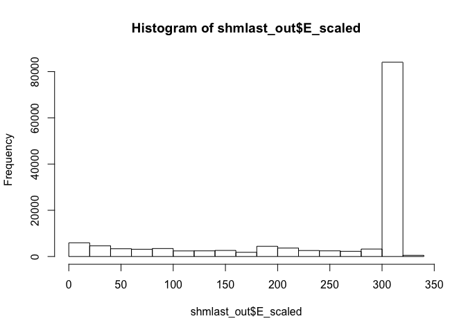
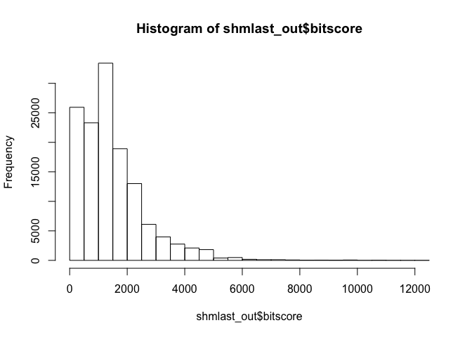
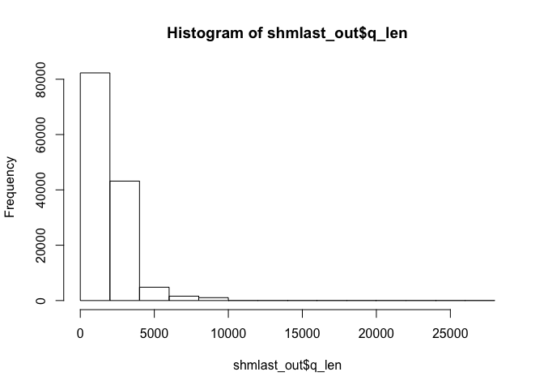
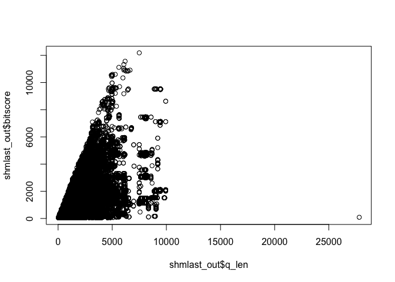

Class 16: UNIX for Bioinformatics
================

In this lecture we used UNIX on the command line to do bioinformatics. Most of the exercise is done on the command line.

Hands on Part One is all in UNIX or on remote server
====================================================

Hands-on Part 2 is all in UNIX
==============================

Hands-on Part 3
===============

Download the precomputed data

``` r
download.file("https://raw.githubusercontent.com/ngs-docs/angus/17a0ba3b1d915de90a5b8bd1fbc1027eba47baf8/_static/shmlast/mouse.1.rna.fna.gz.x.cow.faa.crbl.csv.gz", "shmlast.csv")
```

Next, read the object in to R, and name it something that you might remember

``` r
shmlast_out <- read.csv("shmlast.csv")
```

Now we can explore this data in R Studio

``` r
head(shmlast_out)
```

    ##          E      EG2  E_scaled     ID bitscore q_aln_len q_frame q_len
    ## 1  6.6e-24  9.8e-16  23.18046 641897 109.6580        89       1   390
    ## 2 5.4e-194 4.4e-165 193.26761 719314 605.7589       313       0   331
    ## 3 2.8e-188 5.0e-160 187.55284 423289 588.9869       307       0   323
    ## 4 6.6e-183 5.6e-155 182.18046 725159 572.2148       307       0   318
    ## 5 5.4e-194 4.4e-165 193.26761 719315 605.7589       313       0   331
    ## 6 2.8e-188 5.0e-160 187.55284 423290 588.9869       307       0   323
    ##                                                                     q_name
    ## 1 ref|NM_001013372.2| Mus musculus neural regeneration protein (Nrp), mRNA
    ## 2     ref|NM_207235.1| Mus musculus olfactory receptor 358 (Olfr358), mRNA
    ## 3     ref|NM_146368.1| Mus musculus olfactory receptor 361 (Olfr361), mRNA
    ## 4     ref|NM_146622.1| Mus musculus olfactory receptor 360 (Olfr360), mRNA
    ## 5     ref|NM_207235.1| Mus musculus olfactory receptor 358 (Olfr358), mRNA
    ## 6     ref|NM_146368.1| Mus musculus olfactory receptor 361 (Olfr361), mRNA
    ##   q_start q_strand s_aln_len s_len
    ## 1      64        +        89   389
    ## 2       0        +       313   313
    ## 3       0        +       307   313
    ## 4       0        +       307   313
    ## 5       0        +       313   313
    ## 6       0        +       307   313
    ##                                                                                    s_name
    ## 1 ref|XP_005212262.1| PREDICTED: DNA oxidative demethylase ALKBH1 isoform X1 [Bos taurus]
    ## 2                        ref|XP_607965.3| PREDICTED: olfactory receptor 1361 [Bos taurus]
    ## 3                        ref|XP_607965.3| PREDICTED: olfactory receptor 1361 [Bos taurus]
    ## 4                        ref|XP_607965.3| PREDICTED: olfactory receptor 1361 [Bos taurus]
    ## 5                     ref|XP_002691614.1| PREDICTED: olfactory receptor 1361 [Bos taurus]
    ## 6                     ref|XP_002691614.1| PREDICTED: olfactory receptor 1361 [Bos taurus]
    ##   s_start s_strand score
    ## 1       0        +   241
    ## 2       0        +  1365
    ## 3       0        +  1327
    ## 4       0        +  1289
    ## 5       0        +  1365
    ## 6       0        +  1327

What are the dimensions of this data?

``` r
dim(shmlast_out)
```

    ## [1] 132900     17

Let’s do some data visualization to get a handle on what our blast output looked like: first, let’s look at the E\_scaled column.

``` r
hist(shmlast_out$E_scaled)
```



This tells us we have a lot of low e-values.

Now we will look at the bitscores:

``` r
hist(shmlast_out$bitscore) 
```

 This tells us the lengths of nucleotide alignment.

We can also check the variable length.

``` r
hist(shmlast_out$q_len)
```



This is similar to bitscores.

Let's compare them.

``` r
plot(shmlast_out$q_len, shmlast_out$bitscore)
```



``` r
sessionInfo()
```

    ## R version 3.5.2 (2018-12-20)
    ## Platform: x86_64-apple-darwin15.6.0 (64-bit)
    ## Running under: macOS High Sierra 10.13.4
    ## 
    ## Matrix products: default
    ## BLAS: /Library/Frameworks/R.framework/Versions/3.5/Resources/lib/libRblas.0.dylib
    ## LAPACK: /Library/Frameworks/R.framework/Versions/3.5/Resources/lib/libRlapack.dylib
    ## 
    ## locale:
    ## [1] en_US.UTF-8/en_US.UTF-8/en_US.UTF-8/C/en_US.UTF-8/en_US.UTF-8
    ## 
    ## attached base packages:
    ## [1] stats     graphics  grDevices utils     datasets  methods   base     
    ## 
    ## loaded via a namespace (and not attached):
    ##  [1] compiler_3.5.2  magrittr_1.5    tools_3.5.2     htmltools_0.3.6
    ##  [5] yaml_2.2.0      Rcpp_1.0.1      stringi_1.4.3   rmarkdown_1.12 
    ##  [9] knitr_1.22      stringr_1.4.0   xfun_0.6        digest_0.6.18  
    ## [13] evaluate_0.13
