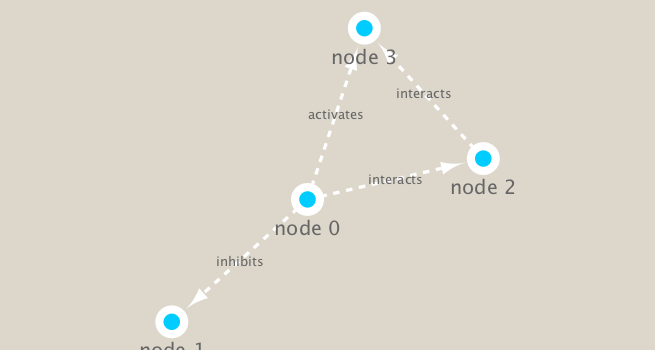
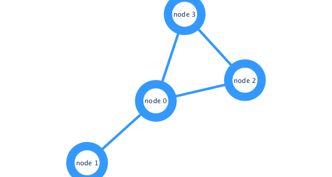

This class requires Cytoscape, so for this code to work you need to download and run Cytoscape on your computer. 

We are practicing how networks can be used to understand biological data. 

# Hands-on Part One is all done in cytoscape

# Hands-on Part Two! 


```{r }

# load the packages we willneed 

library(RCy3)
library(igraph)
library(RColorBrewer)


```

Check our connection to cytoscape which is needed for this notebook. Just open it on the local computer! 

```{r}

cytoscapePing()


```
we are set to go! 


```{r }

cytoscapeVersionInfo()

```


To explore the functions we can make an igraph and send it to cytoscape
```{r}

g <- makeSimpleIgraph()
createNetworkFromIgraph(g,"myGraph")

```

If you turn to your Cytoscape window you should now see a simple 4 vertex and 4 edge network displayed (see below).

We can include this Cytoscape rendered network image in our report with the following code:

```{r}

fig <- exportImage(filename="demo", type="png", height=350)

knitr::include_graphics("./demo.png")


```


Can use different styles through Cytoscape
```{r}

setVisualStyle("Marquee")


```


We can import this new network into our markdown file:
```{r}

fig <- exportImage(filename="demo_marquee", type="png", height=350)



```


You can find out what other styles are available and try a couple:

```{r}

styles <- getVisualStyleNames()
styles

```


```{r}

# try a new visual style 

setVisualStyle(styles[7])

# import in the image
g <- exportImage(filename="demo_7", type="png", height=350)



```


Read our metagenomics data
Data set from Lima-Mendez et al. (2015). 


```{r}

## scripts for processing located in "inst/data-raw/"
prok_vir_cor <- read.delim("./virus_prok_cor_abundant.tsv", stringsAsFactors = FALSE)

## Have a peek at the first 6 rows
head(prok_vir_cor)

```

Convert the dataframe into a network
```{r}

g <- graph.data.frame(prok_vir_cor, directed = FALSE)

```

```{r}

class(g)

```

```{r}

g

```

How many unique species are there?
```{r}

length(unique(c(prok_vir_cor[,1], prok_vir_cor[,2])))

```

What does it look like?

```{r}

plot(g)

```

Oh dear! Lets turn off the blue text labels


```{r}

plot(g, vertex.label=NA)

```

The nodes/vertex are too big. Lets make them smaller...


```{r}

plot(g, vertex.size=3, vertex.label=NA)

```


# Network querys
Note that we can query (and set) vertex and edge attributes with the V() and E() functions respectively:

```{r}

V(g)

```


```{r}

E(g)

```

#Network community detection

Find dense subgraphs within a network

```{r}

cb <- cluster_edge_betweenness(g)
cb

```

View our subgroup
```{r}

plot(cb, y=g, vertex.label=NA,  vertex.size=3)

```

```{r}

# You can extract a cluster/community vector with the membership() function:

head( membership(cb) )


```


# Node degree

The degree is the number of edges a nide has. 
This network is "scale-free" with a small number of nodes with high degree values and many nodes with low degree values.


```{r}

# Calculate and plot node degree of our network
d <- degree(g)

# plot the node degrees
hist(d, breaks=30, col="lightblue", main ="Node Degree Distribution")

```

For the degree_distribution() function a numeric vector of the same length as the maximum degree plus one is returned. The first element is the relative frequency zero degree vertices, the second vertices with degree one, etc.

```{r}

plot( degree_distribution(g), type="h" )

```


# Centrality analysis

Centrality gives an estimation on how important a node or edge is for the connectivity (or the information flow) of a network. 

calculate centrality of nodes 
```{r}

pr <- page_rank(g)
head(pr$vector)


```


Lets plot our network with nodes size scaled via this page rank centrality scores.

```{r}

# Make a size vector btwn 2 and 20 for node plotting size

v.size <- BBmisc::normalize(pr$vector, range=c(2,20), method="range")
plot(g, vertex.size=v.size, vertex.label=NA)

```

One of the simplest centrality scores is of course degree that we calculated previously and stored as the object d. Lets plot this one out also

```{r}

v.size <- BBmisc::normalize(d, range=c(2,20), method="range")
plot(g, vertex.size=v.size, vertex.label=NA)

```

Another very common centrality score is betweenness. The vertex and edge betweenness are (roughly) defined by the number of geodesics (shortest paths) going through a vertex or an edge.

```{r}

b <- betweenness(g)
v.size <- BBmisc::normalize(b, range=c(2,20), method="range")
plot(g, vertex.size=v.size, vertex.label=NA)

```

# Read taxonomic classification for network annotation

Since these are data from small, microscopic organisms that were sequenced using shotgun sequencing, we rely on the classification of the sequences to know what kind of organisms are in the samples. 

```{r}

# read in our organism identification data 

phage_id_affiliation <- read.delim("./phage_ids_with_affiliation.tsv")

# check data
head(phage_id_affiliation)

```


```{r}

# read in data 
bac_id_affi <- read.delim("./prok_tax_from_silva.tsv", stringsAsFactors = FALSE)

# check data
head(bac_id_affi)

```

Add taxonomic annotation data to network
In preparation for sending the networks to Cytoscape we will add in the taxonomic data.


```{r}

## Extract out our vertex names
genenet.nodes <- as.data.frame(vertex.attributes(g), stringsAsFactors=FALSE)
head(genenet.nodes)

```

How may phage (i.e. ph_) entries do we have?

```{r}

length( grep("^ph_",genenet.nodes[,1]) )

```

Therefore we have 81 non phage nodes.

Now lets merge() these with the annotation data


```{r}

# We dont need all annotation data so lets make a reduced table 'z' for merging

z <- bac_id_affi[,c("Accession_ID", "Kingdom", "Phylum", "Class")]
n <- merge(genenet.nodes, z, by.x="name", by.y="Accession_ID", all.x=TRUE)
head(n)

```

```{r}

# Check on the column names before deciding what to merge
colnames(n)

```

```{r}

colnames(phage_id_affiliation)

```

```{r}

# Again we only need a subset of `phage_id_affiliation` for our purposes
y <- phage_id_affiliation[, c("first_sheet.Phage_id_network", "phage_affiliation","Tax_order", "Tax_subfamily")]

# Add the little phage annotation that we have
x <- merge(x=n, y=y, by.x="name", by.y="first_sheet.Phage_id_network", all.x=TRUE)

## Remove duplicates from multiple matches
x <- x[!duplicated( (x$name) ),]
head(x)

```

```{r}

genenet.nodes <- x

```

Send network to Cytoscape using RCy3
Now we will send this network from R to Cytoscape.
Clear Cytoscape to preserve memory.

```{r}

# Open a new connection and delete any existing windows/networks in Cy
deleteAllNetworks()

```


We will need to set the first column in our node data.frame to id as this is what the RCy3 function createNetworkFromDataFrames() expects. Note that additional columns are loaded into Cytoscape as node attributes


```{r}

# Set the main nodes colname to the required "id" 
colnames(genenet.nodes)[1] <- "id"

```


Add to the network the data related to the connections between the organisms, the edge data, and then send the nodes and edges data.frames to Cytoscape using the function createNetworkFromDataFrames().

```{r}

genenet.edges <- data.frame(igraph::as_edgelist(g))

# Set the main edges colname to the required "source" and "target" 
colnames(genenet.edges) <- c("source","target")

# Add the weight from igraph to a new column...
genenet.edges$Weight <- igraph::edge_attr(g)$weight

# Send as a new network to Cytoscape
createNetworkFromDataFrames(genenet.nodes,genenet.edges, 
                            title="Tara_Oceans")

```


# Publishing your network to NDEx-
The new NDEx (Network Data Exchange) web server provides an open-source framework where scientists and organizations can share, store, manipulate, and publish biological network knowledge.


# Exporting from Cytoscape
Back in Cytoscape with your final (for now) network displayed. Click on File > Export > Network to NDXe.... On the window that appears make sure you are logged in by entering your NDEx username and password (see red box number 1 in figure below). Then fill in as much annotation as you can add. It is important that you make your network Public (see red box number 2 in figure). When you are ready click the Save button.


