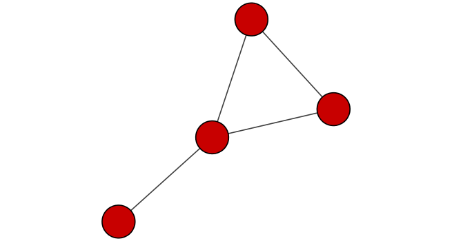

This class requires Cytoscape, so for this code to work you need to download and run Cytoscape on your computer. 

We are practicing how networks can be used to understand biological data. 

# Hands-on Part One is all done in cytoscape

# Hands-on Part Two! 


```{r }

# load the packages we will need 

library(RCy3)
library(igraph)
library(RColorBrewer)


```

Check our connection to cytoscape which is needed for this notebook.

```{r}

cytoscapePing()


```


```{r }

cytoscapeVersionInfo()

```


```{r}
g <- makeSimpleIgraph()
createNetworkFromIgraph(g,"myGraph")
```


If you turn to your Cytoscape window you should now see a simple 4 vertex and 4 edge network displayed (see below).

We can include this Cytoscape rendered network image in our report with the following code:
```{r}

fig <- exportImage(filename="demo", type="png", height=350)

```
```{r}



```

```{r}
setVisualStyle("Marquee")
```


```{r}
fig <- exportImage(filename="demo_marquee", type="png", height=350)

knitr::include_graphics("./demo_marquee.png")
```


You can find out what other styles are available and try a couple:

```{r}

```

```{r}
styles <- getVisualStyleNames()
styles
```

```{r}
setVisualStyle(styles[7])
g <- exportImage(filename="demo_7", type="png", height=350)

knitr::include_graphics("./demo_7.png")
```


Read our metagenomics data
We will read in a species co-occurrence matrix that was calculated using Spearman Rank coefficient. (see reference Lima-Mendez et al. (2015) for details).


```{r}

## scripts for processing located in "inst/data-raw/"
prok_vir_cor <- read.delim("./virus_prok_cor_abundant.tsv", stringsAsFactors = FALSE)

## Have a peak at the first 6 rows
head(prok_vir_cor)
```

How many unique species are there?
```{r}
length(unique(c(prok_vir_cor[,1], prok_vir_cor[,2])))

```

There are many different ways to work with graphs in R. We will primarily use the igraph package (see: http://igraph.org/r/ ) and also work with our network within Cytoscape.

Here we will use the igraph package to convert the co-occurrence dataframe into a network that we can send to Cytoscape. In this case our graph is undirected (so we will set directed = FALSE) since we do not have any information about the direction of the interactions from this type of data.

```{r}
g <- graph.data.frame(prok_vir_cor, directed = FALSE)
```

```{r}
class(g)
```

```{r}
g
```

In this case the first line of output ("UNW- 854 1544 --") tells that our network graph has 845 vertices (i.e. nodes, which represent our bacteria and viruses) and 1544 edges (i.e. linking lines, which indicate their co-occurrence). Note that the first four characters (i.e. the "UNW-" part) tell us about the network setup. In this case our network is Undirected, Named (i.e. has the 'name' node/vertex attribute set) and Weighted (i.e. the 'weight' edge attribute is set).

Common igraph functions for creating network graphs include: graph_from_data_frame(), graph_from_edgelist(), and graph_from_adjacency_matrix(). You can find out more about these functions from their associated help pages.

Our current graph is a little too dense in terms of node labels etc. to have a useful 'default' plot figure. But we can have a look anyway.

```{r}
plot(g)
```


This is a hot-mess! Lets turn off the blue text labels


```{r}
plot(g, vertex.label=NA)


```

The nodes/vertex are too big. Lets make them smaller...


```{r}
plot(g, vertex.size=3, vertex.label=NA)

```


Network querys
Note that we can query (and set) vertex and edge attributes with the V() and E() functions respectively:

```{r}
V(g)
```


```{r}
E(g)
```

Network community detection
Community structure detection algorithms try to find dense subgraphs within larger network graphs (i.e. clusters of well connected nodes that are densely connected themselves but sparsely connected to other nodes outside the cluster) . Here we use the classic Girvan & Newman betweenness clustering method. The igraph package has lots of different community detection algorithms (i.e. different methods for finding communities).

```{r}
cb <- cluster_edge_betweenness(g)
cb
```


```{r}
plot(cb, y=g, vertex.label=NA,  vertex.size=3)
```
```{r}

# You can extract a cluster/community membership vector for further inspection with the membership() function:


head( membership(cb) )
```


Node degree
The degree of a node or vertex is its most basic structural property, the number of its adjacent edges. Here we calculate and plot the node degree distribution.

Note again the scale-free nature of this network with a small number of nodes with high degree values and many nodes with low degree values.


```{r}
# Calculate and plot node degree of our network
d <- degree(g)
hist(d, breaks=30, col="lightblue", main ="Node Degree Distribution")
```

For the degree_distribution() function a numeric vector of the same length as the maximum degree plus one is returned. The first element is the relative frequency zero degree vertices, the second vertices with degree one, etc.

```{r}
plot( degree_distribution(g), type="h" )

```


Centrality analysis
Centrality gives an estimation on how important a node or edge is for the connectivity (or the information flow) of a network. It is a particularly useful parameter in signaling networks and it is often used when trying to find drug targets for example.

Centrality analysis often aims to answer the following question: Which nodes are the most important and why?

One centrality method that you can often find in publications is the Google PageRank score. For the explanation of the PageRank algorithm, see the following webpage: http://infolab.stanford.edu/~backrub/google.html

```{r}
pr <- page_rank(g)
head(pr$vector)
```


Lets plot our network with nodes size scaled via this page rank centrality scores.

```{r}
# Make a size vector btwn 2 and 20 for node plotting size

v.size <- BBmisc::normalize(pr$vector, range=c(2,20), method="range")
plot(g, vertex.size=v.size, vertex.label=NA)
```

One of the simplest centrality scores is of course degree that we calculated previously and stored as the object d. Lets plot this one out also

```{r}
v.size <- BBmisc::normalize(d, range=c(2,20), method="range")
plot(g, vertex.size=v.size, vertex.label=NA)

```

Another very common centrality score is betweenness. The vertex and edge betweenness are (roughly) defined by the number of geodesics (shortest paths) going through a vertex or an edge.

```{r}
b <- betweenness(g)
v.size <- BBmisc::normalize(b, range=c(2,20), method="range")
plot(g, vertex.size=v.size, vertex.label=NA)
```

Read taxonomic classification for network annotation
Since these are data from small, microscopic organisms that were sequenced using shotgun sequencing, we rely on the classification of the sequences to know what kind of organisms are in the samples. In this case the bacterial viruses (bacteriophage), were classified by Basic Local Alignment Search Tool (BLAST http://blast.ncbi.nlm.nih.gov/Blast.cgi) by searching for their closest sequence in the RefSeq database (see methods in Brum et al. (2015)). The prokaryotic taxonomic classifications were determined using the SILVA database.

```{r}

phage_id_affiliation <- read.delim("./phage_ids_with_affiliation.tsv")
head(phage_id_affiliation)

```


```{r}
bac_id_affi <- read.delim("./prok_tax_from_silva.tsv", stringsAsFactors = FALSE)
head(bac_id_affi)
```

Add taxonomic annotation data to network
In preparation for sending the networks to Cytoscape we will add in the taxonomic data.

Side-Note: Some of the organisms do not have taxonomic classifications associated with them and these will get NA values below. Note that with earlier version of RCy3 I found problems sending "NA"s to Cytoscape from RCy3. The RCy3 package is under active development currently and this issue has apparently been resolved.


```{r}
## Extract out our vertex names
genenet.nodes <- as.data.frame(vertex.attributes(g), stringsAsFactors=FALSE)
head(genenet.nodes)
```

How may phage (i.e. ph_) entries do we have?

```{r}
length( grep("^ph_",genenet.nodes[,1]) )

```

Therefore we have 81 non phage nodes.

Now lets merge() these with the annotation data

#

```{r}
# We dont need all annotation data so lets make a reduced table 'z' for merging
z <- bac_id_affi[,c("Accession_ID", "Kingdom", "Phylum", "Class")]
n <- merge(genenet.nodes, z, by.x="name", by.y="Accession_ID", all.x=TRUE)
head(n)
```
```{r}
# Check on the column names before deciding what to merge
colnames(n)
```

```{r}
colnames(phage_id_affiliation)
```

```{r}
# Again we only need a subset of `phage_id_affiliation` for our purposes
y <- phage_id_affiliation[, c("first_sheet.Phage_id_network", "phage_affiliation","Tax_order", "Tax_subfamily")]

# Add the little phage annotation that we have
x <- merge(x=n, y=y, by.x="name", by.y="first_sheet.Phage_id_network", all.x=TRUE)

## Remove duplicates from multiple matches
x <- x[!duplicated( (x$name) ),]
head(x)
```

```{r}
genenet.nodes <- x
```

Send network to Cytoscape using RCy3
Now we will send this network from R to Cytoscape.

To begin we will delete any windows and networks that were already open in Cytoscape. This will clean the slate and help ensure we don't use up all of our memory.


```{r}
# Open a new connection and delete any existing windows/networks in Cy
deleteAllNetworks()
```
If you tun back to your Cytoscape window you should now see that all previous networks have been removed from the open display.

We will need to set the first column in our node data.frame to id as this is what the RCy3 function createNetworkFromDataFrames() expects. Note that additional columns are loaded into Cytoscape as node attributes

Likewise the edge data.frame should contain columns of character strings named: source, target and interaction (with additional columns loaded as edge attributes).


```{r}
# Set the main nodes colname to the required "id" 
colnames(genenet.nodes)[1] <- "id"
```


Add to the network the data related to the connections between the organisms, the edge data, and then send the nodes and edges data.frames to Cytoscape using the function createNetworkFromDataFrames().

```{r}

genenet.edges <- data.frame(igraph::as_edgelist(g))

# Set the main edges colname to the required "source" and "target" 
colnames(genenet.edges) <- c("source","target")

# Add the weight from igraph to a new column...
genenet.edges$Weight <- igraph::edge_attr(g)$weight

# Send as a new network to Cytoscape
createNetworkFromDataFrames(genenet.nodes,genenet.edges, 
                            title="Tara_Oceans")
```


Publishing your network to NDEx-
The new NDEx (Network Data Exchange) web server provides an open-source framework where scientists and organizations can share, store, manipulate, and publish biological network knowledge (Pillich et al. 2017). It is developed here at UCSD in close collaboration with the Cytoscape development team. Once you have an account on the web server you can upload your networks directly from Cytoscape or use the bioconductor R package ndexR.

Visit the NDEx homepage http://www.ndexbio.org and create a new account for yourself. You will need to recall your username and password in a later step.

Exporting from Cytoscape
Back in Cytoscape with your final (for now) network displayed. Click on File > Export > Network to NDXe.... On the window that appears make sure you are logged in by entering your NDEx username and password (see red box number 1 in figure below). Then fill in as much annotation as you can add. It is important that you make your network Public (see red box number 2 in figure). When you are ready click the Save button.


