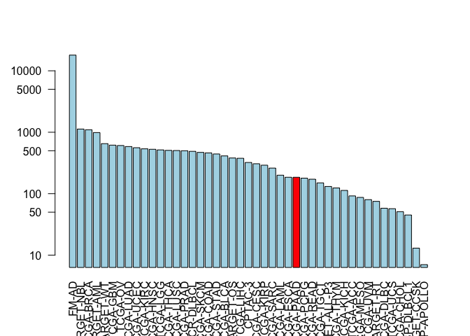

Untitled
================

``` r
library(GenomicDataCommons)
```

    ## Loading required package: magrittr

    ## 
    ## Attaching package: 'GenomicDataCommons'

    ## The following object is masked from 'package:stats':
    ## 
    ##     filter

``` r
library(TCGAbiolinks)
```

    ## Warning: package 'TCGAbiolinks' was built under R version 3.5.3

``` r
library(maftools)
```

    ## Warning: package 'maftools' was built under R version 3.6.0

``` r
BiocManager::install("GenomicDataCommons")
```

``` r
status()
```

    ## $commit
    ## [1] "e588f035feefee17f562b3a1bc2816c49a2b2b19"
    ## 
    ## $data_release
    ## [1] "Data Release 16.0 - March 26, 2019"
    ## 
    ## $status
    ## [1] "OK"
    ## 
    ## $tag
    ## [1] "1.20.0"
    ## 
    ## $version
    ## [1] 1

1.  Querying the GDC from R We will typically start our interaction with the GDC by searching the resource to find data that we are interested in investigating further. In GDC speak this is called “Querying GDC metadata”. Metadata here refers to the extra descriptive information associated with the actual patient data (i.e. ‘cases’) in the GDC.

For example: Our query might be ‘find how many patients were studied for each major project’ or ‘find and download all gene expression quantification data files for all pancreatic cancer patients’. We will answer both of these questions below.

The are four main sets of metadata that we can query, namely projects(), cases(), files(), and annotations(). We will start with projects()

``` r
projects <- getGDCprojects()
head(projects)
```

    ##   dbgap_accession_number
    ## 1                   <NA>
    ## 2              phs000466
    ## 3                   <NA>
    ## 4                   <NA>
    ## 5              phs001444
    ## 6              phs000471
    ##                                                          disease_type
    ## 1 Cystic, Mucinous and Serous Neoplasms, Adenomas and Adenocarcinomas
    ## 2                                    Clear Cell Sarcoma of the Kidney
    ## 3                                               Mesothelial Neoplasms
    ## 4                                        Adenomas and Adenocarcinomas
    ## 5                     Lymphoid Neoplasm Diffuse Large B-cell Lymphoma
    ## 6                                               High-Risk Wilms Tumor
    ##   releasable released state
    ## 1      FALSE     TRUE  open
    ## 2      FALSE     TRUE  open
    ## 3      FALSE     TRUE  open
    ## 4      FALSE     TRUE  open
    ## 5      FALSE     TRUE  open
    ## 6      FALSE     TRUE  open
    ##                                                                                     primary_site
    ## 1 Rectosigmoid junction, Unknown, Rectum, Colon, Connective, subcutaneous and other soft tissues
    ## 2                                                                                         Kidney
    ## 3                                              Heart, mediastinum, and pleura, Bronchus and lung
    ## 4   Other and unspecified parts of biliary tract, Gallbladder, Liver and intrahepatic bile ducts
    ## 5                                                                                    Lymph Nodes
    ## 6                                                                                         Kidney
    ##     project_id           id
    ## 1    TCGA-READ    TCGA-READ
    ## 2  TARGET-CCSK  TARGET-CCSK
    ## 3    TCGA-MESO    TCGA-MESO
    ## 4    TCGA-CHOL    TCGA-CHOL
    ## 5 NCICCR-DLBCL NCICCR-DLBCL
    ## 6    TARGET-WT    TARGET-WT
    ##                                                  name tumor
    ## 1                               Rectum Adenocarcinoma  READ
    ## 2                    Clear Cell Sarcoma of the Kidney  CCSK
    ## 3                                        Mesothelioma  MESO
    ## 4                                  Cholangiocarcinoma  CHOL
    ## 5 Genomic Variation in Diffuse Large B Cell Lymphomas DLBCL
    ## 6                               High-Risk Wilms Tumor    WT

Moving onto cases() we can use an example from the package associated publication to answer our first from question above (i.e. find the number of cases/patients across different projects within the GDC):

``` r
cases_by_project <- cases() %>%
  facet("project.project_id") %>%
  aggregations()
head(cases_by_project)
```

    ## $project.project_id
    ##               key doc_count
    ## 1           FM-AD     18004
    ## 2      TARGET-NBL      1127
    ## 3       TCGA-BRCA      1098
    ## 4      TARGET-AML       988
    ## 5       TARGET-WT       652
    ## 6        TCGA-GBM       617
    ## 7         TCGA-OV       608
    ## 8       TCGA-LUAD       585
    ## 9       TCGA-UCEC       560
    ## 10      TCGA-KIRC       537
    ## 11      TCGA-HNSC       528
    ## 12       TCGA-LGG       516
    ## 13      TCGA-THCA       507
    ## 14      TCGA-LUSC       504
    ## 15      TCGA-PRAD       500
    ## 16   NCICCR-DLBCL       489
    ## 17      TCGA-SKCM       470
    ## 18      TCGA-COAD       461
    ## 19      TCGA-STAD       443
    ## 20      TCGA-BLCA       412
    ## 21      TARGET-OS       381
    ## 22      TCGA-LIHC       377
    ## 23        CPTAC-3       322
    ## 24      TCGA-CESC       307
    ## 25      TCGA-KIRP       291
    ## 26      TCGA-SARC       261
    ## 27      TCGA-LAML       200
    ## 28      TCGA-ESCA       185
    ## 29      TCGA-PAAD       185
    ## 30      TCGA-PCPG       179
    ## 31      TCGA-READ       172
    ## 32      TCGA-TGCT       150
    ## 33  TARGET-ALL-P3       131
    ## 34      TCGA-THYM       124
    ## 35      TCGA-KICH       113
    ## 36       TCGA-ACC        92
    ## 37      TCGA-MESO        87
    ## 38       TCGA-UVM        80
    ## 39      TARGET-RT        75
    ## 40      TCGA-DLBC        58
    ## 41       TCGA-UCS        57
    ## 42      TCGA-CHOL        51
    ## 43    CTSP-DLBCL1        45
    ## 44    TARGET-CCSK        13
    ## 45 VAREPOP-APOLLO         7

Q9. Write the R code to make a barplot of the cases per project. Lets plot this data with a log scale for the y axis (log="y"), rotated axis labels (las=2) and color the bar coresponding to the TCGA-PAAD project.

``` r
x <- cases_by_project$project.project_id

# Make a custom color vector for our plot
colvec <- rep("lightblue", nrow(x))
colvec[x$key == "TCGA-PAAD"] <- "red"

# Plot with 'log' for y axis and rotate labels with 'las'
#par(___)  
barplot(x$doc_count, names.arg=x$key, log="y", col=colvec, las=2)
```



We can use the getSampleFilesSummary() function to determine for a given project how many cases and what type of data we have available for each case:

``` r
samp <- getSampleFilesSummary("TCGA-PAAD")
```

    ## Accessing information for project: TCGA-PAAD

    ## Using 'state_comment' as value column. Use 'value.var' to override

    ## Aggregation function missing: defaulting to length

``` r
head(samp)
```

    ##            .id Biospecimen_Biospecimen Supplement
    ## 1 TCGA-2J-AAB1                                 14
    ## 2 TCGA-2J-AAB4                                 14
    ## 3 TCGA-2J-AAB6                                 14
    ## 4 TCGA-2J-AAB8                                 14
    ## 5 TCGA-2J-AAB9                                 14
    ## 6 TCGA-2J-AABA                                 14
    ##   Biospecimen_Slide Image_Diagnostic Slide
    ## 1                                        1
    ## 2                                        1
    ## 3                                        1
    ## 4                                        1
    ## 5                                        1
    ## 6                                        1
    ##   Biospecimen_Slide Image_Tissue Slide Clinical_Clinical Supplement
    ## 1                                    1                            8
    ## 2                                    1                            8
    ## 3                                    1                            8
    ## 4                                    1                            8
    ## 5                                    1                            8
    ## 6                                    1                            8
    ##   Copy Number Variation_Copy Number Segment_Genotyping Array_Affymetrix SNP 6.0
    ## 1                                                                             2
    ## 2                                                                             2
    ## 3                                                                             2
    ## 4                                                                             2
    ## 5                                                                             2
    ## 6                                                                             2
    ##   Copy Number Variation_Gene Level Copy Number Scores_Genotyping Array_Affymetrix SNP 6.0
    ## 1                                                                                       1
    ## 2                                                                                       1
    ## 3                                                                                       1
    ## 4                                                                                       1
    ## 5                                                                                       1
    ## 6                                                                                       1
    ##   Copy Number Variation_Masked Copy Number Segment_Genotyping Array_Affymetrix SNP 6.0
    ## 1                                                                                    2
    ## 2                                                                                    2
    ## 3                                                                                    2
    ## 4                                                                                    2
    ## 5                                                                                    2
    ## 6                                                                                    2
    ##   DNA Methylation_Methylation Beta Value_Methylation Array_Illumina Human Methylation 450
    ## 1                                                                                       1
    ## 2                                                                                       1
    ## 3                                                                                       1
    ## 4                                                                                       1
    ## 5                                                                                       1
    ## 6                                                                                       1
    ##   Sequencing Reads_Aligned Reads_miRNA-Seq_Illumina
    ## 1                                                 1
    ## 2                                                 1
    ## 3                                                 1
    ## 4                                                 1
    ## 5                                                 1
    ## 6                                                 1
    ##   Sequencing Reads_Aligned Reads_RNA-Seq_Illumina
    ## 1                                               1
    ## 2                                               1
    ## 3                                               1
    ## 4                                               1
    ## 5                                               1
    ## 6                                               1
    ##   Sequencing Reads_Aligned Reads_WXS_Illumina
    ## 1                                           2
    ## 2                                           2
    ## 3                                           2
    ## 4                                           2
    ## 5                                           2
    ## 6                                           2
    ##   Simple Nucleotide Variation_Aggregated Somatic Mutation_WXS
    ## 1                                                           4
    ## 2                                                           4
    ## 3                                                           4
    ## 4                                                           4
    ## 5                                                           4
    ## 6                                                           4
    ##   Simple Nucleotide Variation_Annotated Somatic Mutation_WXS
    ## 1                                                          4
    ## 2                                                          4
    ## 3                                                          4
    ## 4                                                          4
    ## 5                                                          4
    ## 6                                                          4
    ##   Simple Nucleotide Variation_Masked Somatic Mutation_WXS
    ## 1                                                       4
    ## 2                                                       4
    ## 3                                                       4
    ## 4                                                       4
    ## 5                                                       4
    ## 6                                                       4
    ##   Simple Nucleotide Variation_Raw Simple Somatic Mutation_WXS
    ## 1                                                           4
    ## 2                                                           4
    ## 3                                                           4
    ## 4                                                           4
    ## 5                                                           4
    ## 6                                                           4
    ##   Transcriptome Profiling_Gene Expression Quantification_RNA-Seq
    ## 1                                                              3
    ## 2                                                              3
    ## 3                                                              3
    ## 4                                                              3
    ## 5                                                              3
    ## 6                                                              3
    ##   Transcriptome Profiling_Isoform Expression Quantification_miRNA-Seq
    ## 1                                                                   1
    ## 2                                                                   1
    ## 3                                                                   1
    ## 4                                                                   1
    ## 5                                                                   1
    ## 6                                                                   1
    ##   Transcriptome Profiling_miRNA Expression Quantification_miRNA-Seq
    ## 1                                                                 1
    ## 2                                                                 1
    ## 3                                                                 1
    ## 4                                                                 1
    ## 5                                                                 1
    ## 6                                                                 1
    ##     project
    ## 1 TCGA-PAAD
    ## 2 TCGA-PAAD
    ## 3 TCGA-PAAD
    ## 4 TCGA-PAAD
    ## 5 TCGA-PAAD
    ## 6 TCGA-PAAD

Now we can use GDCquery() function to focus in on a particular data type that we are interested in. For example, to answer our second question from above - namely ‘find all gene expression data files for all pancreatic cancer patients’:

``` r
query <- GDCquery(project="TCGA-PAAD",
                  data.category="Transcriptome Profiling",
                  data.type="Gene Expression Quantification")
```

    ## --------------------------------------

    ## o GDCquery: Searching in GDC database

    ## --------------------------------------

    ## Genome of reference: hg38

    ## --------------------------------------------

    ## oo Accessing GDC. This might take a while...

    ## --------------------------------------------

    ## ooo Project: TCGA-PAAD

    ## --------------------

    ## oo Filtering results

    ## --------------------

    ## ooo By data.type

    ## ----------------

    ## oo Checking data

    ## ----------------

    ## ooo Check if there are duplicated cases

    ## Warning: There are more than one file for the same case. Please verify query results. You can use the command View(getResults(query)) in rstudio

    ## ooo Check if there results for the query

    ## -------------------

    ## o Preparing output

    ## -------------------

``` r
ans <- getResults(query)
```

``` r
head(ans)
```

    ##   data_release                      data_type
    ## 1  12.0 - 16.0 Gene Expression Quantification
    ## 2  12.0 - 16.0 Gene Expression Quantification
    ## 3  12.0 - 16.0 Gene Expression Quantification
    ## 4  12.0 - 16.0 Gene Expression Quantification
    ## 5  12.0 - 16.0 Gene Expression Quantification
    ## 6  12.0 - 16.0 Gene Expression Quantification
    ##                   updated_datetime
    ## 1 2018-11-30T10:59:48.252246+00:00
    ## 2 2018-11-30T10:59:48.252246+00:00
    ## 3 2018-11-30T10:59:48.252246+00:00
    ## 4 2018-11-30T10:59:48.252246+00:00
    ## 5 2018-11-30T10:59:48.252246+00:00
    ## 6 2018-11-30T10:59:48.252246+00:00
    ##                                              file_name
    ## 1  27f41c98-3658-48c9-a257-d9ecad3276c8.FPKM-UQ.txt.gz
    ## 2  2132e4b3-f882-4d05-9cb6-be9a24c510c0.FPKM-UQ.txt.gz
    ## 3 25b906db-fd54-4b85-b67e-e421826bd794.htseq.counts.gz
    ## 4     1b54f883-d25d-4f6c-9398-7d7dcfb75653.FPKM.txt.gz
    ## 5     7051e52f-069d-48d5-966e-064a01bf2725.FPKM.txt.gz
    ## 6     6c73911d-8d0a-4a5a-9251-4ded7ea70fef.FPKM.txt.gz
    ##                                  submitter_id
    ## 1 27f41c98-3658-48c9-a257-d9ecad3276c8_uqfpkm
    ## 2 2132e4b3-f882-4d05-9cb6-be9a24c510c0_uqfpkm
    ## 3  25b906db-fd54-4b85-b67e-e421826bd794_count
    ## 4   1b54f883-d25d-4f6c-9398-7d7dcfb75653_fpkm
    ## 5   7051e52f-069d-48d5-966e-064a01bf2725_fpkm
    ## 6   6c73911d-8d0a-4a5a-9251-4ded7ea70fef_fpkm
    ##                                file_id file_size
    ## 1 1e0be26b-da47-4e56-926c-9afc259a2bd0    528102
    ## 2 2803abb9-bf21-4b75-a3c9-687c87b75701    496856
    ## 3 4d98a852-c30a-437b-a214-ee81015d674b    250164
    ## 4 af9e4765-462e-4fa3-819c-f890456647ba    494993
    ## 5 62809aca-c5ac-47f1-bfed-b82d811a797d    504209
    ## 6 e8ae7104-605a-4bd3-b58d-b85da7f4fcc3    525367
    ##                          cases                                   id
    ## 1 TCGA-FB-AAPS-01A-12R-A39D-07 1e0be26b-da47-4e56-926c-9afc259a2bd0
    ## 2 TCGA-FB-AAQ3-01A-11R-A41B-07 2803abb9-bf21-4b75-a3c9-687c87b75701
    ## 3 TCGA-HZ-8005-01A-11R-2204-07 4d98a852-c30a-437b-a214-ee81015d674b
    ## 4 TCGA-FB-AAPQ-01A-11R-A41B-07 af9e4765-462e-4fa3-819c-f890456647ba
    ## 5 TCGA-HV-A7OL-01A-11R-A33R-07 62809aca-c5ac-47f1-bfed-b82d811a797d
    ## 6 TCGA-3A-A9IB-01A-21R-A39D-07 e8ae7104-605a-4bd3-b58d-b85da7f4fcc3
    ##                   created_datetime                           md5sum
    ## 1 2016-05-26T21:20:54.657488-05:00 23b40da735dd52e9867927e253b7b135
    ## 2 2016-05-29T10:32:57.442916-05:00 94e1c8501c2b0120c5ca238dcaffb500
    ## 3 2016-05-26T21:21:27.312488-05:00 38acc858f2e4390e10c82b9423ca4f3c
    ## 4 2016-05-30T18:57:37.259818-05:00 2736865e0da315e5e5c72efd2f013b4a
    ## 5 2016-05-29T10:07:29.441428-05:00 4387ffbcfc574513b3910fb8d1ac24d6
    ## 6 2016-05-29T10:15:47.187935-05:00 86c8f9940f4dd39c899df7c17f341d29
    ##   data_format access    state version           data_category
    ## 1         TXT   open released       1 Transcriptome Profiling
    ## 2         TXT   open released       1 Transcriptome Profiling
    ## 3         TXT   open released       1 Transcriptome Profiling
    ## 4         TXT   open released       1 Transcriptome Profiling
    ## 5         TXT   open released       1 Transcriptome Profiling
    ## 6         TXT   open released       1 Transcriptome Profiling
    ##              type experimental_strategy   project
    ## 1 gene_expression               RNA-Seq TCGA-PAAD
    ## 2 gene_expression               RNA-Seq TCGA-PAAD
    ## 3 gene_expression               RNA-Seq TCGA-PAAD
    ## 4 gene_expression               RNA-Seq TCGA-PAAD
    ## 5 gene_expression               RNA-Seq TCGA-PAAD
    ## 6 gene_expression               RNA-Seq TCGA-PAAD
    ##                            analysis_id        analysis_updated_datetime
    ## 1 593c4dd1-0fde-4a26-9d37-0d8dfb2c3693 2018-09-10T15:08:41.786316-05:00
    ## 2 5c56e496-5fa6-4880-a297-0339d7519a7c 2018-09-10T15:08:41.786316-05:00
    ## 3 52be80a4-7268-4caa-aaff-d449a13a3a41 2018-09-10T15:08:41.786316-05:00
    ## 4 a51cf7ed-5f4a-486f-9b28-b62ece59c185 2018-09-10T15:08:41.786316-05:00
    ## 5 c1473452-e376-413a-ad15-9b9e3efe94cd 2018-09-10T15:08:41.786316-05:00
    ## 6 1abb4868-1793-46c4-bccd-90c0934cc1b2 2018-09-10T15:08:41.786316-05:00
    ##          analysis_created_datetime
    ## 1 2016-05-26T21:20:54.657488-05:00
    ## 2 2016-05-29T10:32:57.442916-05:00
    ## 3 2016-05-26T21:21:27.312488-05:00
    ## 4 2016-05-30T18:57:37.259818-05:00
    ## 5 2016-05-29T10:07:29.441428-05:00
    ## 6 2016-05-29T10:15:47.187935-05:00
    ##                         analysis_submitter_id analysis_state
    ## 1 27f41c98-3658-48c9-a257-d9ecad3276c8_uqfpkm       released
    ## 2 2132e4b3-f882-4d05-9cb6-be9a24c510c0_uqfpkm       released
    ## 3  25b906db-fd54-4b85-b67e-e421826bd794_count       released
    ## 4   1b54f883-d25d-4f6c-9398-7d7dcfb75653_fpkm       released
    ## 5   7051e52f-069d-48d5-966e-064a01bf2725_fpkm       released
    ## 6   6c73911d-8d0a-4a5a-9251-4ded7ea70fef_fpkm       released
    ##                 analysis_workflow_link analysis_workflow_type
    ## 1 https://github.com/NCI-GDC/htseq-cwl        HTSeq - FPKM-UQ
    ## 2 https://github.com/NCI-GDC/htseq-cwl        HTSeq - FPKM-UQ
    ## 3 https://github.com/NCI-GDC/htseq-cwl         HTSeq - Counts
    ## 4 https://github.com/NCI-GDC/htseq-cwl           HTSeq - FPKM
    ## 5 https://github.com/NCI-GDC/htseq-cwl           HTSeq - FPKM
    ## 6 https://github.com/NCI-GDC/htseq-cwl           HTSeq - FPKM
    ##   analysis_workflow_version   tissue.definition
    ## 1                        v1 Primary solid Tumor
    ## 2                        v1 Primary solid Tumor
    ## 3                        v1 Primary solid Tumor
    ## 4                        v1 Primary solid Tumor
    ## 5                        v1 Primary solid Tumor
    ## 6                        v1 Primary solid Tumor

In RStudio we can now use the View() function to get a feel for the data organization and values in the returned ans object.
